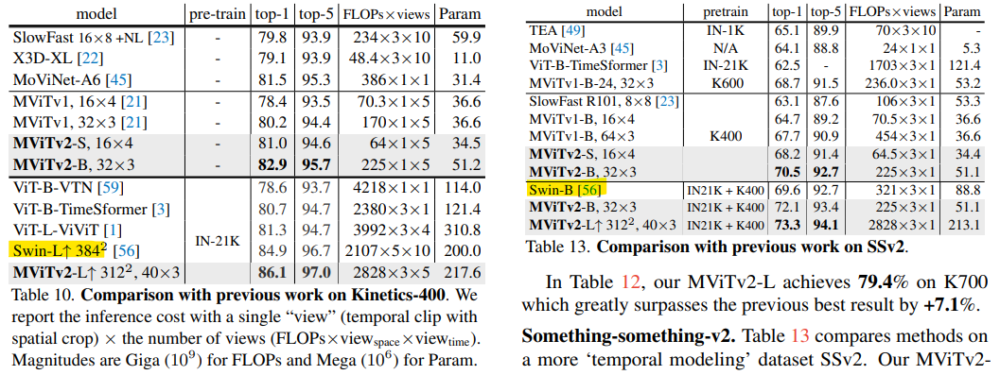

# MViTv2: Improved Multiscale Vision Transformers for Classification and Detection

> "MViTv2: Improved Multiscale Vision Transformers for Classification and Detection" CVPR, 2021 Dec
> [paper](http://arxiv.org/abs/2112.01526v2) [code](https://github.com/facebookresearch/SlowFast/blob/2efb99faa254075b4e28d3d4f313052b51da05bc/slowfast/models/video_model_builder.py#L810) 
> [pdf](./2021_12_CVPR_MViTv2--Improved-Multiscale-Vision-Transformers-for-Classification-and-Detection.pdf)
> Authors: Yanghao Li, Chao-Yuan Wu, Haoqi Fan, Karttikeya Mangalam, Bo Xiong, Jitendra Malik, Christoph Feichtenhofer

## Key-point

- Task

- Problems

  ViT 对于长序列计算复杂度太大，目前的策略有：窗口内计算**局部注意力**；**池化注意力**，在计算视频任务中的自注意之前，局部聚集特征

  MViT建模两个patch之间交互的方式将根据它们在图像中的绝对位置而改变。为了解决这个问题，作者将相对位置嵌入纳入池化自注意计算中，它只取决于token之间的相对位置距离。

- :label: Label:

**Decomposed relative position embedding**

时空结构建模完全依赖于“绝对”位置嵌入来提供位置信息。MViT 建模两个patch之间交互的方式将根据它们在图像中的绝对位置而改变；

将相对位置编码嵌入注意力计算中

位置编码向量 

**Residual pooling connection**

残差池化连接添加到池化的Q张量中，以增加信息流并促进MViT中池化注意力块的训练

## Contributions

## Introduction

### MViT

MViTv1的关键思想是为低级和高级视觉建模构建不同的阶段，而不是ViT中的单比例尺块。从网络的输入阶段到输出阶段，MViT缓慢扩展通道宽度D，同时降低分辨率L（即，序列长度）

## methods

## Experiment

> ablation study 看那个模块有效，总结一下

对比 video swin transformer 参数来更低的情况下， 准确率更高

## Limitations

## Summary :star2:

> learn what & how to apply to our task

