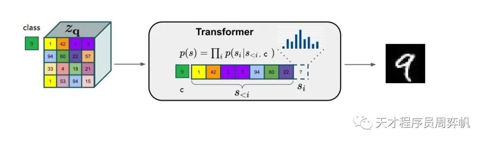
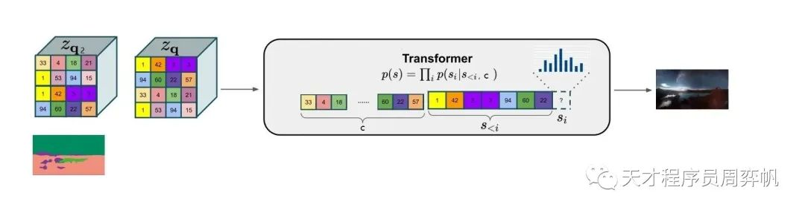

# VQ-GAN :moyai:

> [2021_CVPR_VQGAN_Taming-Transformers-for-High-Resolution-Image-Synthesis.pdf](./2021_CVPR_VQGAN_Taming-Transformers-for-High-Resolution-Image-Synthesis.pdf)
> [CompVis/taming-transformers: Taming Transformers for High-Resolution Image Synthesis (github.com)](https://github.com/CompVis/taming-transformers)
> https://compvis.github.io/taming-transformers/
>
> [Youtuber The AI Epiphany VQ-GAN Paper explained](https://www.youtube.com/watch?v=j2PXES-liuc) :+1:
> :star2:  [WeChat blog & code](https://mp.weixin.qq.com/s/iyfUDU93GUNqKtOJDUKjKA)  >> 可以参考博客笔记的行文，总分总：核心思想 -> 基础知识补充 > 论文方法 > 实验 -> Paper Summary -> Code Implementation

motivation: Stable Diffusion 的 Encoder 使用 VQ-GAN 中的方法训练

**Background**

VQ-GAN uses modified VQ-VAEs and a powerful transformer (GPT-2) to synthesize high-res images.

**Contributions**

- An important modification of VQ-VAE >> To get a more high-fidelity image-reconstruction image
  1. replace MSE with **perceptual loss** >> VQ-VAE have blur result
  2. adding **adversarial loss** which makes the images way more crispy
- The first methods using Transformer to generate images


## **Related Work TODO**

- [ ] [VQ-VAEs](https://www.youtube.com/watch?v=VZFVUrYcig0)

- [ ] Transformer Decoder-only >> VQ-GAN conditioned synthesis

  https://zhuanlan.zhihu.com/p/625184011

### VQ-VAE

> [WeChat blog & code](https://mp.weixin.qq.com/s/iyfUDU93GUNqKtOJDUKjKA) >> 简单补一下 VQ-VAE
> https://www.youtube.com/watch?v=VZFVUrYcig0&t=36s

VQVAE 的学习目标是训练一个**高保真度的图像压缩重建模型**：用一个编码器把图像压缩成离散编码，再用一个解码器把图像尽可能地还原回原图像。

- CodeBooks

  VQVAE采取了一种离散化策略：把每个输出向量替换成嵌入空间中最近的那个向量。的离散编码就是在嵌入空间的下标。

- LossFunction
  $$
  L_{VQ} = \underbrace{L_{reconstruct}}_{重建误差} + \underbrace{L_{embedding}}_{Embedding误差}
  $$
  
  $$
  L_{reconstruct} = \Vert{x- \hat{x}}\Vert^2 \\
  L_{embedding} = \Vert{z_e(x) - z_q(x)}\Vert^2_2
  $$


### Transformer Decoder-only

> Used in VQ-GAN Conditioned Synthesis


## methods

VQGAN使用了**两阶段的图像生成方法**

- 训练时，先训练一个**图像压缩模型（VQGAN**，包括编码器和解码器两个子模型），再训练一个生成压缩图像的模型。
- 生成时，先用第二个模型生成出一个压缩图像，再用第一个模型（**基于Transformer的模型）复原成真实图像**。

> 从 Transformer 计算开销只能生成小图的限制 & VQ-VAE 生成的模糊，两个角度来展开 VQ-GAN 的改进点

相比擅长捕捉局部特征的CNN，Transformer的优势在于它能更好地融合图像的全局信息。可是，Transformer的自注意力操作开销太大，只能生成一些分辨率较低的图像。因此，作者认为，可以综合CNN和Transformer的优势，**先用基于CNN的VQGAN把图像压缩成一个尺寸更小、信息更丰富的小图像，再用Transformer来生成小图像。**

为提升 VQVAE 的生成效果，作者提出了两项改进策略：1) 图像压缩模型VQVAE仅使用了均方误差，压缩图像的复原结果较为模糊，可以把**图像压缩模型换成GAN**；2) 在**生成压缩图片这个任务上，基于CNN的图像生成模型比不过Transformer**，可以用Transformer代替原来的CNN。


### VQ-GAN 压缩模型

1. 用感知误差(perceptual loss)代替原来的均方误差作为VQGAN的重建误差。
2. 作者引入了GAN的对抗训练机制，加入了一个基于图块的判别器，把GAN误差加入了总误差。


#### PatchGAN :baby:

TODO


### Learning Image-Composition with Transformer

VQGAN得到的压缩图像与真实图像有一个本质性的不同：**真实图像的像素值具有连续性，相邻的颜色更加相似，而压缩图像的像素值则没有这种连续性。:question:**多数强大的真实图像生成模型（比如GAN）都是输出一个连续的浮点颜色值，再做一个浮点转整数的操作，得到最终的像素值。

- VQVAE使用了一个能建模离散颜色的 PixelCNN 模型作为压缩图像生成模型。但 PixelCNN 的表现不够优秀。

  VQVAE 输出的 codebooks 本身就是离散的但各个 code 之间没有连续的那种关系。由于code 离散，没有办法模仿 GAN 那种输出连续值然后取整的操作。因此需要一种方法实现 离散值 -> 离散的像素灰度值

- Transformer天生就支持建模离散的输出，但是**Transformer每次会根据之前所有的单词来生成下一单词。而图像是二维数据，没有先后的概念，怎样让像素和文字一样有先后顺序呢？** :question:

  将 2D matrix 中的 patch 按一种顺序离散化为 1D 序列输入 Transformer


### Conditioned synthesis

- Class-conditioned

  把这个 class ID 的约束信息添加到Transformer的输入之前，以实现由类别约束的图像生成

  

- Spatial-conditioned

  对于这种以图像形式表示的约束，作者的做法是，再训练另一个VQGAN，把约束图像压缩成另一套压缩图片。这一套压缩图片和生成图像的压缩图片有着不同的codebook，就像两种语言有着不同的单词一样。这样，约束图像也变成了一系列的整数，可以用之前的方法进行带约束图像生成了。

  


### High-Resolution Generation

> 滑动窗口看 code 理解

由于Transformer注意力计算的开销很大, 作者在所有配置中都只使用了 $16 \times 16$ 的压缩图像, 再增大压缩图像尺寸的话计算资源就不够了。设边长压缩了 f 倍, 则该方法一次能生成的图片的最大尺寸是 $16f \times 16f$

作者做实验发现 $f=16$ 效果比较好，压缩比（压缩前 Bytes / 压缩后 Bytes）再大效果就不好了，对于 f=16 只能够生成 $256 \times 256$ 大小的图像。**为了生成更大尺寸的图片,** 作者先**训练好了一套能生成 $256 \times 256$ 的图片的 VQGAN+Transformer**，再用了一种**基于滑动窗口的采样机制来生成大分辨率图片**

- f=16 不变 ，预训练模型只能够从 16x16 -> 256x256，对于更大尺寸的图，H,W 先除以 f=16 得到压缩图尺寸。在压缩图上进行 16x16 的滑动窗口


## Experiment

在实验部分，作者先是分别验证了基于Transformer的压缩图像生成模型较以往模型的优越性（4.1节）、VQGAN较以往模型的优越性（4.4节末尾）、使用VQGAN做图像压缩的必要性及相关消融实验（4.3节），再把整个生成方法综合起来，在多项图像生成任务上与以往的图像生成模型做定量对比（4.4节），最后展示了该方法惊艳的带约束生成效果（4.2节）

- autoregressive 方法对比：Transformer & PixelCNN

- VQGAN+Transformer在各种约束下的图像生成结果

  语义分割图像，深度图，超分用低分辨率做 condition,骨架

- 探究了VQGAN+Transformer在多项 benchmark 上的结果

  - class conditioned on ImageNet
  - face image synthesis

- 增大codebook的尺寸 (压缩比 f 大小) 或者编码种类都能提升重建效果

- 验证了使用VQGAN的必要性，使用了VQGAN后，图像生成速度快了10多倍，且图像生成效果也有所提升


## **Unsolved Limitations**


## **Summary:star2:**

> learn what & how to apply to our task

- VQ-GAN

  VQGAN是一个改进版的VQVAE，它将感知误差和GAN引入了图像压缩模型，把压缩图像生成模型替换成了更强大的Transformer。

  借助**NLP中"decoder-only"策略**实现了带约束图像生成，并使用滑动窗口机制实现了高清图像生成。

  虽然在某些特定任务上VQGAN还是落后于其他GAN，但**VQGAN的泛化性和灵活性都要比纯种GAN要强**。>> 促成 Stable Diffusion


## Code

VQGAN定义在模块`taming.models.vqgan.VQModel`中。我们可以打开`taming\models\vqgan.py`这个文件，查看其中`VQModel`类的代码

> VQGAN 前向可可拆解为 4 个主要模块 `encoder & decoder` , `quant_conv & post_quant_conv`, `quantize`

模型的前向传播逻辑非常清晰。`self.encoder`可以把一张图片变为特征，`self.decoder`可以把特征变回图片。`self.quant_conv`和`post_quant_conv`则分别完成了**编码器到codebook、codebook到解码器的通道数转换**。`self.quantize`实现了VQVAE和VQGAN中那个找codebook里的最近邻、替换成最近邻的操作。

```python
def encode(self, x):
    h = self.encoder(x)
    h = self.quant_conv(h)
    quant, emb_loss, info = self.quantize(h)
    return quant, emb_loss, info

def decode(self, quant):
    quant = self.post_quant_conv(quant)
    dec = self.decoder(quant)
    return dec

def forward(self, input):
    quant, diff, _ = self.encode(input)
    dec = self.decode(quant)
    return dec, diff
```


### Encoder, Decoder

`taming/modules/diffusionmodules/model.py` 

使用 DDPM 中用到的 **U-Net 结构，只不过把 Downsample 和 Upsample 拆开**。Encoder/Decoder 里面每层由 `ResnetBlock` & `AttnBlock` & (`Downsample` |  `Upsample`) 组成

- Decoder >> Upsample

  https://pytorch.org/docs/stable/generated/torch.nn.functional.interpolate.html?highlight=torch+nn+functional+interpolate#torch.nn.functional.interpolate

```python
class Upsample(nn.Module):
    """分辨率升一倍，最近邻插值"""
    def __init__(self, in_channels, with_conv):
    	pass
    	
    def forward(self, x):
        x = torch.nn.functional.interpolate(x, scale_factor=2.0, mode="nearest")
        if self.with_conv:
        x = self.conv(x)
        return x
```

- Encoder >> Downsample

  https://pytorch.org/docs/stable/generated/torch.nn.functional.pad.html?highlight=torch+nn+functional+pad#torch.nn.functional.pad

  > `pad :Tuple[int]` 从最后 dim 开始向前表示 pad 参数，每个dim pad参数有两个 (pad_left, pad_right) 表示左 or右边 pad 的像素个数
  >
  > ```shell
  > >>> t4d = torch.empty(3, 3, 4, 2)
  > >>> out = F.pad(t4d, p3d, "constant", 0)
  > >>> print(out.size())
  > torch.Size([3, 9, 7, 3])
  > ```

  ```python
  class Downsample(nn.Module):
      def __init__(self, in_channels, with_conv):
          super().__init__()
          self.with_conv = with_conv
          if self.with_conv:
              # no asymmetric padding in torch conv, must do it ourselves
              self.conv = torch.nn.Conv2d(in_channels,
                                          in_channels,
                                          kernel_size=3,
                                          stride=2,
                                          padding=0)
  
      def forward(self, x):
          if self.with_conv:  # True
              pad = (0,1,0,1)
              x = torch.nn.functional.pad(x, pad, mode="constant", value=0)
              x = self.conv(x)
          else:
              x = torch.nn.functional.avg_pool2d(x, kernel_size=2, stride=2)
          return x
  ```

### Codebook

`taming\modules\vqvae\quantize.py` 参考 VQVAE 中的实现
$$
e_j (z - e)^2 = z^2 + e^2 - 2 e * z
$$
前向过程：获取 **`Encoder` 输出 `z`**，与 `embedding.weights` **计算二范数距离，取最接近**的那个  embedding , 经过 `z_q = z + (z_q - z).detach()` 得到 **Decoder 的输入 `z_q`**


### Loss

误差的定义在`taming\modules\losses\vqperceptual.py`的`VQLPIPSWithDiscriminator`

- LPIP Loss (Learned Perceptual Image Patch Similarity)

  > `taming/modules/losses/lpips.py`

  先是把图像`input`和`target`都输入进VGG，获取各层输出`outs0, outs1`，再求出两个图像的输出的均方误差`diffs`，最后用`lins`给各层误差加权，求和

- GAN loss

  > `a PatchGAN discriminator` >>`taming\modules\discriminator\model.py`
