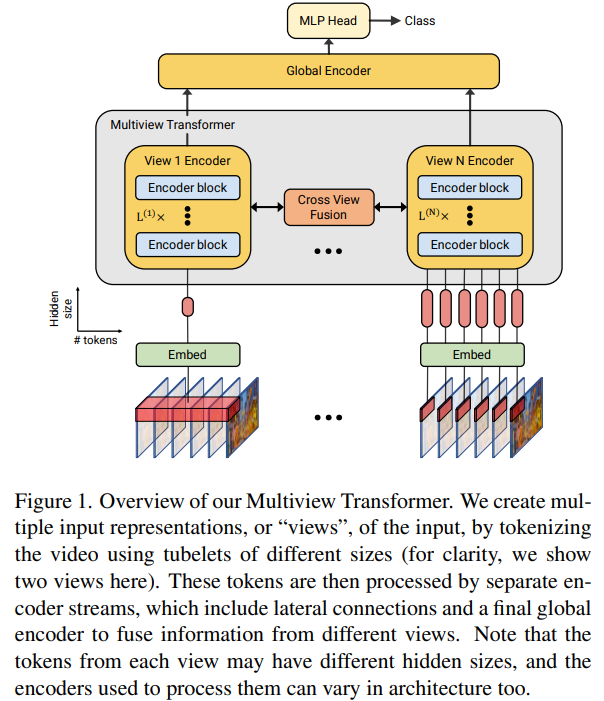

# Multiview Transformers for Video Recognition

> "Multiview Transformers for Video Recognition" CVPR, 2022 Jan
> [paper](http://arxiv.org/abs/2201.04288v4) [code](https://github.com/google-research/scenic/tree/main/scenic/projects/mtv) 
> [pdf](./2022_01_CVPR_Multiview-Transformers-for-Video-Recognition.pdf)
> Authors: Shen Yan, Xuehan Xiong, Anurag Arnab, Zhichao Lu, Mi Zhang, Chen Sun, Cordelia Schmid

## Key-point

- Task

- Problems

  transformer architectures have not explicitly modelled **different spatiotemporal resolutions** 窗口大小固定

- :label: Label:

设置多个不同窗口大小，去获取不同分辨率的时空信息，实现时用多个编码器提取特征，再融合


## Contributions

## Introduction


## methods

Multiview Transformer




定义 a view as a video representation expressed by a set of fixed-sized tubelets

- Motivation

  fine-grained motions can be captured by smaller tubelets whilst larger tubelets capture slowly-varying semantics


### cross-view fusion


根据后面实验，b）bottleneck 方式融合效果差不多


## Experiment

> ablation study 看那个模块有效，总结一下

- setting

  B/2+S/4+Ti/8 denotes a three-view model, where a “Base”, “Small”, and “Tiny” encoders, spatial patch size default 16x16


1. larger models to smaller tubelet sizes achieves the highest accuracy

   大模型用在小 tubelet 上更好

2. apply the same “Base” encoder to all views

   minimal accuracy difference 在大的 tubelet 上用小模型降低计算量也不降性能

3. 融合方式，CVA 效果和 bottleneck 差不多，反而计算量、参数量更大


CVA 在不同层融合的差异


**使用多个 view 收益比增加模型深度更有用**

achieve substantial accuracy by adding more views, and this improvement is larger than that obtained by adding more layers to a single encoder


对比 ViViT（当时 sota)


SOTA 比较


### Code

> [MTVClassification Model define](https://github.com/google-research/scenic/blob/1963df79aad2fa2bc5fb2184dd9bbc8761e27e84/scenic/projects/mtv/model.py#L677)

pySlowFast 使用 jax 框架，继承 `class BaseModel` ，在其 `__init__` 调用 `self.flax_model = self.build_flax_model()` 执行模型初始化 

pySlowFast 调用流程范例

```python
model_cls = model_lib.models.get_model_cls('fully_connected_classification')
model = model_cls(config, dataset.meta_data)
flax_model = model.build_flax_model  # BaseModel 里面初始化了
dummy_input = jnp.zeros(input_shape, model_input_dtype)
model_state, params = flax_model.init(
    rng, dummy_input, train=False).pop('params')

# 调用
variables = {'params': params, **model_state}
logits, new_model_state = flax_model.apply(variables, inputs, ...)
```


> [class MTV](https://github.com/google-research/scenic/blob/1963df79aad2fa2bc5fb2184dd9bbc8761e27e84/scenic/projects/mtv/model.py#L377)

不同 view 设置使用不同 encoder，`B/2+S/4+Ti/8`

```
MODEL_SIZE_ORDER = ['Ti', 'S', 'B', 'L', 'H']
HIDDEN_SIZES = {'Ti': 192, 'S': 384, 'B': 768, 'L': 1024, 'H': 1280}
MLP_DIMS = {'Ti': 768, 'S': 1536, 'B': 3072, 'L': 4096, 'H': 5120}
NUM_HEADS = {'Ti': 3, 'S': 6, 'B': 12, 'L': 16, 'H': 16}
NUM_LAYERS = {'Ti': 12, 'S': 12, 'B': 12, 'L': 24, 'H': 32}
PATCH_SIZES = {
    'Ti': (16, 16),
    'S': (16, 16),
    'B': (16, 16),
    'L': (16, 16),
    'H': (14, 14),
}
```

用不同的 3D 卷积提取特征 `(b T N C)`

统一不同 view 的 temporal dim

```python
  def _align_temporal_dimension_across_views(
      self, tokens: Sequence[jnp.ndarray]) -> List[jnp.ndarray]:
    """Reshapes tokens from each view so they have the same temporal dim."""
    min_temporal_dim = min(self.input_token_temporal_dims)
    outputs = []
    for t in tokens:
      bs, time, n, c = t.shape
      outputs.append(
          t.reshape(bs, min_temporal_dim, (n * time) // min_temporal_dim, c))
    return outputs
```


## Limitations

## Summary :star2:

> learn what & how to apply to our task

