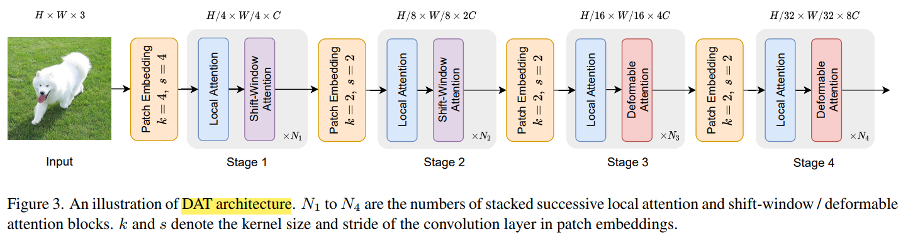

# Vision Transformer with Deformable Attention

> "Vision Transformer with Deformable Attention" CVPR, 2022 Jan, DAT
> [paper](https://arxiv.org/abs/2201.00520) [code](https://github.com/LeapLabTHU/DAT) [blog_explanation](https://zhuanlan.zhihu.com/p/497432647) [code_improvement](https://github.com/lucidrains/deformable-attention/blob/main/deformable_attention/deformable_attention_2d.py)
> [paper local pdf](./2022_01_CVPR_Vision-Transformer-with-Deformable-Attention.pdf)

## **Key-point**

- Task: Transformer Attention

- Motivation

  Dense Attention(ViT) 增大感受野计算量大，Sparse Attn(Swin) 的感受野与数据无关，只是分 patch。本文提出了一个可变形的 attn 能够更好提取数据特征

  > learning sparse-attention patterns in a data-dependent way

- **deformable attention serves as a feature extractor**


## **Contributions**

- 可变形卷积改进到 Transformer && relative positional embedding


## **Related Work**

- "Swin Transformer: Hierarchical Vision Transformer using Shifted Windows"

  [paper](https://arxiv.org/abs/2103.14030)


### basic

**Layer Normalization**

> [blog](https://www.pinecone.io/learn/batch-layer-normalization/)

对 batch 里面每个数据单独计算均值方差，做归一化


**depth-wise convolution**

>[doc](https://medium.com/@zurister/depth-wise-convolution-and-depth-wise-separable-convolution-37346565d4ec) :+1:


break the filter and image into three different channels and then convolve the corresponding image with corresponding channel and then stack them back. **need three different filters — one for each channel.**

参数量和普通卷积一样， 但可以有 3 个输出通道


**CutMix**

> [blog](https://sarthakforwet.medium.com/cutmix-a-new-strategy-for-data-augmentation-bbc1c3d29aab)


## **methods**

### Deformable Attn


1. 用输入特征图 X 先计算 Query,  有一个网络学习偏移量 $\triangle p$

2. 将 query 加上偏移量后，**取 X 特征图中最近的四个点在做加权平均（其余点更新后的特征 = 0）**，得到更新后的特征图 $\tilde{x}$ 去计算 Key, Value

3. 得到原始 Query, 用 query 学到的偏移更新后的 Key, Value ; && 计算 `Deformable relative position bias` 计算 MHSA
   $$
   z^{(m)} = Softmax(\frac{q \cdot \tilde{k}^T}{\sqrt{d}} + \phi(\hat{B}, R)) \cdot \tilde{v}
   $$

follow MHSA 按 channel 维度分为多个 group，**各个group用共享的一个 offset 网络**


### Deformable relative position bias

Swin Transformer 对于 $H \times W$ 的特征图，两个坐标的偏移范围 $[-H, H] ,\cdots$ ，构造一个相对偏置矩阵 （离散）$\hat{B} \in R^{(2H−1)×(2W−1)}$；
DAT 中限制了偏移范围为 $[-1, 1]$，有个偏移矩阵 R，插值对应到相对偏置矩阵 $\hat{B}$

在 MHSA 注意力里面加上了这个偏移矩阵，**理解为对 QK 出来的权值矩阵进一步加上偏移**

> 理解：DAT 用了两层偏移
>
> 1. 对于 self-attn 里面的 KV 加上了 query 通过网络得到偏移
> 2. position embedding 对 qkv 结果进一步加偏移


### DAT model



为了抽取 multi-scale 特征，经典的 pyramid 网络；后面 2 个 stage 采用 Deformable Attn


## **Experiment**

> ablation study 看那个模块有效，总结一下

- 在 ImageNet 和 object detection dataset 效果优于 Swim-Transformer 0.7 Acc, 0.8 mAP

### Ablation Study

- deformable offsets and deformable relative position embeddings

  前两个 stage 用 Swin-Transformer shifted-window attn，提出的 deformable offsets 或者 relative position embeddings 只用一个就有 0.3 Acc 提升

- 一共 4 个 stage 在哪些 stage 用 Deformable attn

  发现需要前两个 stage 用 shift-window attention of Swin Transfomer 提取局部特征

- maximum offset s=2


## Code

- 常见卷积

  > 输入 16 通道，输出 32 通道, kernel_size=(3,3) 卷积为例子

  - 普通 Conv2d

    需要 $32*(16*3*3) = 4068$ 个参数

  - 深度可分离卷积

    每一个通道用一个 filter 卷积之后得到对应一个通道的输出，然后再进行信息的融合。

    - 优点：减少了所需要的参数 & 同时考虑通道和区域改变，实现了通道和区域的分离。卷积先只考虑区域，然后再考虑通道。

    1. 输入 16 通道特征图的每一层，用一个 2D 卷积（卷积核通道数 =1）出一张图，[16,w,h]
    2. 转化到 32 通道：用 32 个 c=16, kernel_size=(1,1) 的 1x1 卷积

    $16*(3*3) + 32*(16*1*1) = 656$

  - 组卷积

    **对输入 tensor 按通道分组**，$c_1=16, c_2=32$ 每组里面卷积核深度=$c_1 / group$，每组卷积核个数 $c_2/group$，参数量 $g=2$, $g * (c_2/g * (c_1/g)*3*3) = 2304$

    - 特点
      1. 在实际实验中同样的网络结构下，这种分组的卷积效果是好于未分组的卷积的效果的

    

    


- **Deformable Transformer 小结 :star:**

  1. 输入过一个 1x1 Conv 得到 Query

  2. 将输入特征通过 downsample 划分例如 16x16 的格子，每个代表一个采样点

     - query 过 offset 预测网络生成 2D x,y 坐标偏移
     - `meshgrid` 生成每个格子的坐标

  3. 加上偏移的坐标，去原始特征图取对应坐标的特征，这一部分 16x16 特征作为 $\tilde{x}$
     `F.grid_sample(group(x), vgrid_scaled, mode = 'bilinear', padding_mode = 'zeros', align_corners = False)`

     - 计算 Key, Value

     - 计算 `continuous positional bias` 

       > 看 SwimV2 Positional Bias，大致是`sign()*log(1+abs())` 过 MLP

  4. MHSA 多头自注意力

     最后 concat 每个 group


### `rel_pos_bias`

> Referenced by `continuous positional bias from SwinV2`

实现 $\phi(\hat{B};~R)$  

```
rel_pos_bias = self.rel_pos_bias(grid_scaled, vgrid_scaled)  # $\phi(\hat{B};~R)$
```

输出 `[1,8,4096,256]` 


- 保持数值稳定

  `torch.amax(x, dim)` 返回 dim 维度的各个最大值

  ```
  sim = sim - sim.amax(dim = -1, keepdim = True).detach()
  ```

  


## **Limitations**

## **Summary :star2:**

> learn what & how to apply to our task

- Deformable 卷积对于单张图像，将 reference points 通过学习地偏移，更好地迁移到 "物体" 上

  针对多张图交互