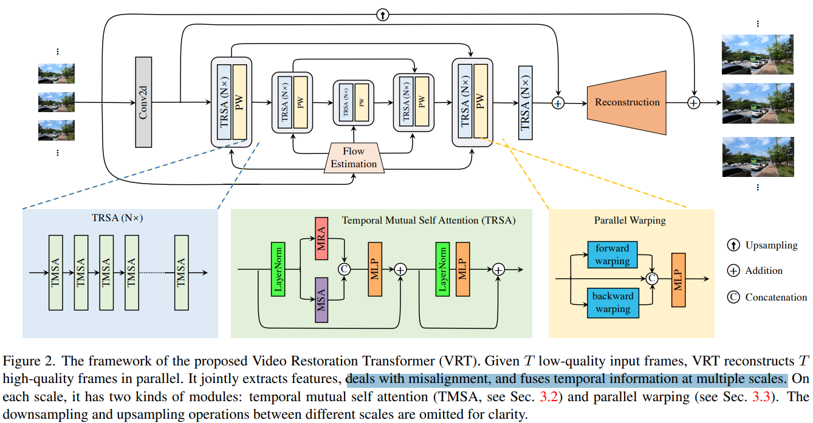

# VRT: A Video Restoration Transformer

> "VRT: A Video Restoration Transformer" TIP, 2022 Jan 28
> [paper](http://arxiv.org/abs/2201.12288v2) [code](https://github.com/JingyunLiang/VRT) [pdf](./2022_01_TIP_VRT--A-Video-Restoration-Transformer.pdf) [note](./2022_01_TIP_VRT--A-Video-Restoration-Transformer_Note.md)
> Authors: Jingyun Liang, Jiezhang Cao, Yuchen Fan, Kai Zhang, Rakesh Ranjan, Yawei Li, Radu Timofte, Luc Van Gool (ETH + Meta)

## Key-point

- Task: VSR, video deblur, denoise, VFI, space-time VSR

- Problems

  - 先前工作依赖 recurrent & sliding window，没有长时序能力

    > Existing deep methods generally tackle with this by exploiting a sliding window strategy or a recurrent architecture, which either is restricted by frame-by-frame restoration or lacks longrange modelling ability

- :label: Label:

## Contributions

- More specifically, VRT is composed of multiple scales, each of which consists of two kinds of modules: **temporal mutual self attention (TMSA) and parallel warping.**
-  To enable **cross-clip interactions**, the video sequence is shifted for every other layer
- SOTA


## Introduction


## methods

> - Unet https://github.com/JingyunLiang/VRT/blob/94a5f504eb84aedf1314de5389f45f4ba1c2d022/models/network_vrt.py#L1580



Attention 改成了两个分支，加了一个类似 ConvLaer 的东西 warp 一下更新的特征

一开始用 Conv2d 逐帧提取特征，用 UNet 结构处理 multi-scale 的特征，最后逐帧出图，搞了一个 resized LR 的全局残差；

> At the beginning, we extract shallow features I SF ∈ R T ×H×W×C by a single spatial 2D convolution from the LQ sequence I LQ.
>
> After feature extraction, we reconstruct the HQ frames from the addition of shallow feature $I^{SF}$ and deep feature $I^{DF}$. Different frames are **reconstructed independently** based on their corresponding features.

发现 Video deblur 用一层 Conv 还原 RGB 就够了；x4 SR 用 Conv2d 夹着两层 PixelShuffle :star:


### ConvOut

发现 Video deblur 用一层 Conv 还原 RGB 就够了；x4 SR 用 Conv2d 夹着两层 PixelShuffle :star:

>  For video SR, we use the **sub-pixel convolution layer [79]** to upsample the feature by a scale factor of s.
>
> https://github.com/JingyunLiang/VRT/blob/94a5f504eb84aedf1314de5389f45f4ba1c2d022/models/network_vrt.py#L1439

```python
            if self.upscale == 1:
                # video deblurring, etc.
                x = self.conv_first(x.transpose(1, 2))
                x = x + self.conv_after_body(
                    self.forward_features(x, flows_backward, flows_forward).transpose(1, 4)).transpose(1, 4)
                x = self.conv_last(x).transpose(1, 2)
                return x + x_lq
            else:
                # video sr
                x = self.conv_first(x.transpose(1, 2))
                x = x + self.conv_after_body(
                    self.forward_features(x, flows_backward, flows_forward).transpose(1, 4)).transpose(1, 4)
                x = self.conv_last(self.upsample(self.conv_before_upsample(x))).transpose(1, 2)
                _, _, C, H, W = x.shape
                return x + torch.nn.functional.interpolate(x_lq, size=(C, H, W), mode='trilinear', align_corners=False)
```

用 Conv2d 逐帧提取特征

```
self.conv_first = nn.Conv3d(conv_first_in_chans, embed_dims[0], kernel_size=(1, 3, 3), padding=(0, 1, 1))
```


发现 **Video deblur** 用一层 Conv 还原 RGB 就够了 :star:

>  For video deblurring, a single convolution layer is enough for reconstruction. Apart from this, the architecture designs are kept the same for all tasks.
>
> https://github.com/JingyunLiang/VRT/blob/94a5f504eb84aedf1314de5389f45f4ba1c2d022/models/network_vrt.py#L1372

```python
        # reconstruction
        if self.pa_frames:
            if self.upscale == 1:
                # for video deblurring, etc.
                self.conv_last = nn.Conv3d(embed_dims[0], out_chans, kernel_size=(1, 3, 3), padding=(0, 1, 1))
            else:
                # for video sr
                num_feat = 64
                self.conv_before_upsample = nn.Sequential(
                    nn.Conv3d(embed_dims[0], num_feat, kernel_size=(1, 3, 3), padding=(0, 1, 1)),
                    nn.LeakyReLU(inplace=True))
                self.upsample = Upsample(upscale, num_feat)
                self.conv_last = nn.Conv3d(num_feat, out_chans, kernel_size=(1, 3, 3), padding=(0, 1, 1))
        else:
            num_feat = 64
            self.linear_fuse = nn.Conv2d(embed_dims[0]*img_size[0], num_feat, kernel_size=1 , stride=1)
            self.conv_last = nn.Conv2d(num_feat, out_chans , kernel_size=7 , stride=1, padding=0)
```

x4 SR，先做一次 Conv2d + Relu，再做两次 PixelSuffle，最后再做一次 Conv2d

```python
class Upsample(nn.Sequential):
    """Upsample module for video SR.

    Args:
        scale (int): Scale factor. Supported scales: 2^n and 3.
        num_feat (int): Channel number of intermediate features.
    """

    def __init__(self, scale, num_feat):
        assert LooseVersion(torch.__version__) >= LooseVersion('1.8.1'), \
            'PyTorch version >= 1.8.1 to support 5D PixelShuffle.'

        class Transpose_Dim12(nn.Module):
            """ Transpose Dim1 and Dim2 of a tensor."""

            def __init__(self):
                super().__init__()

            def forward(self, x):
                return x.transpose(1, 2)

        m = []
        if (scale & (scale - 1)) == 0:  # scale = 2^n
            for _ in range(int(math.log(scale, 2))):
                m.append(nn.Conv3d(num_feat, 4 * num_feat, kernel_size=(1, 3, 3), padding=(0, 1, 1)))
                m.append(Transpose_Dim12())
                m.append(nn.PixelShuffle(2))
                m.append(Transpose_Dim12())
                m.append(nn.LeakyReLU(negative_slope=0.1, inplace=True))
            m.append(nn.Conv3d(num_feat, num_feat, kernel_size=(1, 3, 3), padding=(0, 1, 1)))
        elif scale == 3:
            m.append(nn.Conv3d(num_feat, 9 * num_feat, kernel_size=(1, 3, 3), padding=(0, 1, 1)))
            m.append(Transpose_Dim12())
            m.append(nn.PixelShuffle(3))
            m.append(Transpose_Dim12())
            m.append(nn.LeakyReLU(negative_slope=0.1, inplace=True))
            m.append(nn.Conv3d(num_feat, num_feat, kernel_size=(1, 3, 3), padding=(0, 1, 1)))
        else:
            raise ValueError(f'scale {scale} is not supported. ' 'Supported scales: 2^n and 3.')
        super(Upsample, self).__init__(*m)
```


### corss-"clip"

这里定义的 clip 是两帧一个 clip。。。。还是没出去一个 scene；

相邻 clip 的两帧，每次移动一帧，换个 clip 待一下。。。


### Temporal Mutual Self Attention(TMSA)

> https://github.com/JingyunLiang/VRT/blob/94a5f504eb84aedf1314de5389f45f4ba1c2d022/models/network_vrt.py#L728


> Mutual attention is proposed for joint feature alignment between two frames. To extract and preserve feature from the current frame, we use mutual attention together with self attention. Let X ∈ R 2×N×C represent two frames

一个 X 是 2 帧的一个小 clip。。。拆成 Reference 一帧，source 一帧（互换做两次 CrossAttn） ，原始 X 做一次 Self-Attn，一起 Concat 起来过 MLP。。。


- Q：mutual attention 是啥？

**Mutual Attention** 就是一个普通的 cross-attn。。。一个 clip 的两帧，一个作为 reference 一个作为 source 做 Cross-Attn，顺序互换一下又可以再做一次，叫做 Mutual；

直接做 T 帧复杂度太高，Attention 实现用的 SwinTransformer， $O(T^2) \to O(T)$

> One naive way to extend Eq. (6) for T frames is to deal with frame-to-frame pairs exhaustively, resulting in the computational complexity of O(T 2 ). Inspired by the shifted window mechanism [59, 60], we propose the temporal mutual self attention (TMSA) to remedy the problem. TMSA first partitions the video sequence into nonoverlapping 2-frame clips and then applies Eq. (6) to them in parallel.


attention mask

> https://github.com/JingyunLiang/VRT/blob/94a5f504eb84aedf1314de5389f45f4ba1c2d022/models/network_vrt.py#L499


### Parallel Warping

光流 warp 一下嘛。。。

把自身特征，forward，backward 特征 (b t c h w) 在 C 上 concat 起来，过 MLP

> https://github.com/JingyunLiang/VRT/blob/94a5f504eb84aedf1314de5389f45f4ba1c2d022/models/network_vrt.py#L1103C22-L1103C29

这里 MLP 模块参考 "GLU Variants Improve Transformer" 分别用**一个MLP 去得到权重，去更新另一个 MLP 得到的特征** :star:

```python
class Mlp_GEGLU(nn.Module):
    """ Multilayer perceptron with gated linear unit (GEGLU). Ref. "GLU Variants Improve Transformer".

    Args:
        x: (B, D, H, W, C)

    Returns:
        x: (B, D, H, W, C)
    """

    def __init__(self, in_features, hidden_features=None, out_features=None, act_layer=nn.GELU, drop=0.):
        super().__init__()
        out_features = out_features or in_features
        hidden_features = hidden_features or in_features

        self.fc11 = nn.Linear(in_features, hidden_features)
        self.fc12 = nn.Linear(in_features, hidden_features)
        self.act = act_layer()
        self.fc2 = nn.Linear(hidden_features, out_features)
        self.drop = nn.Dropout(drop)

    def forward(self, x):
        x = self.act(self.fc11(x)) * self.fc12(x)
        x = self.drop(x)
        x = self.fc2(x)

        return x
```


### Loss

- Charbonnier loss


## setting

## Experiment

> ablation study 看那个模块有效，总结一下

### x4 SR


挑的。。这么模糊跟生成没啥区别了。。


### denoise/deblur

- DVD
- GoPro


### ablation

- 最后加上 8x8 的 scale 提点用处几乎没区别了。。
-  光流虽然垃圾，稍微比加一个 scale 好一点
- T 只有 4 帧效果很有限的。。。T=8 稍微好点


## Limitations

## Summary :star2:

> learn what

- Video Denoise  用一层 Conv2d 还原特征 ok 了
- （x, forward 光流 warp 特征，backward 特征） 3 个特征过 MLP 模块，参考 "GLU Variants Improve Transformer" 分别用**一个MLP 去得到权重，去更新另一个 MLP 得到的特征** :star:


### how to apply to our task

- 整理好了 testset 数据集 :+1:
- 自己从头训练 UNet 最后加上 8x8 的 scale 提点用处几乎没区别了。。
-  光流虽然垃圾，稍微比加一个 scale 好一点
- T 只有 4 帧效果很有限的。。。T=8 稍微好点
