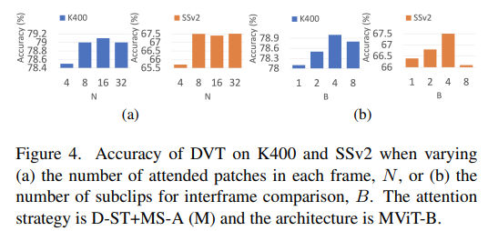

# Deformable Video Transformer

> "Deformable Video Transformer" Arxiv, 2022 Mar
> [paper](http://arxiv.org/abs/2203.16795v1) [code]() 
> [pdf](./2022_03_Arxiv_Deformable-Video-Transformer.pdf)
> Authors: Jue Wang, Lorenzo Torresani

## Key-point

- Task

- Problems

  These fixed attention schemes not only have high computational cost but, by comparing patches at predetermined locations, they neglect the motion dynamics in the video.

- :label: Label:

## Contributions

## Introduction

**复杂度**

Exhaustive comparison of all space-time pairs of patches in a video is not only prohibitively costly but also highly redundant.

limit the temporal attention to compare only pairs of patches in different frames but at the same spatial location

不同帧的 patch 可能找不到对应，拍摄视频在之后没出现，用 motion 信息有限

`Video Swin transformer` 只在预先固定的区域做 attention。

## methods

### Deformable Space-Time Attention (D-ST-A)

$\alpha_s$​ 为可学习的权重：$m_s^{t,t^\prime}$ 为收集从 t 到 t1 的运动信息 MD 通过可学习矩阵映射得到；这个权重也可以通过 QK 点乘得到

> While the self-attention coefficients could also be obtained by means of a traditional dot-product between queries and keys

$v_s(n)$ 为加入了 offset 的特征，在 offset 对应的 patch 上通过 bilinear 插值提取的特征。这个 offset 的计算使用 Q 和 h264 视频中存储的运动信息  motion displacements (MD) 学习得到。

发现问题：两帧之间间隔太多，mt,t′ s become noisy proxies of motion paths when the temporal distance (t − t ′ ) between the two frames is large》》按 B 帧分为 sub-clip. 在计算 D-ST-A 时候的 V 只用同一个 sub-clip 的 v

### Deformable Multi-Scale Attention (D-MS-A)

用 3D 卷积对特征 q 处理，得到多尺度特征，用 D-ST-A 做

得到多个更新后的特征，分别验证了两种 fusion layer: MLP or MLP-Mixer。

## Experiment

> ablation study 看那个模块有效，总结一下

- Video Classification 任务数据集：Kinetics-400, Something-Something-V2, EPIC-KITCHENS-100, Diving-48 

### **对比 SOTA**

The larger gain on SSv2 compared to K400 suggests that our model beneficially leverages the motion cues to capture relevant temporal dependencies

#### 运动信息

光流最理想，但需要额外计算量

1.  RGB residuals (RGB-Rs) & motion displacements (MDs)
2. Averaged Pooled RGB” (Avg-P-RGB) averages the RGB values of the patches in query position s between all frames between time t and time t ′
3. RGB Differences” (RGB-D)
4. TV-L1 Optical Flow

### Attention and fusion blocks

D-ST+MS-A  (M): M 代表 MLP-Mixer, L 代表 MLP

1. 融合使用 MLP-Mixer 相比 MLP 更好

   MLP-Mixer projects the features into a higher dimensional space with a non-linear activation function, which allows better channel-wise communication compared to the linear pro

2. **同时使用多尺度特征能够提升性能**

### Number of patches in the deformable attention & sub-clips in D-ST-A

the accuracy tends to level off after N = 8. This confirms that the frames in the **video contain highly redundant information** and that it is sufficient to attend a small number of patches to achieve strong accuracy

sub-clip 帧数：对当前窗口，再分 sub-clips，B帧为一块。Each sub-clip contains T ′ = T /B frames. T=16.  see that the best accuracy is achieved for B = 4； D-ST-A compares only frames belonging to the same sub-clip.

可视化结果

## Limitations

1. motions clues 需要额外从视频文件提取。
2. 相比 Video Swin Transformer 参数来更大

## Summary :star2:

> learn what & how to apply to our task

1. 使用多尺度融合，能提升性能。且融合方式使用 MLP-Mixer 相比 MLP 更好
