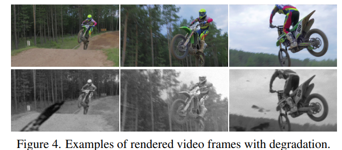

# Bringing Old Films Back to Life

> "Bringing Old Films Back to Life" CVPR, 2022 Mar 31, `RTN` :fire:
> [paper](http://arxiv.org/abs/2203.17276v1) [code](https://github.com/raywzy/Bringing-Old-Films-Back-to-Life) [website](http://raywzy.com/Old_Film/) [pdf](./2022_03_CVPR_Bringing-Old-Films-Back-to-Life.pdf) [note](./2022_03_CVPR_Bringing-Old-Films-Back-to-Life_Note.md)
> Authors: Ziyu Wan, Bo Zhang, Dongdong Chen, Jing Liao

## Key-point

- Task: video restoration
- Problems
  - 退化类型更复杂

- :label: Label:

老电影分辨率过低，存在退化问题（灰尘遮挡、划痕噪声，颜色缺失等问题)。人工修复成本太大，利用自动化方式对老电影进行修复，提升老电影观感质量。


## Contributions

- unify the entire film restoration tasks with a single framework in which we conduct spatio-temporal **restoration and coloarization**.

  1. **the memorization nature of recurrent modules** benefits the temporal coherency whereas the **long-range modeling capability of transformers** helps the spatial restoration
  2. 上色：模仿人工方式，对一帧上色，然后 propagated 到其他帧

- bi-directional RNN 累计前后相邻帧的信息，减少 flickering。recurrent module 输出的 hidden_state embedding 表示场景内容

  1. 保持 temporal consistency 前后帧一致，避免 flickering
  2. 实现 occluded 区域只要在别的帧出现过，能够复原出来
  3. structured defects (划痕) can be localized 刚出现的地方前后帧差别很大

  - :grey_question: 为啥用 bidirectional：由于 flickering 问题，需要结合长时间的序列分析，因此用 bidirectional 信息

- `Swin Transformer ` 实现不同位置像素的信息交换，提升 restore mixed degradation 的效果，缓解 frame alignment 的问题


## Introduction

- Image restoration

  only focus on a single type of degradation. 无法应对真实场景的多种 degradation 同时出现的情况

- Video Restoration

  > [EF2GVI Video Inpainting](https://github.com/MCG-NKU/E2FGVI)

  1. denoising, deblurring, super-resolution 生成效果有限
  2. video inpainting 需要指定 mask 的区域，在 old-films 中没有


**Old-film restoration**

- 传统方法去除 **structed artifacts**( scratches, cracks, etc.)：先目标检测，再加 inpainting pipline

  无法处理 photometric degradations (e.g., blurriness and noises)；以来手工特征检测 structed artifacts，没有理解内容


- Deepremaster

- temporal smoothing

  "Learning blind video temporal consistency" ECCV, 2018 Aug
  [paper](https://arxiv.org/abs/1808.00449)

  E-warp Loss as temporal consistency metrics

  相邻帧之间的短期 temporal loss
  $$
  \mathcal{L}_{st}=\sum_{t=2}^T\sum_{i=1}^N M_{t\Rightarrow t-1}^{(i)}\left\|O_t^{(i)}-\hat{O}_{t-1}^{(i)}\right\|_1
  $$
  $\hat{O}_{t-1}^{(i)}$ 为 ${O}_{t-1}$ 帧用下一帧到当前帧的反向光流 $F_{t\Rightarrow t-1}$ warp ；$ M_{t\Rightarrow t-1}^{(i)}$ 为原始输入视频

  光流用 FlowNet，bilinear 去 warp

  长期 temporal loss （5帧以上），每帧去和第一帧

- "BasicVSR: The Search for Essential Components in Video Super-Resolution and Beyond" CVPR, 2020 Dec
  [paper](https://arxiv.org/abs/2012.02181) [code](https://github.com/ckkelvinchan/BasicVSR-IconVSR) [website](https://ckkelvinchan.github.io/projects/BasicVSR/) [blog explanation](https://zhuanlan.zhihu.com/p/364872992)

- "Video Swin Transformer" CVPR, 2021 Jun
  [paper](https://arxiv.org/abs/2106.13230) [code](https://github.com/SwinTransformer/Video-Swin-Transformer?utm_source=catalyzex.com)

上色 Baseline

- DeepExemplar

  > "Deep Exemplar-based Video Colorization" CVPR, 2019 Jun
  > [paper](https://arxiv.org/abs/1906.09909) [code](https://github.com/zhangmozhe/Deep-Exemplar-based-Video-Colorization)
  > [local pdf](./2019_07_CVPR_Deep-Exemplar-based-Video-Colorization.pdf) [note](./2019_07_CVPR_Deep-Exemplar-based-Video-Colorization_Note.md)

Flow estimation

- RAFT


## methods


- Q：如何得到噪声的 mask？

在 RGB 空间，**当前和前一帧图像用 flow warp 一下，和前一帧图像减一下得到 RGB mask；**

具体看下下面传播的 code


- Q：咋传播？ :star: :star:

1. 生成首帧特征
2. 后续帧传播
   1. 前一帧 warped 到当前帧的特征：前一阵的特征用 flow warp 一下，得到`feat_prop`
   2. RGB 空间预测噪声 mask，前后帧 flow warp 后减一下得到 `residual_indicator`
   3. `Backward_Aggregation` 内部融合一下（前一帧 warped 到当前帧的特征，当前帧图像的特征），再过 `swintransformer` 得到当前帧特征

```
        # Backward Propagation
        rlt = []
        feat_prop = lrs.new_zeros(n, self.num_feat, h, w)
        residual_indicator = torch.zeros(n,1,h,w).cuda()
        for i in range(t-1, -1, -1):
            curr_lr = lrs[:, i, :, :, :]
            if i < t-1:
                flow = backward_flow[:, i, :, :, :]  # flow propagation
                feat_prop = flow_warp(feat_prop, flow.permute(0, 2, 3, 1))

                pixel_prop = flow_warp(lrs[:, i+1, :, :, :], flow.permute(0, 2, 3, 1))  # generate mask
                residual_indicator = torch.abs(pixel_prop[:,:1,:,:] - curr_lr[:,:1,:,:])

                feat_prop = self.backward_resblocks(self.Backward_Aggregation(feat_prop,curr_lr,residual_indicator,head=False))
            else:
                feat_prop = self.backward_resblocks(self.Backward_Aggregation(feat_prop,curr_lr,residual_indicator,head=True))
```


- 生成**首尾帧的初始特征**（backward 第 t 帧没有先前的特征！）

> 这一帧没有预测 mask ! :warning:

把 LQ 图像过**一层卷积**转换到特征维度 $C=3 \to 16$; & **外面再过 Swintransformer**

```python
feat_prop = self.backward_resblocks(self.Backward_Aggregation(feat_prop,curr_lr,residual_indicator,head=True))
```


- Q：`Backward_Aggregation` 内部怎么融合（前一阵特征，当前帧图像的特征）?


就是 framework 图左边部分，里面的那个公式；
$$
fea_{wapred} * x + fea_{current} * (1-x)
$$

> 已有 $fea_{wapred}$，RGB-space用光流预测的噪声mask，需要**预测一个当前帧特征 $fea_{current}$ 和融合权重 x**

- Q：当前帧特征 $fea_{current}$ 和融合权重 x 怎么得到？:star: 

**看下这个类的 forward，把 (先前特征，当前LQ 图像，使用光流在 RGB-space 预测的 mask) 融合** 

```python
# Hidden State Aggregation
self.Forward_Aggregation = Gated_Aggregation(hidden_channels=num_feat,kernel_size=3,padding=1)
```

已有前一帧 flow warped 过来的特征 `hidden_state`，RGB预测的噪声 mask `residual_indicator`;

1. 把 LQ 图像过一层卷积转换到 $C=3 \to 16$ ，作为**当前帧浅层的特征** `latent_feature`

2. **预测融合权重 x**

   把 flow-warped 特征 & 当前前层特征 & RGB噪声 mask 拼起来 `[hidden_state, latent_feature, residual_indicator]`，
   过一层 conv 实现 $C=16+16+1=33 \to 8$，再过 `LeakyReLU`，再过一层 conv 实现 $C=8 \to 1$，**再过 `sigmoid` 得到融合权重 x**

3. 融合 `x*hidden_state+(1-x)*latent_feature` 更新当前帧的特征；再到外面去用 swin-transformer 更新一下当前帧 :star: 

> 结合上面 `class Gated_Aggregation` 的 forward

```python
    def forward(self, hidden_state, curr_lr, residual_indicator, head = False, return_mask = False, return_feat = False):

        latent_feature = self.conv2d_projection_head(curr_lr)
        x = self.activation(self.conv2d_1(torch.cat([hidden_state, latent_feature, residual_indicator], dim=1)))
        x = self.sigmoid(self.conv2d_2(x))

        if return_mask:
            if head:
                if return_feat:
                    return (latent_feature, latent_feature)
                else:
                    return (latent_feature, x)
            else:
                if return_feat:
                    return (x*hidden_state+(1-x)*latent_feature, latent_feature)
                else:    
                    return (x*hidden_state+(1-x)*latent_feature, x)

        else:
            if head:
                return latent_feature
            else:
                return x*hidden_state+(1-x)*latent_feature
```


- Q：为什么还要去学一个 learnable mask，不直接用 optical flow 减出来的 mask?

> Learnable Guided Mask

1. 检测 artifact 的方式，训练数据难搞，检测效果不好
2. **有些 dirt 是透明的，还存在一些信息可以利用**

用一种动态加权方式进性结合

> 注意哦，当前生成 RGB mask 要在 L(AB) 灰度图上搞，因为只选了一个 channel 。。

```
pixel_prop = flow_warp(lrs[:, i-1, :, :, :], flow.permute(0, 2, 3, 1))
                residual_indicator = torch.abs(pixel_prop[:,:1,:,:] - curr_lr[:,:1,:,:])
```


### 小结

- 先用 **卷积 + optical flow 传播**的方式，得到一个大致修复的特征

  **用 RGB flow 可以搞出来一个噪声的 mask 哦！:star:**

- 再用 Spatial Transformer 修复一下，在当前帧内部实现远程的关联，但实验做下来比较有限

- 也发现光流也不是很准，因此去微调了一下 RAFT 光流模型

CNN 的 locality & pattern restoration 无法适用于很多 artifact 的情况。**此时提取的 RGB 光流（前后真对应像素的关系）会存在错误。**

> 确实不是很准！`range(-1,1)` 的图像，看一下 optical flow `min=-22` 。。。


### 生成 old-film 数据

1. Contaminant Blending
2. Quality Degradation

随机对视频帧中使用上面 2 种方式





- Q：**生成的噪声不是很真实啊。。和真实退化差距有点大；**

但是呢用光流在 RGB 预测的那个 mask 很有用哦，能解决掉大多数没见过的划痕；

看一个技术老师发我的一个真实退化；

- **发现把下面这个图 resize 到很小，几乎看不出来划痕了！Stable Diffusion 把全局图 resize 完加进去感觉有点希望！** :fire:


- Contaminant Blending

  **collect 1k+ texture templates** from the Internet, which are further augmented with random rotation, local cropping, contrast change, and morphological operations. Then we **use addition, subtract and multiply blending modes** with various levels of opacity∈ [0.6, 1.0] to combine the scratch textures with the natural frames.

- blurring, noise and unsharpness

  - Gaussian noise and speckle noise with σ ∈ [5, 50]
  - Isotropic and anisotropic Gaussian blur kernels
  - Random *downsampling and upsampling* with different interpolation methods
  - *JPEG compression* whose level is in the range of [40, 100].
  - *Random color jitter* through adjusting the brightness∈ [0.8, 1.2] and contrast∈ [0.9, 1.0].

**inject these defects randomly,** one observation of old films. **first define a set of template parameters for each video.** Then we further apply predefined parameters with slight perturbations on consecutive temporal frames to achieve more realistic rendering
随机将上述 DA 映射到随机的帧上，相邻帧之间用相同的 DA 组合 & 扰动


## setting

- 4 x 2080Ti >> 44G 显存

> **During optimization**, we randomly crop 256 patches from REDS [33] dataset and apply the proposed video degradation model on the fly.
>
> batchsiz=4, 4*2080Ti

- training set

  crop 256 patches from REDS [33] dataset and apply the proposed video degradation model on the fly

  **batchsize = 4, 4 卡 DDP, 训  2 天**

- Quantitative Comparison
  - DAVIS 视频 + 合成: 计算 PSNR, SSIM 等客观指标
  - 收集的 63 个真实老电影: 计算 NIQE, BRISQUE 指标


- GAN 方式训练! 看下 Loss

1. perceptual loss
2. Temporal-PatchGAN
3. hinge loss


## Experiment

> ablation study 看那个模块有效，总结一下


## Limitations

- Q：上色咋搞？

说使用作者先前的一个工作，对首帧上色，再传播，但代码没开源

- 部分划痕还是没去掉

- fail to distinguish the contaminant from the frame content

  存在**退化被错误识别为场景内容**，从而没有得到去除。例如黑色划痕被误识别为场景内的烟雾

- 一些烟雾被当作划痕，被去除掉了。。

- 生成的细节不是很好，模糊的情况下，生成的很垃圾

  - 对于 barely recognizable 的内容很难重建


## Summary :star2:

> learn what

### how to apply to our task

