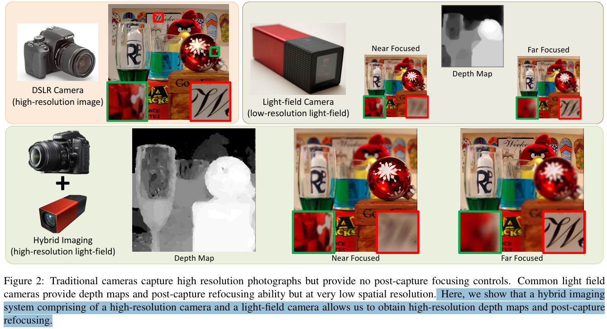

# Reference-based Video Super-Resolution Using Multi-Camera Video Triplets

> "Reference-based Video Super-Resolution Using Multi-Camera Video Triplets" CVPR, 2022 Mar 28, `RefVSR`
> [paper](http://arxiv.org/abs/2203.14537v1) [web](https://junyonglee.me/projects/RefVSR/) [code](https://github.com/codeslake/RefVSR) [pdf](./2022_03_CVPR_Reference-based-Video-Super-Resolution-Using-Multi-Camera-Video-Triplets.pdf) [note](./2022_03_CVPR_Reference-based-Video-Super-Resolution-Using-Multi-Camera-Video-Triplets_Note.md)
> Authors: Junyong Lee, Myeonghee Lee, Sunghyun Cho, Seungyong Lee

## Key-point

- Task: RefVSR
- Problems
- :label: Label:

## Contributions

- To facilitate the fusion and propagation of temporal reference features, we propose a propagative temporal fusion module.
- we present the first RefVSR dataset consisting of triplets of ultra-wide, wide-angle, and telephoto videos concurrently taken from triple cameras of a smartphone.
- SOTA


## Introduction

手机上多个不同焦距的相机，做超分

> In a triple camera setting, each ultra wide, wide-angle, and telephoto camera has a different field of view (FoV) and optical zoom factor. 
>
> One advantage of such configuration is that, compared to an ultra-wide camera, a wide-angle camera captures a subject with more details and higher resolution, and the advantage escalates even further with a telephoto camera. A question naturally follows is why not leverage higher-resolution frames of a camera with a longer focal length to improve the resolution of frames of a camera with a short focal length.

### RefSR(img)

- "Improving Resolution and Depth-of-Field of Light Field Cameras Using a Hybrid Imaging System" ICCP-2014, `Hybrid-Imager`
  https://www.researchgate.net/publication/269302249_Improving_resolution_and_depth-of-field_of_light_field_cameras_using_a_hybrid_imaging_system

提供后处理控制焦距、高精度 depth map

>  Here, we show that a hybrid imaging system comprising of a high-resolution camera and a light-field camera allows us to obtain **high-resolution depth maps and post-capture refocusing.**




- "Crossnet: An end-to-end reference-based super reso lution network using cross-scale warping" ECCV-2018


- " Learning cross-scale cor respondence and patch-based synthesis for reference-based super-resolution" BMCV-2019


- " Image super-resolution by neural texture transfer" CVPR-2019


- "Robust reference-based super-resolution with similarity-aware de formable convolution" CVPR-2020 

  https://openaccess.thecvf.com/content_CVPR_2020/papers/Shim_Robust_Reference-Based_Super-Resolution_With_Similarity-Aware_Deformable_Convolution_CVPR_2020_paper.pdf


- "Feature representation matters: End-to-end learning for reference-based image super-resolution" ECCV-2020


- "Learning texture transformer network for image super-resolution" CVPR-2020


- "Dual-Camera Super-Resolution with Aligned Attention Modules" ICCV oral, 2021 Sep, DCSR
  [paper](https://arxiv.org/abs/2109.01349) [code](https://github.com/Tengfei-Wang/DCSR) [web](https://tengfei-wang.github.io/Dual-Camera-SR/index.html) [pdf](./2021_09_ICCV_oral_Dual-Camera-Super-Resolution-with-Aligned-Attention-Modules.pdf) [note](./2021_09_ICCV_oral_Dual-Camera-Super-Resolution-with-Aligned-Attention-Modules_Note.md)

> However, it has not been explored yet to utilize a Ref video for video super-resolution (VSR)


对齐的多个 LR 视频（手机上的多个镜头）一起做 VSR

> Applying RefVSR for a video captured in an asymmetric multi-camera setting requires consideration of the unique relationship between LR and Ref frames in multi-camera videos. In the setting, a pair of LR and Ref frames at each time step shares almost the same content in their overlapped FoV (top and middle rows of the leftmost column in Fig. 1).


先前 Ref-Img SR 方法做全局的相似度匹配

> In previous RefSR approaches [26, 28, 29, 32], global matching has been a common choice for establishing nonlocal correspondence between a pair of LR and Ref images.


## methods

## setting

## Experiment

> ablation study 看那个模块有效，总结一下

## Limitations


## Code

- Q：dataset download?

> https://github.com/codeslake/RefVSR/issues/15
>
> zip 10G segment https://www.dropbox.com/scl/fo/0kf9tujv5dwz603lv0fq6/AFIY6jzo1lq3xSvJYeO7McU?rlkey=ylyrqpctm2884ew0ywnc6ubp5&e=2

combine all segments

```python
 zip -FF RealMCVSR.zip --out RealMCVSR.zip.fixed
```


## Summary :star2:

> learn what

### how to apply to our task

