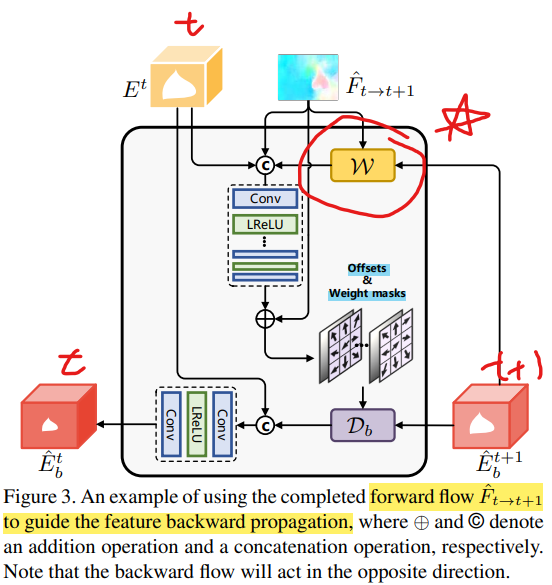

# Towards An End-to-End Framework for Flow-Guided Video Inpainting

> "Towards An End-to-End Framework for Flow-Guided Video Inpainting" CVPR, 2022 Apr, **E2FGVI** :star:
> [paper](https://arxiv.org/abs/2204.02663) [code](https://github.com/MCG-NKU/E2FGVI) [explanation_author](https://zhuanlan.zhihu.com/p/597094058)
> [paper local pdf](./2022_04_CVPR_E2FGVI_Towards-An-End-to-End-Framework-for-Flow-Guided-Video-Inpainting.pdf)

## **Key-point**

End2end & optical-flow based video inpainting methods


**Contributions**

- 效果 SOTA
- End2End 更高效，相较先前方法提速 15x，更低 FLOPS


## **Related Work**

先前工作可以分为 3 阶段：**optical completion** 填补损坏区域的 optical flow；**pixel propagation** 填补区域；**hallucination** 用 image inpainting 方法填充缺损的区域

1. 各个阶段用了很多 hand-crafted operation。多阶段存在误差累计：早期阶段产生的误差会影响候后续 pixel propagation 阶段，放大了误差。
2. 许多操作无法用 GPU 加速，耗时
3. hallucination 阶段用 image inpainting 预训练模型，每一帧之间不一致

**针对上述问题，E2FGVI 使用 End2End 方式组合各个模块**

1. optical flow 只做一步 completion
2. propagation process at the feature space 传播 feature 代替 pixel & 增加更多可学 offset 减轻 optical flow 的误差。
3. 用 **temporal-focal transformer** 模拟大跨度的一致性


- "Focal Self-attention for Local-Global Interactions in Vision Transformers" NeurIPS, 2021 Jul
  [paper](https://arxiv.org/abs/2107.00641) [code](https://github.com/microsoft/Focal-Transformer) [video-explanation](https://www.youtube.com/watch?v=YH319yyeoVw)

  > E2FGVI baseline modified


## **methods**

> - [ ] local neighboring frames, non-local reference frames 如何选取
> - [ ] AutoEncoder?
> - [ ] Content hallucination 里面 soft split?


End2end model，分解为 `flow completion`, `feature propagation`, `content hallucination` 模块。需要处理的 frames 先用每一帧用 Encoder 转到特征空间的 latent code。将图像 resize 到 latent code 相同尺寸，进行 flow completion（微调了光流预测网络，具有预测光流的效果）。每一帧维护一个特征，融合光流和前后帧特征，更新当前帧的特征

- Input frames
  Training: local neighboring frames 选取连续的 5 帧，non-local reference frames 在整个视频范围随机取 3 帧

  > Testing: use a sliding window with the size of 10 to get local neighboring frames and uniformly sample the non-local neighboring frames with a sampling rate of 10


### **Flow completion**

先将 frame 下采样到 $1/4$ size，与 latent code 尺寸匹配。
用一个轻量的光流预测网络，预测 i,j 帧，前向 & 后向的光流。网络用预训练的参数初始化，之后针对 masked 区域，**设计 L1 loss 去使得网络有 flow completion 能力**
$$
L_{flow} = \sum_{t=1}^{T}{\vert\vert \hat{F}_{t\to t+1} - {F}_{t\to t+1} \vert\vert} + \sum{反向}
$$

#### SPyNet


### Flow-guided feature propagation

> 看作是 local adjacent frames 的信息
>
> - SPyNet 预测光流
>   "Optical flow estimation using a spatial pyramid network."

每一帧保存一个 latent code，前向后向逐帧更新，逐渐更新 latent code 。

针对 flow error, 用一个 filter 过滤一下。

更新 $E^{t}$: 将当前 code 、过滤后的 t+1 帧特征、$F_{t\to t+1}$ 一起**得到 weight & Flow 的偏移**

> 融合：Db denotes the operation of the deformable convolution

- bi-directional: 前后向分别有个 更新的特征，用 $1 \times 1$ Conv 融合




### Temporal focal transformer

> the corrupted content at local neighbors may appear in the **non-local ones**
>
> - Focal Transformer
>   "Focal Self-attention for Local-Global Interactions in Vision Transformers" NIPS, 2021 Jul, `Focal Transformer`
>   [paper](https://arxiv.org/abs/2107.00641) [code](https://github.com/microsoft/Focal-Transformer)
>   [note](./2021_07_NeurIPS_Focal-Self-attention-for-Local-Global-Interactions-in-Vision-Transformers_Note.md)
>   
>   
>   
> - soft split operation & F3N 模块连接多个 patches :question:
>   "FuseFormer: Fusing Fine-Grained Information in Transformers for Video Inpainting" ICCV, 2021 Sep
>   [paper](https://arxiv.org/abs/2109.02974) [code](https://github.com/ruiliu-ai/FuseFormer?utm_source=catalyzex.com)

- Motivation
  不用传统的 ViT ，**用修改的 Focal Transformer 融合 local & non-local 信息**（concat 的 local 和 reference 帧）

  - the computational and memory cost
  - 实现 the fine-grained self-attention only in local regions while the coarse-grained attentions globally

  original focal transformer is unable to process sequence data >> 改到视频上


将 propagated 特征 soft-split 后得到 FuseFormer 里面的 patch embedding $Z^i$
$$
Z_0 = SS([E^l, E^{nl}]) \in \cal{R} ^{(T_l+T_{nl})×M×N×C_e}
$$
patch embedding $Z^i$ 中直接取一块作为 local 信息。non-local 跨越多帧的信息粗糙一些就行，因此对 patch embedding $Z^i$ 整体做 `sub-window pooling` 。之后两个特征过 linear 层得到 Q, K, V 特征


### Loss

> - T-PatchGAN 
>   "Free-form Video Inpainting with 3D Gated Convolution and Temporal PatchGAN"
>   [paper](https://arxiv.org/abs/1904.10247) [code](https://github.com/amjltc295/Free-Form-Video-Inpainting?utm_source=catalyzex.com)

- 视频 pixel L1 loss

- t-PatchGAN loss

  想要输出的视频 Discriminator 输出 1（认为是真实视频）
  
- flow consistency loss >> 让光流网络去做 flow completion

 


## **Experiment**

> ablation study 看那个模块有效，总结一下

### setting

> see appendix

- All frames resize to $432 \times 240$ 用于 train,val,test

- train

  5 local frames, 3 randomly selected ref frames

  - final model

    500K iterations, 8 V100 batch_size = 8 

    trained for 500K iterations, and the initial learning rate is set as 0.0001 for all modules and reduced by the factor of 10 at 400K iteration

  - Ablation study model

    use 8 NVIDIA Tesla V100 GPUs for training and the batch size is set as 8。  250K iteration

  

- eval

  sliding window 取 local frame


**Ablation Study**

- flow completion

  用了光流 + complete PSNR 提升 0.3 db

- 特征传播：用一个提升 0.4 db，两个都用提升 0.6 db

  1. Flow wrap
  2. Deformable Conv 

- Hallucination ability

  缺失区域用光流 warp ，剩余的区域用 TimeFocalFormer 补 or 造

  32.35 效果并不好

  > 这里加 stable diffusion

  


### Dataset

> video object segmentation datasets >> YouTube-VOS [56] and DAVIS
>
> 

- Youtube-VOS [download](https://competitions.codalab.org/competitions/19544#participate-get-data) [googledrive](https://drive.google.com/drive/folders/1bI5J1H3mxsIGo7Kp-pPZU8i6rnykOw7f)

   3471, 474, 508 >> train, val, test

- DAVIS

  60, 90 train, test >> 只用 test set 50 个 clip 测试 (follow FuseFormer)

E2FGVI 在 Youtube-VOS 上 train, test set 用 Youtube-VOS, DAVIS 的 test-set

- following [8, 23, 28, 33, 63] 生成静态和 object mask


### Metrics

PSNR, SSIM >> Distortion
VFID >> Perceptual similarity
$E_{warp}$ >> temporal stability

- Ablation Study

  - Flow completion module

    加入后，产生的光流与 GT 更接近

  - feature propagation

    结合 optical flow & learnable offset

  - different attention

    focal transformer


## **Limitations**

- 模型参数量稍大 41.7M

- 发生严重遮挡时候，hallucination 的效果不好

  当视频帧之间差异过大，训练会崩

- 存在闪烁的问题

  https://drive.google.com/file/d/1JyT3nnaqGp1MgqXGzR7biit9APxUM8fH/view


## Code

`class InpaintGenerator(BaseNetwork)` 主要模块 `model/e2fgvi.py`


### training

> - :question: batchsize = 1 训到第 70 epoch loss 崩了
>
>   原始视频 720x1280 E2FGVI 直接 resize 到 420x240
>   当前方案直接 crop 到 256x256, 图像变化太大 && 噪声量随机加，突然噪声过大导致 loss 崩掉

**input**

- evaluation

  读取一个视频的所有帧，搞一个滑动窗口 size=10帧，从 index=0 向后滑动，local frames 共 10 帧，neighbor_stride=5帧；reference frames 在剩下帧里面按跨度=5 取，确保不在 local frames 里面。

  model output local frames 对应的修复结果。多个滑动窗口重叠区域的预测结果，按 0.5 加权平均


**Loss**

- `AdversarialLoss` >> hinge
- Gan Loss
- *Flow completion loss*
- l1_loss


### feature propagation :star:

> `class BidirectionalPropagation(nn.Module):`

#### ModulatedDeformConv2d

> [blog](https://zhuanlan.zhihu.com/p/519793194)

`from mmcv.ops import ModulatedDeformConv2d, modulated_deform_conv2d`


### content hallucination

#### SoftSplit

使用 `torch.nn.Unfold` 类似卷积，只不过每个卷积核的区域 flatten为一个 1D 列向量 

若原来 C=128, kernelsize=(7,7) >> 新的通道数变为 `128*7*7`


#### WindowAttn

> 在 Focal-Transformer WindowAttn 基础上改的
> [The Question about the mask of window attention](https://github.com/microsoft/Swin-Transformer/issues/38)
> [How to get QKV](https://github.com/microsoft/Focal-Transformer/issues/6)


- spectral_norm

  ```python
  def spectral_norm(module,
                    name='weight',
                    n_power_iterations=1,
                    eps=1e-12,
                    dim=None):
  ```

  对输入模块中的参数按下面的公式归一化，***stabilizes the training of discriminators** (critics) in Generative Adversarial Networks (GANs) by rescaling the weight tensor with spectral norm* 

$$
\mathbf{W}_{SN} = \dfrac{\mathbf{W}}{\sigma(\mathbf{W})},
        \sigma(\mathbf{W}) = \max_{\mathbf{h}: \mathbf{h} \ne 0} \dfrac{\|\mathbf{W} \mathbf{h}\|_2}{\|\mathbf{h}\|_2}
$$


### 训练崩掉

> - [What can be the cause of a sudden explosion in the loss when training a CNN (Deeplab)](https://datascience.stackexchange.com/questions/58731/what-can-be-the-cause-of-a-sudden-explosion-in-the-loss-when-training-a-cnn-dee)
>
>   make sure that the input data to your network is normalized (from [0, 1] interval), your weights would be very large and if you have large weights
>
> - One possible cause is a high learning rate
>   [Setting the learning rate of your neural network.](https://www.jeremyjordan.me/nn-learning-rate/)
>
> - A potential answer to this phenomenon is the instability of the training process due to the flawed training data and the design of our models.
>
>   - clip gradient
>   - weight decay to normalize the Adam optimizer.
>   
> - **用 Stable diffusion 做 inpainting** :star:
>
>   - 看图像咋做

整理目前 setting 与原始不一致的地方。


#### 数据

- [custom datasets](https://github.com/MCG-NKU/E2FGVI/issues/24)

  `RuntimeError: shape '[2, 8, 6, 5, 4, 9, 512]' is invalid for input of size 11272192`

  - baseline: DAVIS 数据 (frame size=854x480) 

    resize 到 (432, 240)

    > constrain that the width must be divisible by 108 and the height must be divisible by 60. >> using cropping/resizing/padding to meet the constraint mentioned earlier.

  - 参照 Old-films 数据方式，crop 整体 crop 256x256 

- frames num

  ```yaml
  # baseline
  "num_local_frames": 5,
  "num_ref_frames": 3
  
  # old-films
  num_frame: 7
  gt_size: [256,256]
  
  # current setting
  num_local_frame: 7  # FrameNum
  num_ref_frames: 5
  gt_size: [256,256]
  ```

  


#### 训练 setting

参考 [`train_e2fgvi_hq.json`](https://github.com/MCG-NKU/E2FGVI/blob/master/configs/train_e2fgvi_hq.json)

- learning rate.

  > [Model Performance on Medical Video Datasets](https://github.com/MCG-NKU/E2FGVI/issues/28)

  Maybe it is possible to train all parts of the network with a smaller learning rate.

  

  


## **Summary :star2:**

> learn what & how to apply to our task

- 这种双向的 bidirectional 为啥还要用 diffusion
  - 风格迁移
  - 融合文本等，更多特征
  
- 融合 local + neighbor 特征

  soft-split + Focal Transformer
  
- memory 机制，增加 non-local frames 高效性