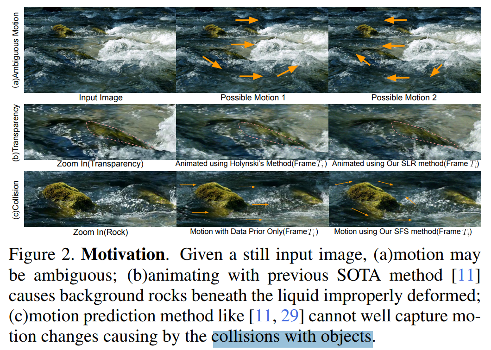
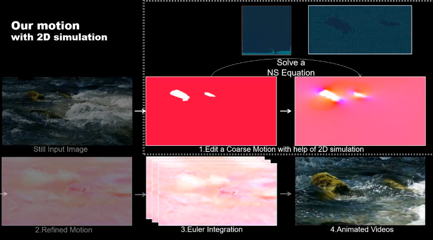
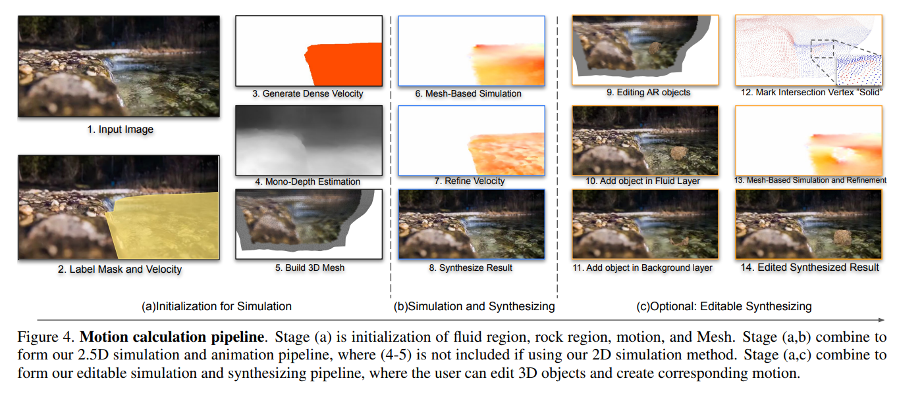
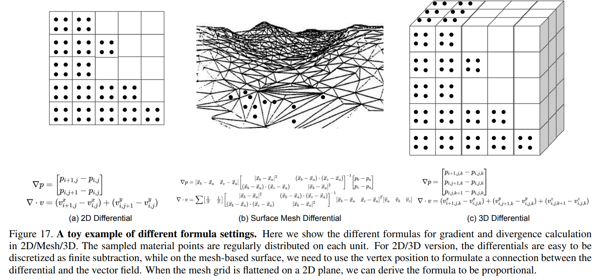
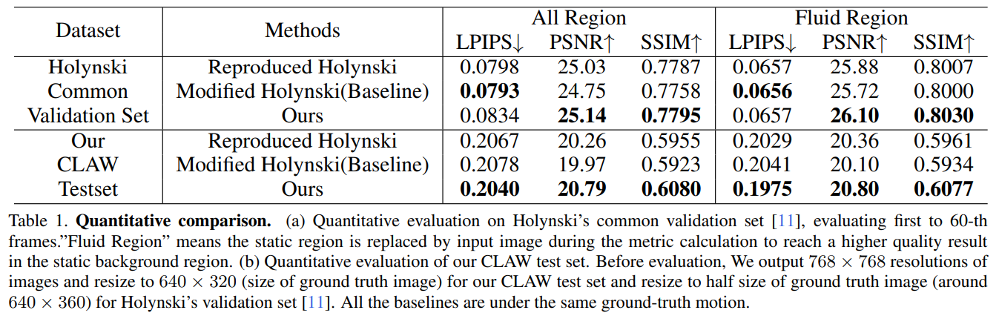

# Simulating Fluids in Real-World Still Images

> "Simulating Fluids in Real-World Still Images" ICCV-2023-oral, 2022 Apr 24
> [paper](http://arxiv.org/abs/2204.11335v1) [code](https://github.com/simon3dv/SLR-SFS) [web](https://slr-sfs.github.io/) [pdf](./2022_04_ICCV_Simulating-Fluids-in-Real-World-Still-Images.pdf) [note](./2022_04_ICCV_Simulating-Fluids-in-Real-World-Still-Images_Note.md)
> Authors: Siming Fan, Jingtan Piao, Chen Qian, Kwan-Yee Lin, Hongsheng Li

## Key-point

- Task
- Problems
- :label: Label:

## Contributions

## Introduction

- Q：先前工作背景不该动的物体，也跟着水流移动？

预测水流的 RGBA 图层，最后合在一起

## methods

给一个 spare motion 做为 hint 预测水流 motion；

预测 RGBA，把水流的图层分割出来

- Q：水流不真实？

使用 NS 公式计算真实的水流移动

生成背景 3D mesh, 再用 NS 公式渲染

### motion calc

构造 3D mesh，加上 NS 仿真水流移动轨迹，去优化水流轨迹

### Data

收集水流视频构造了一个训练数据集

## setting

## Experiment

> ablation study 看那个模块有效，总结一下

效果没差多少啊

## Limitations

https://slr-sfs.github.io/  视频里面背景也在抖动

## Summary :star2:

> learn what

### how to apply to our task

- 预测水流的 RGBA 图层，分割背景 & 水流，看效果还可以啊
- 构造 3D mesh，加上 NS 仿真水流移动轨迹，去优化水流轨迹
