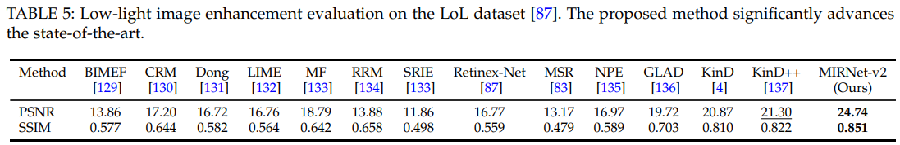

# MIRNetv2

> "Learning Enriched Features for Fast Image Restoration and Enhancement" ECCV&TPAMI, 2022 May, **MIRNetv2**
> [paper](https://arxiv.org/pdf/2205.01649.pdf) [code](https://github.com/swz30/MIRNetv2) [blog_explanation](https://zhuanlan.zhihu.com/p/259898434)
> [paper local pdf](./2022_05_TPAMI_Learning-Enriched-Features-for-Fast-Image-Restoration-and-Enhancement.pdf)

## **Key-point**

- Task: Image Restoration

- Background

  - full-resolution: 细节信息没有很好地被 encode

    1. Full-re: 更好的 spatial details
    2. encoder-decoder: 保留更好的上下文信息

    两种架构此前无法满足这两个优点

  - progressively-low-re: semantically reliable but spatially less accurate

- :label: Label：通道注意力, 多尺度特征融合，上下文信息融合，训练策略 

本文关注 spatially-precise high-resolution Image Restoration，提出一个图像修复框架，通过整个网络维护空间精确的高分辨率表示，并从低分辨率表示中接收强大的上下文信息。提出一个 feature fusion 模块，去融合不同尺度信息。

> 集成了各种 Trick：关注 Encoder，（多尺度）特征融合，上下文信息融合，训练策略；消融实验很有参考价值:moneybag:

## **Contributions**

- feature extraction model
- 多尺度特征
  - selective kernel fusion 多尺度交互，类似通道注意力
  - contextual feature 过滤噪声特征 
- Progressive Training

## Related Work

- "Transformers in Vision: A Survey"
  [paper](https://arxiv.org/abs/2101.01169)

## methods

整体 pipeline

- Charbonnier Loss [code](https://github.com/swz30/MIRNetv2/blob/main/basicsr/models/losses/losses.py)

###  Multi-Scale Residual Block

本文提出的主要模块，多尺度特征融合

### Selective Kernel Feature Fusion

> [SKNet blog_explanation](https://zhuanlan.zhihu.com/p/80513438)

参考 SKNet，即通道注意力，获取每个通道的权值，在每个 channel，取两个尺度信息的加权平均。相比于 concatenate 效果好，参数量也少 5 倍。:laughing:

> uses ∼5x fewer parameters than aggregation with concatenation but generates more favorable results

### RCB:  Context modeling :star:

distillation mechanism to extract useful information 希望过滤掉噪声，提取有用的信息。提取上下文信息很经典的操作

>  group convolutions are more resource efficient

1. (group) conv + `leaky Relu` + conv

   **learning unique representations** in each filter group

2. $F_c$ 获取新特征（过滤的特征），与原来相乘得到 **global feature descriptor**，就是每个通道的注意力

3. 用 1x1 conv （conv + LeakyRelu + conv）得到各个通道之间的相关性 **inter-channel dependencies**

   **得到 contextual features $F_e$**

4. 融合上下文信息到输入的 unique 特征上（对输入 1x1 过滤后）

   每个通道得到一个权值 $1 \times 1 \times C$，直接按元素加到 $H \times W \times C$

   > 区别于 SENet，SENet 得到的 $1 \times 1 \times C$ 的特征代表每个通道的权重

### Progressive Training Regime:star:

训练数据 patch 的大小很影响性能和速度，小 patch 训得快，性能掉很多。大 patch 训的慢，性能好。
提出一个训练策略，去折中训练速度和性能：先在小 patch 上训练几个 epoch，逐渐增加 patch_size

1. 提升模型效果
2. 实现输入图像的不同的 size

## **Experiment**

> ablation study 看那个模块有效，总结一下

- Dataset
  - Deblur
    - Dual-pixel defocus deblurring
  - Image denoising
    - DND
    - SIDD
  - SR
    - RealSR
  - enhancement
    - LoL
    - MIT-Adobe FiveK

### Setting

- Adam:$\beta_{1}=0.9,\mathrm{and}\beta_{2}=0.999$

  - learning rate: **cosine annealing strategy**

    $2 \times 10^{−4}$ steadily decrease the learning rate from initial value to $10^{−6}$

  - 训练 $3 \times 10^5$ iteration >> 30w

- Loss

  Charbonnier Loss

- patch: use the image patch sizes of 128,144, 192, and 224

- DA

  水平，垂直翻转

- 多尺度特征：特征尺寸设置

  3 parallel streams with channel dimensions of 80, 120, 180 at resolutions 1, 1/2 , 1/4

在各任务效果实现 or 接近 SOTA

- LowLight 提升 3db

  

### Ablation Studies

训 10w iterations

- Progressive Learning

  提速 & 效果接近最大的 patch

  

- 用 SE 通道注意力代替 concat

  节省参数量，效果还有略微 0.1db 提升

  

- RCB

  一开始的 group convolution 不用 group 性能会好很多，但参数量也会多很多。group=2 能够节省 3M 参数量

  

- 多尺度的分支数 & 每个分支特征提取模块个数

  

- Skip connect 影响很大，有2db 影响！！

  

## **Limitations**

?

## **Summary :star2:**

> learn what & how to apply to our task

1. Progressive 训练策略
2. Skip Connect 影响很大 3db！！
3. SE 代替 concat 节省很多参数量同时保持 or 略微提升性能