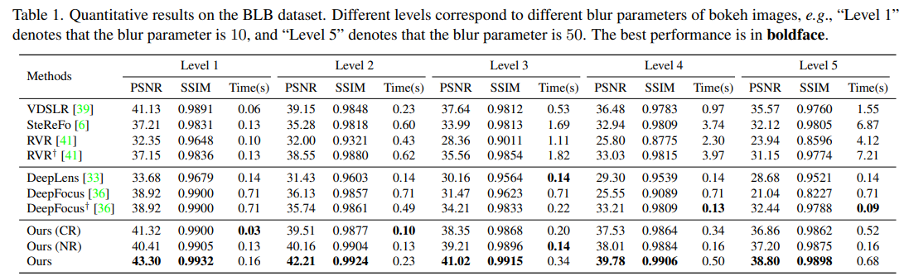
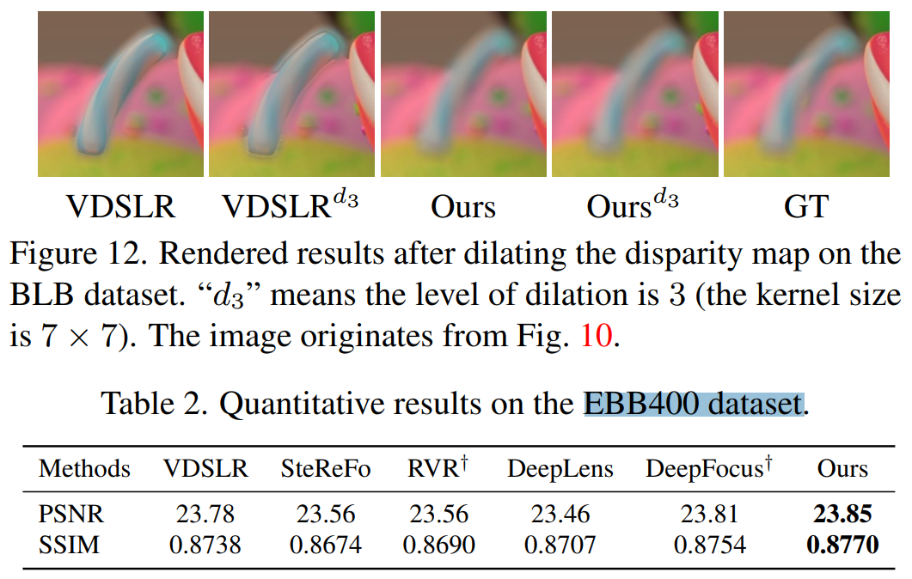

# BokehMe: When Neural Rendering Meets Classical Rendering

> "BokehMe: When Neural Rendering Meets Classical Rendering" CVPR-oral, 2022 Jun 25
> [paper](http://arxiv.org/abs/2206.12614v1) [code]() [pdf](./2022_06_CVPR-oral_BokehMe--When-Neural-Rendering-Meets-Classical-Rendering.pdf) [note](./2022_06_CVPR-oral_BokehMe--When-Neural-Rendering-Meets-Classical-Rendering_Note.md)
> Authors: Juewen Peng, Zhiguo Cao, Xianrui Luo, Hao Lu, Ke Xian, Jianming Zhang (Adobe Research)

## Key-point

- Task
- Problems
- :label: Label:

## Contributions

- 提出 BokehMe，给定一张图 & 视差图，**实现可控的 bokeh effect 生成**，例如**控制光圈大小，形状**

> Given a single image and a potentially imperfect disparity map, BokehMe generates highresolution photo-realistic bokeh effects with adjustable blur size, focal plane, and aperture shape.

- 分析传统方法中的 error map，用 neural render 修复 error

> To this end, we analyze the errors from the classical scattering-based method and derive a formulation to calculate an error map. Based on this formulation, we implement the classical renderer by a scattering-based method and propose a two-stage neural renderer to fix the erroneous areas from the classical renderer. 

- propose a two-stage neural renderer which uses adaptive resizing and iterative upsampling to handle arbitrary blur sizes for high-resolution images

- 合成的测试数据集；Bokeh Effect 好坏很主观 -> UserStudy

  > In addition, due to the lack of test data in the field of controllable bokeh rendering, we contribute a new benchmark: BLB, synthesized by Blender 2.93 [5], together with EBB400, processed from EBB! [11].

  >  Since the evaluation of bokeh effects is subjective, we also conduct a user study on images captured by iPhone 12.

- SOTA

## Introduction

- Q：**Bokeh effect: what it is and how to achieve it.**

> https://www.adobe.com/uk/creativecloud/photography/discover/bokeh-effect.html
>
> https://www.youtube.com/watch?v=aXZyc36gkMU

Bokeh effect is a popular photographic technique which uses blur to focus the viewer’s attention on a specific area of an image. But there’s more to the technique than just adding blur. Learn all about bokeh and what it can bring to your images.

普通 blur -> 高斯 blur；这里是 bokeh blur 光圈模糊，亮点在背景呈现圆形亮斑

### Neural Render

- Q：However, the main problem of neural rendering is lack of controllability.

## methods

传统方法在物体边缘存在误差！

用 NN 去训练一个 error_map

> We aim to obtain an error map to identify areas rendered incorrectly by the classical renderer.

- Q：error map 计算时候不在边缘的 error 不是那么重要！

搞了一个权重

> Let E∗ denote the target error map. Since only regions within the scattering radius from the depth boundary may have significant difference from the real rendering, E∗ can be conservatively formulated as the spatially variant dilation of the depth boundary

ARNet 生成 error-map 和 **LR bokeh 图**；之后用 IUNet 对 LR Bokeh 图 ，结合原始输入，逐步 upsample

逐步 bilinear resize 做 upsample

## setting

- BLB 数据集

> BLB contains 500 test samples synthesized by Blender 2.93 [5]

- EBB 400

> EBB400 contains 400 wide and shallow DoF image pairs which are randomly selected from EBB! 

## Experiment

> ablation study 看那个模块有效，总结一下

借助 fig12 理解下先前方法在边缘的误差 && 调节 dilation 后误差变显著:star:

## Limitations

## Summary :star2:

> learn what

借助 fig12 理解下先前方法在边缘的误差 && 调节 dilation 后误差变显著:star:

### how to apply to our task

