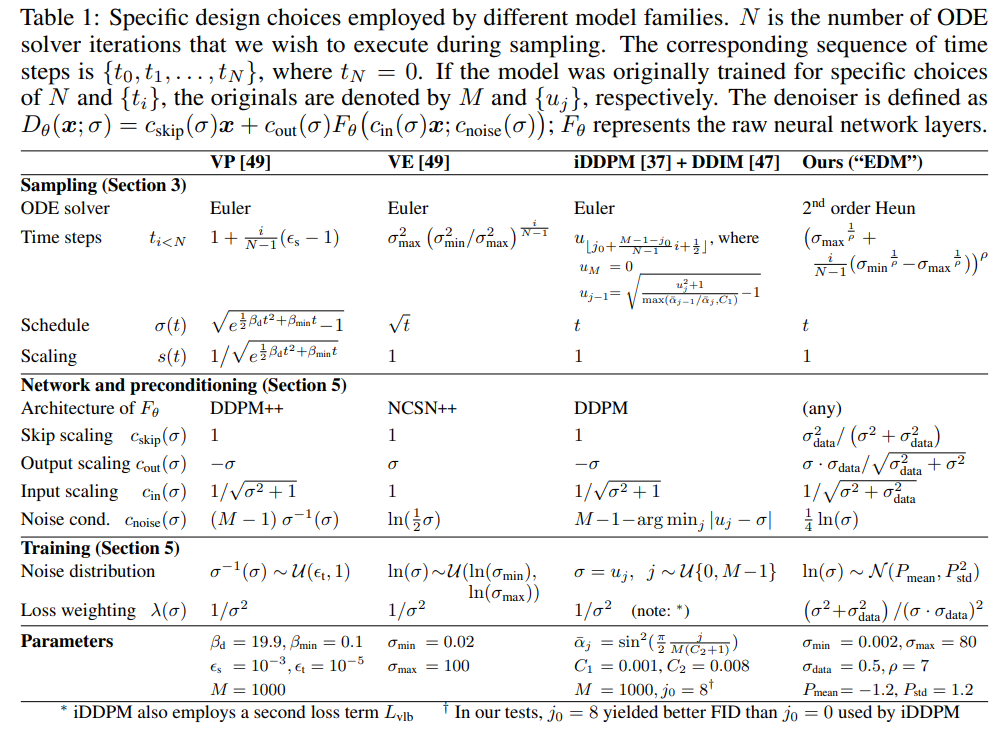

# Elucidating the Design Space of Diffusion-Based Generative Models

> "Elucidating the Design Space of Diffusion-Based Generative Models" NIPS, 2022 Jun 1
> [paper](http://arxiv.org/abs/2206.00364v2) [code](https://github.com/NVlabs/edm) [pdf](./2022_06_NIPS_Elucidating-the-Design-Space-of-Diffusion-Based-Generative-Models.pdf) [note](./2022_06_NIPS_Elucidating-the-Design-Space-of-Diffusion-Based-Generative-Models_Note.md)
> Authors: Tero Karras, Miika Aittala, Timo Aila, Samuli Laine

## Key-point

- Task
- Problems
- :label: Label:

## Contributions

## Introduction

## methods

EDM 去噪过程，x0 是纯高斯噪声

## setting

## Experiment

> ablation study 看那个模块有效，总结一下

## Limitations

## Summary :star2:

> learn what

### how to apply to our task

