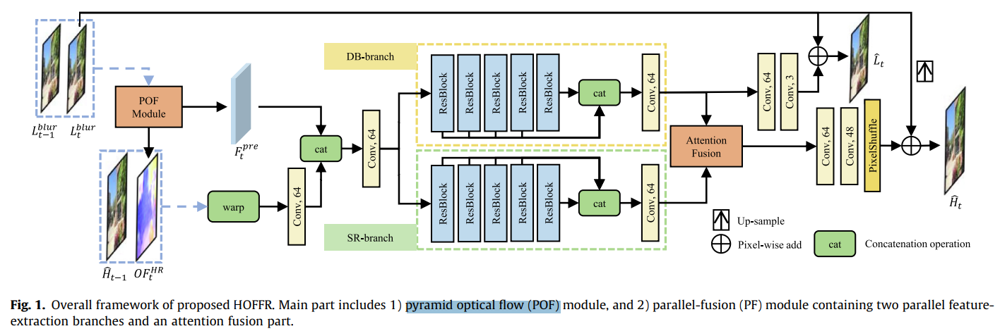

# High-resolution optical flow and frame-recurrent network for video super-resolution and deblurring

> "High-resolution optical flow and frame-recurrent network for video super-resolution and deblurring" NeuralComputing, 2022 Jun 7, `HOFFR`
> [paper](https://www.sciencedirect.com/science/article/pii/S0925231222002363) [code]() [pdf](./2022_06_NeuralComputing_High-resolution-optical-flow-and-frame-recurrent-network-for-video-super-resolution-and-deblurring.pdf) [note](./2022_06_NeuralComputing_High-resolution-optical-flow-and-frame-recurrent-network-for-video-super-resolution-and-deblurring_Note.md)
> Authors: Ning Fang, Zongqian Zhan

## Key-point

- Task
- Problems
- :label: Label:

## Contributions

## Introduction

## methods

- 两帧 POF 出后面一帧 && 预测的前一帧到这一帧的光流
- 搞了两个 branch，分别做 deblur & SR

### 光流预测模块

POF 模块预测 HR 光流，类似一个光流修复网络

> estimates the HR optical flow

### Dual branch Attention fusion

> Attention feature fusion: Integrating the features extracted by parallel feature extraction is an important part of the PF module

$F^{DB}_t$ 为 deblur 分支输出；$F^{SR}_t$ 为 SR 分支的输出；Deblur 分支输出过几层 Conv 出 sharp 的 LR，做 Loss

> the output of each ResBlocks will be concatenated. The output features are DB features FDB t and SR features FSR t . In the DB branch, to strengthen the DB effect, a DB loss function ‘DB is introduced. FDB t will be convolved and then added to Lblur t to obtain the deblurred image bLt

Attention 模块参考先前工作 RCAB 模块的设计，**看描述类似一个 channel attention**

>  For this reason, the residual channel attention block (RCAB) proposed in [21]
>
> - "Image super-resolution using very deep residual channel attention networks" ECCV

### Loss

- SR Loss，逐帧 GT 帧 L2 loss

- Deblur 模块 loss

- 光流模块的 Loss，写的 OF(optical flow)

  > 光流 warp 过来的帧也做 L2 loss
  >
  > $L_t$ and $L_{t-1}$ denote **sharp** LR frames
  >
  > $Ld_t$ 为尺寸再减半的 LR sharp 图  -> 光流预测模块**多个 scale 输出**

## setting

VSR

- VID2K and Vimeo-90 K

> video SR datasets such as VID2K and Vimeo-90 K lack real motion blur, which cannot satisfy the training needs of the proposed model

用 VDB 数据集，bilinear 构造 LR video

-  DeepVideoDeblurring (DVD)
- REDS
  - REDS4 测试

> The DeepVideoDeblurring (DVD) dataset [64] which contained 61 sequences for training and 10 sequences for testing was chosen as one of the experimental datasets (using MATLAB for bicubic downsampling)
>
> REDS [66] contains more complex motion blur, which is more challenging, and REDS was used as one of the experimental datasets as well.
>
>  four representative sequences REDS4 were selected from REDS as the test set,

- 分辨率才 64x64 ...
- 两张 1080Ti

> During training, RGB patches of size 64  64 were randomly rotated and flipped for data augmentation. The mini-batch size was set to 4 and the input sequence length was 8. The proposed model was trained with the Adam optimizer [67], which was set to b1 ¼ 0:9 and b2 ¼ 0:999. 
>
> - The proposed model was implemented with the PyTorch [68] framework and trained on two NVIDIA GeForce GTX 1080Ti GPUs

## Experiment

> ablation study 看那个模块有效，总结一下

## Limitations

## Summary :star2:

> learn what

### how to apply to our task

