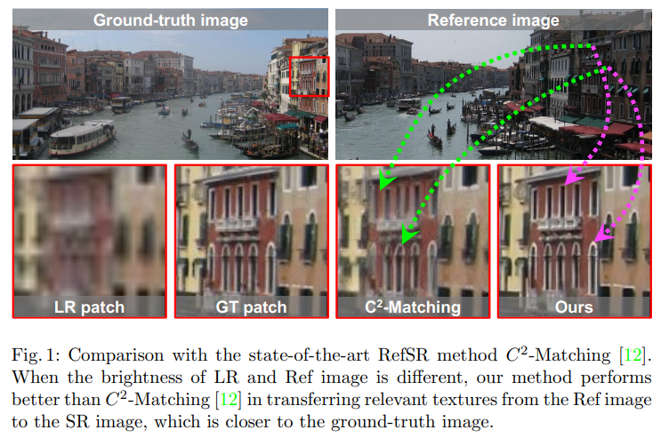
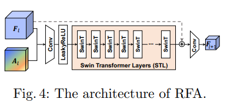
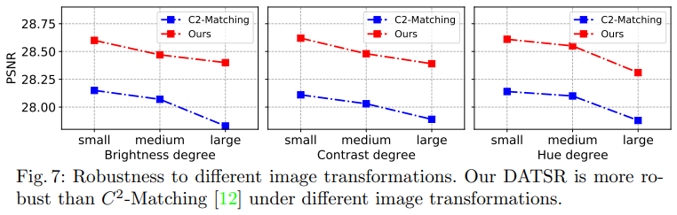
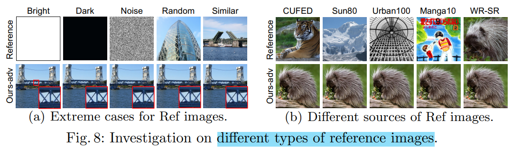

# DATSR

> "Reference-based Image Super-Resolution with Deformable Attention Transformer" ECCV, 2022 Jul, DATSR
> [paper](https://arxiv.org/abs/2207.11938) [code](https://github.com/caojiezhang/DATSR)
> [paper_local_pdf](./2022_07_ECCV_Reference-based-Image-Super-Resolution-with-Deformable-Attention-Transformer.pdf)
> [blog_explanation](https://zhuanlan.zhihu.com/p/578141026)

## Key-point

- Task: RefSR

- Background

  RefSR 问题中，存在两点主要的挑战

  1. 参考图像和LR图像之间差异很大时，很难将二者对应关系匹配
  2. 如何从参考图像中转移相关纹理来补偿LR图像的细节

- :label: Label: Reference-based, Deformable 

估计LR和REF图像之间纹理特征的像素或块相似度来匹配对应关系，**相似性度量对诸如图像的亮度、对比度和颜色等图像变换很敏感。**本文要提出一个方法，对于这种数据分布差异很大的问题比较鲁棒，对于参考图像的要求不是很苛刻：**使用 deformable 对初步过滤的 patch 再次进行特征提取，对于完全不相关的 reference 很鲁棒。**

探索一种新的结构来自适应地传递纹理信息并**减轻参考图像中不准确的对应的影响**


> 关注如何做 patch-based Deformable attn


## Contributions

1. texture feature encoder (TFE)
2. reference-based deformable attention (RDA)


## Related Work

- "Robust reference-based super-resolution via c2-matching"

- "Learning Texture Transformer Network for Image Super-Resolution" TTSR
  [paper](https://arxiv.org/abs/2006.04139) [code](https://github.com/researchmm/TTSR) [explanation](https://blog.csdn.net/x779250919/article/details/109667804)

  > 关注如何找到最相近的patch，如何使用其信息辅佐LR的超分：Hard Attention（直接用最相似 ref path 的 v） & Soft Attention （LR 和 ref 特征融合一下）
  >
  > 1. 每个像素点特征视为 patch，通过**Learnable Texture Extractor** 提取 QKV 特征，对 QK 做 normalized inner product 计算相似度
  > 2. 直接把相似 patch 的特征作为使用的特征

- "EDVR: Video Restoration With Enhanced Deformable Convolutional Networks"
  [paper]() [code](https://www.github.com/xinntao/EDVR)


## methods

> [code modification: Missing package"mmsr](https://github.com/caojiezhang/DATSR/issues/11)
> [mRefRestorationModel` code](https://github.com/caojiezhang/DATSR/blob/main/datsr/models/ref_restoration_model.py) & [model_yaml](https://github.com/caojiezhang/DATSR/blob/main/options/train/train_restoration_gan.yml)

### Texture Feature Encoders

LR 图和 Ref 图存在 gap: resolution & distribution(brightness, contrast and hue) gap

1. resolution gap: U-net 多尺度特征

   将 LR 图先上采样，再去提取特征

2. distribution gap: 不同 DA

   参考 C2-matching，对比学习方式训练 encoder be less sensitive to different image transformations

**为了使得特征匹配更稳定，用同一个 Encoder 去提取特征** :star: 作为对比 TTSR 用 learnable feature encoder （类似 ref 和 lr 用不同 encoder）性能很不稳定

$Q_l=~E_l^q(\boldsymbol{X}_{LR\uparrow}),\quad\boldsymbol{K}_l=~E_l^k(\boldsymbol{X}_{Ref}),\quad\boldsymbol{V}_l=~E_l^v(\boldsymbol{X}_{Ref}),$


### Reference-based Deformable Attention

$$
A_l=\text{ RefAttention}(\boldsymbol{Q}_l,\boldsymbol{K}_l,\boldsymbol{V}_l,\boldsymbol{F}_l)=\mathrm{~}\mathcal{T}\left(\sigma\left(\boldsymbol{Q}_l^\top\boldsymbol{K}_l\right),\boldsymbol{V}_l,\boldsymbol{F}_l\right).
$$



#### correspondence matching :star:

> 解决找到相似的 patch
> [code： `def feature_match_index`](https://github.com/caojiezhang/DATSR/blob/76faa616774cbef983acaa855eaaec75d5dc9d8c/datsr/models/archs/flow_similarity_corres_generation_arch.py#L48) 实现很巧妙,： 1. patch 太多，分为 batch 来做； 2. Conv2d 实现 patch 点乘！:star:
>
> 计算复杂度很高！

**获取 local 对应 ref 相似的 patch：**将 local, ref 通过 unfold 分 patch，各个 ref patch 对应到 local patch 计算**余弦相似度（做归一化后点乘）**取 topK (K=1)；每个 Q 中的 patch $q_i \in R^{c \times h \times w}$找到 K 个相似的 $k_i$ 对应位置，存为 $p_i^k$
$$
\begin{aligned}P_i&=\left[\sigma\left(\boldsymbol{Q}_l^{\prime\top}\boldsymbol{K}_l^{\prime}\right)\right]_i=\mathrm{TopK}_j\left(\widetilde{\boldsymbol{q}}_i\cdot\widetilde{\boldsymbol{k}}_j\right),\\\\\mathrm{where~}\widetilde{\boldsymbol{q}}_i&=\boldsymbol{q}_i/\|\boldsymbol{q}_i\|\mathrm{~and~}\widetilde{\boldsymbol{k}}_j=\boldsymbol{k}_j/\|\boldsymbol{k}_j\|\mathrm{~are~normalized~features},\end{aligned}
$$

- 在空间 hxw 维度归一化
  在 $h \times w $ 维度拉直做归一化，再还原回去

  `feat_in = F.normalize(feat_in.reshape(c, -1), dim=0).view(c, h, w)`

- Patch matching between input and reference features. 点乘取 topK,K=1

  > [code](https://github.com/caojiezhang/DATSR/blob/main/datsr/models/archs/ref_map_util.py#L28)

  ```
  _max_idx, _max_val = feature_match_index(   # [38, 38], [38, 38]
                  feat_in,
                  feat_ref,
                  patch_size=self.patch_size,
                  input_stride=self.stride,
                  ref_stride=self.stride,
                  is_norm=True,
                  norm_input=True)
  ```

  抽取 ref 的 patch：`unfold` sample patches

  ```python
  c, h, w = inputs.shape
  patches = inputs.unfold(1, patch_size, stride)\
      .unfold(2, patch_size, stride)\
      .reshape(c, -1, patch_size, patch_size)\
      .permute(0, 2, 3, 1)  # [64, 3, 3, 1444]
  ```

  > 为了减少现存和优化速度>>多个 patch 组成 batch 来处理
  >
  > 对每个 patch (对于 0，1，2 维度) 做 L2 Norm

  ```
  batch = patches_ref[..., idx:idx + batch_size]
  if is_norm:
      batch = batch / (batch.norm(p=2, dim=(0, 1, 2)) + 1e-5)  # [64, 3, 3, 1444]
  ```

  利用 Conv2d 实现 patch 之间的点乘 :star:

  > [doc: torch.nn.functional.conv2d](https://pytorch.org/docs/stable/generated/torch.nn.functional.conv2d.html#torch.nn.functional.conv2d) 可以指定 ref patch 作为 kernel. kernel 个数看作是 patch 个数
  >
  > 参考进行单元测试

  ```python
  corr = F.conv2d(feat_input.unsqueeze(0),
      batch.permute(3, 0, 1, 2),   # [1444, 64, 3, 3]
      stride=input_stride)         # [1, 1444, 38, 38]
  # fea_in [64, 40, 40], patch [1444, 64, 3, 3] >> out:[1444, 38, 38]
  ```

  local 每个 patch，有 N 个 ref patch 对应，取最相似的 K(K=1) 个 ref patch

  `max_idx_tmp` 对应匹配到 patch 的序号

  ```
  max_val_tmp, max_idx_tmp = corr.squeeze(0).max(dim=0) # [38, 38], [38, 38]
  ```

   `def index_to_flow` 计算 local patch 到目标块需要偏移多少距离


#### Similarity-aware texture transfer

> 特征融合

**相似的 patch 内部也有 irrelevant texture or no information**, our model is able to guild whether to transfer the textures in Ref images 用 deformable 在 patch 内部

**每个 patch 内部用 DCN 做特征融合，提取想要的 value 信息**。在对所有 K 个 patch 加权，得到当前 patch 对应相似 patch 融合的特征
$$
\boldsymbol{A}_l(p_i)=\sum_{k=1}^Ks_i^k\sum_jw_j\boldsymbol{V}_l(p_i+\Delta p_i^k+p_j+\Delta p_j)m_j,\\
s_i^k=\exp(\widetilde{\boldsymbol{q}}_i\cdot\widetilde{\boldsymbol{k}}_{p_i^k})/\sum_{j\in\boldsymbol{P}_i}\exp(\widetilde{\boldsymbol{q}}_i\cdot\widetilde{\boldsymbol{k}}_j)\\

\begin{cases}\Delta\mathcal{P}_l=r\cdot\operatorname{Tanh}\left(\operatorname{Conv}([\boldsymbol{F}_l;\omega(\boldsymbol{V}_l,\mathcal{P}_l)])\right)\\\boldsymbol{M}_l=\operatorname{Sigmoid}\left(\operatorname{Conv}([\boldsymbol{F}_l;\omega(\boldsymbol{V}_l,\mathcal{P}_l)])\right)\end{cases}
$$

$p_i+\Delta p_i^k$ 为 ref 中相似 patch 对应区域中心点；$p_j+\Delta p_j$ 为 deformable 9 个偏移点位置
$s_i^k$ 为每个相似 patch 的权重

> 通过 mask $m_j$ 去处理当 ref 和 local 差异很大的情况 :star: exp 有做消融实验


#### Feature Aggregation

融合相似 patch 提取的特征 与 当前 patch 特征 $F_l$，得到当前尺度特征 $F_{l+1}$
$$
F_{l+1}^{\prime}=\text{ Conv}(\boldsymbol{F}_l,\boldsymbol{A}_l)\\
F_{l+1}^{\prime}=\text{STL}(F_{l+1}^{\prime})+F_l,\\
F_{l+1} = Conv(F_{l+1}^{\prime})
$$



## Experiment

> ablation study 看那个模块有效，总结一下

- Robustness to  image transformations **提升 0.4 db**

  > use ColorJitter to augment the CUFED5 testing set by randomly change

  

  

- type and number of Ref images

  1. Ref extreme case 随机噪声，不相关图像，相似的图
  2. 不同数据集的图

  


### Ablation Study


## Limitations

## Summary :star2:

> learn what & how to apply to our task

- 用 deformable 代替相似度筛选