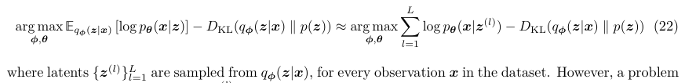
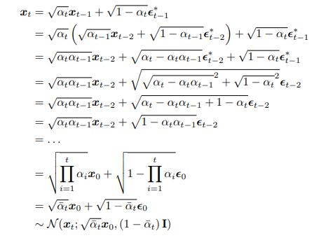
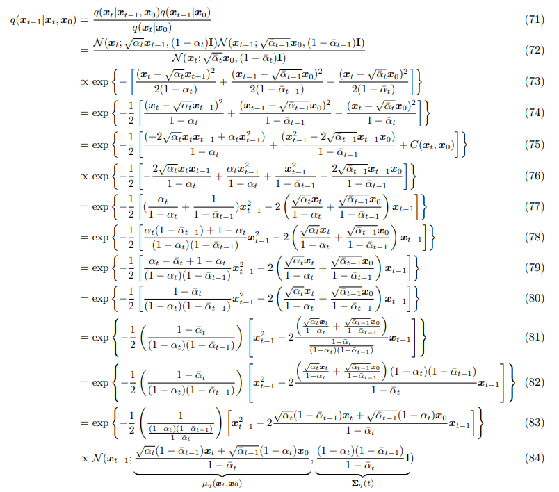

# Understanding Diffusion Models: A Unified Perspective

> "Understanding Diffusion Models: A Unified Perspective" Arxiv, 2022 Aug :+1:
> [paper](https://arxiv.org/abs/2208.11970) [pdf](./2022_08_Arxiv_Understanding Diffusion Models-A Unified Perspective.pdf)

本文档用于整理 Diffusion 基础知识，便于后续复习！:construction_worker:

## related survey

- [ ] "Diffusion Models: A Comprehensive Survey of Methods and Applications" ACM-Computing-Surveys, 2023
  [paper](https://arxiv.org/pdf/2209.00796.pdf)

## Background

Analogously, the objects that we encounter in the actual world may also be generated as a function of some higher-level representations; Whereas Plato’s Allegory illustrates the idea behind **latent variables as potentially unobservable representations that determine observations**.

### ELBO

**motivation**: **the goal of generative models** is to model true data distribution $p(x)$. so that we wish to maximize the probability $p(x)$ :star:

In this case, we marginalize out latent variable Z and appeal to chain rule of probability. 
$$
p(x) = \int{ p(x|z) dz } =  \frac{p(x,z)}{p_{\phi}(z | x)}
$$

> [What does it mean to "marginalise out" something?](https://math.stackexchange.com/questions/1511622/what-does-it-mean-to-marginalise-out-something)
>
> [marginal distribution](https://en.wikipedia.org/wiki/Marginal_distribution)

- Q：直接去 maximize 这个式子需要积分，不好实现咋办？

因此引入 ELBO 去优化模型，这里 $q_{\phi}(z | x)$ 看作编码器

ELBO stands for `Evidence Lower Bounds`, which acts as a proxy to optimize the model. 
$$
\log p(x) \geq \mathbb{E}_{q_{{\phi}}(z|x)}\left[\log\frac{p(x,z)}{q_{{\phi}}(z|x)}\right]
$$
**evidence** is quantified as $\log{p(x)}$ :star:

- Q：为什么是优化 ELBO 这个式子？看 pdf P3

和 $\log{p(x)}$ 差距在于一个 KL 散度 $D_{KL}({q_{{\phi}}(z|x)} || {p(z|x)})$，本质上是想要编码器 $q_{\phi}(z | x)$ 去拟合 $p(z|x)$
$$
\log{p(x)}  = \mathbb{E}_{q_{{\phi}}(z|x)}\left[\log\frac{p(x, z)}{q_{{\phi}}(z|x)}\right] + D_{KL}({q_{{\phi}}(z|x)} || {p(z|x)})
$$
**因此最大化 ELBO 等价于去最小化 KL Divergence（最好情况 KL 散度=0）**

### VAE

VAE stands for Variational AutoEncoder. 

**最大化 ELBO，等价于优化 2 项**：第一项最大化 z 重建效果，第二项最小化 z 特征分布之间的差距
$$
\begin{align}
\mathbb{E}_{q_{{\phi}}(z|x)}\left[\log\frac{p(x, z)}{q_{{\phi}}(z|x)}\right] = 
\underbrace{{\mathbb{E}_{q_{{\phi}}(z|x)}\left[\log p_{{\theta}}(x|z)\right]}}_\text{reconstruction term(Decode)} - \underbrace{{D_{KL}{q_{{\phi}}(z|x)}{p(z)}}}_\text{prior matching term(Encoder)}
\end{align}
$$

- Q：如何利用 ELBO 去优化 VAE Encoder $\phi$, Decoder $\theta$ ？

**VAE Encoder 的概率分布一般选取多元高斯分布，特征 z 分布 $p(z)$ 选取为标准多元高斯分布**；最大化 ELBO 式子可以改写为

 $q_{\phi}(z|x)$ 编码器把训练数据 x （理解为图像）编码得到一堆 z，**z 就从这个集合里面选取**；同时按照前面设定，这里的 $p(z)$ 是符合标准多元高斯分布的，**z 是需要随机采样来生成的（约束了 Encoder 生成 z 的方式）**。因此**采用 Monte Carlo estimate 方法，从标准多元高斯分布随机采样一个 z** ，所以需要 Encoder 去模拟随机采样的过程来从 x 生成 z

- Q：随机采样的操作不可微分咋办，Encoder 怎么从 x 把 z 得到，使得 z 满足多元高斯分布？

**利用 parameterization trick 将随机的一个多元高斯分布的采样，转换为相对更确定的标准高斯分布的采样**；

利用 Encoder 去预测 $\mu_{\phi}, \sigma_{\phi}$，剩下的 $\epsilon$ 从标准高斯分布中随机取一个，从而**得到满足多元高斯分布假设的 z**
$$
z = \mu + \sigma*\epsilon ~with~\epsilon \in N(0,I)
$$

## Diffusion basics

> [What are Diffusion Models?](https://lilianweng.github.io/posts/2021-07-11-diffusion-models/)
> [知乎 Diffusion 博客](https://zhuanlan.zhihu.com/p/587727367)
>
> [survey github repo](https://github.com/chq1155/A-Survey-on-Generative-Diffusion-Model)
> [Diffusion Models in Vision: A Survey](https://ieeexplore.ieee.org/abstract/document/10081412)

### Forward diffusion process

$$
q(x_t | x_{t-1}) = \mathcal{N}(x_t; \sqrt{1- \beta_t} x_{t-1}, \beta_tI)
$$

均值 $\mu= \sqrt{1- \beta_t}，\sigma^2= \beta_t$ ，Let $\alpha_t = 1-\beta_t >> \mu = \sqrt{1 - \alpha_t}, \sigma=\sqrt{1-\alpha_t}$ .
根据 Reparameterization Trick，$z = \mu + \sigma \bigodot \epsilon$ ，得到 $x_t = \sqrt{1 - \alpha_t} + \sqrt{1-\alpha_t} * \epsilon_{t-1}, ~where~\epsilon\sim\mathcal{N}(0,I)$ :star:
$$
x_t = \sqrt{\overline{\alpha}} \cdot x_0 + \sqrt{1- \overline{\alpha}} \cdot \epsilon_0 \\
= \sqrt{\alpha_0 \ldots\alpha_{t-(T-1)}} x_{t-T} + \sqrt{1-(\alpha_0 \ldots\alpha_{t-(T-1)})} \epsilon_{t-T}  ~~where~timestamp=T
$$

反向去噪

#### Reparameterization Trick

> [博客参考](https://lilianweng.github.io/posts/2018-08-12-vae/#reparameterization-trick)
>
> - isotropic Gaussian distribution
>
>   isotropic (having uniform physical properties in all directions) 各同向性，**isotropic distribution 在不同方向上的分布都很均匀**，这应该是”各向同性“的直观解释。
>
>   
>
>   `isotropic random vector` 指的就是每个方向上方差为 1，不同方向上协方差为 0 的随机向量。**VAE的reparameterization那一层其实就是isotropic random vector**
>   $$
>   Definition:~\text{A random vector X in } R^n \text{is called isotropic if} \\
>   Cov(X) = E(XX^T) = I_n
>   $$
>
>   1. 判定X是否为 isotropic
>      isotropic 的随机向量与任意向量的内积都等于那个向量的 L2-norm
>   2. 高维的 isotropic random vector 几乎正交（向量内积==0）

Sampling is a stochastic process and therefore we cannot backpropagate the gradient. To make it trainable, the reparameterization trick is introduced. 
$$
z \sim q_{\phi}(z | x) = \mathcal{N}(z;\mu^{(i)},\sigma^{2(i)}I)\\
z = \mu + \sigma \bigodot \epsilon , where ~\epsilon\sim N(0,I)
$$
In the multivariate Gaussian case, we make the model trainable by **learning the mean and variance of the distribution, $\mu$ and $\sigma$,** explicitly using the reparameterization trick, while the stochasticity remains in the random variable $\epsilon\sim N(0,I)$. 

> 随机采样，转化为 $z = \mu + \sigma \bigodot \epsilon$ 形式，能够去学习 $\mu, \sigma$

### [Reverse diffusion process](https://lilianweng.github.io/posts/2021-07-11-diffusion-models/#parameterization-of-l_t-for-training-loss)

reverse the above process and sample from $q(x_{t-1} | x_t)$， we will be able to recreate the true sample from a Gaussian noise input $x_T \sim \mathcal{N}(0,1)$. Unfortunately, we **cannot easily estimate $q(x_{t-1} | x_t)$ because it needs to use the entire dataset** 

Thus we need to learn a neural network to approximate the conditioned probability distributions in the reverse diffusion process, $q(x_{t-1} | x_t) = \mathcal{N}(x_t; \mu_{\theta}(x_t,t), \Sigma_{\theta}(x_t,t))$. 

**We would like to train $\mu_{\theta}$ to predict $\tilde{\mu_t} = \frac{1}{\sqrt{\alpha_t}}\cdot(x_t - \frac{1-\alpha_t}{\sqrt{1-\bar{\alpha}_t}}\cdot\epsilon_t)$** :star:

- model predict $\epsilon_{t}$ from input $x_t$ at timestep=t
  $$
  \mu_{\theta} = \frac{1}{\sqrt{\alpha_t}}\cdot(x_t - \frac{1-\alpha_t}{\sqrt{1-\bar{\alpha}_t}}\cdot \epsilon_{\theta}(x_t,t))
  $$

  真实值根据 forward Diffusion process 的公式逆推得到 $\tilde{\mu_t} = \frac{1}{\sqrt{\alpha_t}}\cdot(x_t - \frac{1-\alpha_t}{\sqrt{1-\bar{\alpha}_t}}\cdot\epsilon_t)$

使用 $L_t$ （细节后续补）优化模型，使得预测的 $\mu_{\theta}$ 与 $\tilde{\mu_t}$ 差别最小

- 小结

  1. Forward diffusion process

     对原图 x0 **逐步（Timestep t）**施加一个**少量（通过 $\beta_i$ 来控制）**的高斯噪声，使得原图逐渐失去特征，得到 noise map
     $$
     q(x_t | x_{t-1}) = \mathcal{N}(x_t; \sqrt{1- \beta_t} x_{t-1}, \beta_tI) \\
     x_t = \sqrt{1 - \alpha_t} + \sqrt{1-\alpha_t} * \epsilon_{t-1}, ~where~\epsilon\sim\mathcal{N}(0,I)
     $$

  2. Reverse diffusion process

     希望根据  $q(x_{t-1} | x_t) = \mathcal{N}(x_t; \mu_{\theta}(x_t,t), \Sigma_{\theta}(x_t,t))$ 采样来逆转上述加噪声过程，得到原图。模型预测 $\mu_{\theta}$ 

  3. 加速 Diffusion Process

     - DDIM samples only a subset of S diffusion steps

     - LDM(*Latent diffusion model*) runs the diffusion process in the latent space instead of pixel space, making training cost lower and inference speed faster. 

## DDPM :baby:

> [2020_NeurIPS_DDPM_Denoising-diffusion-probabilistic-models.pdf](./2020_NeurIPS_DDPM_Denoising-diffusion-probabilistic-models.pdf)
> [博客参考](https://zhuanlan.zhihu.com/p/563661713)
> [Markov Chain 博客参考](https://zhuanlan.zhihu.com/p/274775796)
> [DDPM B站视频](https://www.bilibili.com/video/BV1b541197HX/?spm_id_from=333.337.search-card.all.click&vd_source=eee3c3d2035e37c90bb007ff46c6e881)  [DDPM 数学基础](https://zhuanlan.zhihu.com/p/530602852)

reverse diffusion 迭代一步
$$
q(x_{t-1}| x_t,x_0) = \mathcal{N}(x_{t-1}; \tilde{\mu}(x_t, x_0), \tilde{\beta_t}I)\\
$$
网络训练 $ \tilde{\mu}(x_t, x_0), \tilde{\beta_t}$ 从而构成生成模型，模型给出的均值方差通过 reparameteration trick $y_{t-1} = \mu + \sigma * \epsilon$ 

> $\epsilon \in \mathcal{N}(0,1)$ 随机采样得到

## DDIM :baby:

> [keras implementation](https://keras.io/examples/generative/ddim/):+1:
> [2020_ICLR_DDIM_Denoising-Diffusion-Implicit-Models.pdf](./2020_ICLR_DDIM_Denoising-Diffusion-Implicit-Models.pdf)

$$
\sigma^2_t = \eta * \tilde{\beta_t} \\

\tilde{\beta_t} = \sigma^2_t = \eta *\beta_t  ~~ where~\eta~is~constant \\
$$

 when $\eta ==0$ 

## Score-based

> [参考](https://zhuanlan.zhihu.com/p/551139290)
> [Stochastic Differential Equations and Diffusion Models](https://www.vanillabug.com/posts/sde/)

