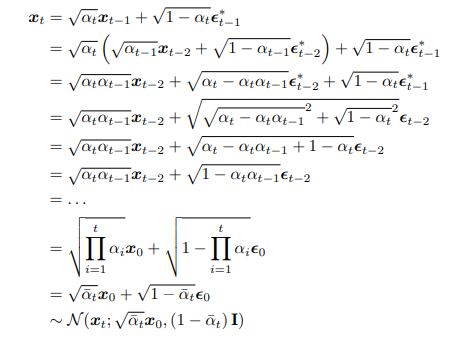
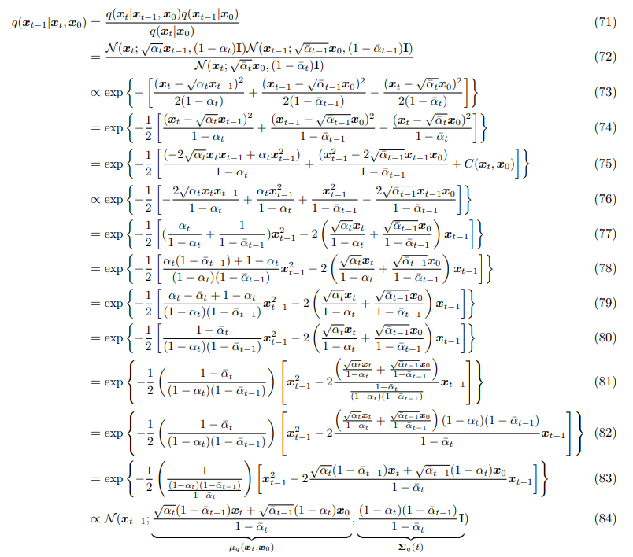

# Understanding Diffusion Models: A Unified Perspective

> "Understanding Diffusion Models: A Unified Perspective" Arxiv, 2022 Aug 25
> [paper](http://arxiv.org/abs/2208.11970v1) [code]() [pdf](./2022_08_Arxiv_Understanding-Diffusion-Models--A-Unified-Perspective.pdf) [note](./2022_08_Arxiv_Understanding-Diffusion-Models--A-Unified-Perspective_Note.md)
> Authors: Calvin Luo

本文档用于整理 Diffusion 基础知识，便于后续复习！:construction_worker:

## Key-point

- Task: survey
- Problems
- :label: Label:

## related survey

- "Diffusion Models: A Comprehensive Survey of Methods and Applications" ACM-Computing-Surveys, 2023
  [paper](https://arxiv.org/pdf/2209.00796.pdf)

> [What are Diffusion Models?](https://lilianweng.github.io/posts/2021-07-11-diffusion-models/)
> [知乎 Diffusion 博客](https://zhuanlan.zhihu.com/p/587727367)
>
> [survey github repo](https://github.com/chq1155/A-Survey-on-Generative-Diffusion-Model)
> [Diffusion Models in Vision: A Survey](https://ieeexplore.ieee.org/abstract/document/10081412)

## Background

Analogously, the objects that we encounter in the actual world may also be generated as a function of some higher-level representations; Whereas Plato’s Allegory illustrates the idea behind **latent variables as potentially unobservable representations that determine observations**.

### ELBO

目标是学习更高维度的表示，要去最大化数据分布的概率 $p(x)$，

> **motivation**: **the goal of generative models** is to model true data distribution $p(x)$. so that we wish to **maximize the probability $p(x)$** :star:

学习更高维度的表示 z，去表示 x，因此：

1. marginalize out 一下搞成一个条件概率
2. 再用 chain rule of probability 改写一下

> In this case, we marginalize out latent variable Z and appeal to **chain rule of probability.** 

$$
p(x) = \int{ p(x|z) dz } =  \frac{p(x,z)}{p_{\phi}(z | x)} ~~(3)
$$

- Q：What's `marginalize out`？

> [What does it mean to "marginalise out" something?](https://math.stackexchange.com/questions/1511622/what-does-it-mean-to-marginalise-out-something)
>
> [marginal distribution](https://en.wikipedia.org/wiki/Marginal_distribution)

$p(x) = \int{ p(x|z) dz }$ .  可以**将 x, z 分别为 2D 表格的两个轴**，可以对每行 or 每列加起来的概率 = 1

**引出 ELBO 公式**

- Q：直接去 maximize $p(x) = \int{ p(x|z) dz }$ 这个式子需要积分，不好实现咋办？

因此对公式 （3）整理**定义 ELBO 作为优化目标去优化模型**，

> However, **using these two equations (3), we can derive a term called the Evidence Lower Bound (ELBO)**, which as its name suggests, is a **lower bound of the evidence**. The evidence is **quantified in this case as the log likelihood** of the observed data

这里 $q_{\phi}(z | x)$ 是我们要学习的 model，这里可以引入后续的 VAE；
$$
\log p(x) \geq \mathbb{E}_{q_{{\phi}}(z|x)}\left[\log\frac{p(x,z)}{q_{{\phi}}(z|x)}\right]		(4)
$$
ELBO 公式取 log 概率计算；

> **evidence** is quantified as $\log{p(x)}$ :star:

> For now, let us try to dive deeper into why the ELBO is an objective we would like to maximize.

- Q：为什么是优化 ELBO 这个式子？

> From this derivation, we clearly observe from Equation 15 that the evidence is equal to the **ELBO plus the KL Divergence between the approximate posterior qφ(z|x) and the true posterior p(z|x).**

**ELBO 和原始数据分布 $\log{p(x)}$ 差距在于一个 KL 散度 $D_{KL}({q_{{\phi}}(z|x)} || {p(z|x)})$。** :star:

这里用 VAE $q_{\phi}(z | x)$ 去拟合 $p(z|x)$，存在一个预测的特征分布、真实特征分布之间的距离
$$
\log{p(x)}  = \mathbb{E}_{q_{{\phi}}(z|x)}\left[\log\frac{p(x, z)}{q_{{\phi}}(z|x)}\right] + D_{KL}({q_{{\phi}}(z|x)} || {p(z|x)}) \geq \mathbb{E}_{q_{{\phi}}(z|x)}\left[\log\frac{p(x, z)}{q_{{\phi}}(z|x)}\right]
$$
真实分布 $\log{p(x)}$ 是固定的，**因此最大化 ELBO 等价于去最小化 KL Divergence（最好情况 KL 散度=0）** :star:

- Q：为什么称作 lower bound 下界?  

这个预测&真实分布的 KL 散度 $D_{KL}({q_{{\phi}}(z|x)} || {p(z|x)}) \geq 0$，和真实分布  $\log{p(x)}$ 永远差一丢丢，因此是一个下届

> Firstly, we now know **why the ELBO is indeed a lower bound**: the difference between the evidence and the ELBO is a strictly non-negative KL term, thus the value of the ELBO can never exceed the evidence.

- Q：另一种角度看下为什么优化 ELBO

目标是训练一个模型 $\phi$ 对 x 建模一个高维度特征 z，**为了优化模型，就要去最小化 KL 散度**。让 $q_\phi{(z|x)} \to p{(z|x)}$；

> Secondly, we explore why we seek to maximize the ELBO. Having introduced latent variables z that we would like to model, our goal is to learn this underlying latent structure that describes our observed data. In other words, we want to optimize the parameters of our variational posterior qφ(z|x) to exactly match the true posterior distribution p(z|x), which is achieved by minimizing their KL Divergence (ideally to zero).

**但因为 $p{(z|x)}$ 没有 GT 数据，导致 KL 散度很难去优化！** :star:

> Unfortunately, it is intractable to minimize this KL Divergence term directly, as we do not have access to the ground truth p(z|x) distribution.

因此这个 ELBO 就作为代理的 loss 去优化模型，**原始数据分布 p(x) 不变，最大化 ELBO $\mathbb{E}_{q_{{\phi}}(z|x)}\left[\log\frac{p(x, z)}{q_{{\phi}}(z|x)}\right]$ ，等价与优化 KL 散度** :star:
$$
\log{p(x)}  = \mathbb{E}_{q_{{\phi}}(z|x)}\left[\log\frac{p(x, z)}{q_{{\phi}}(z|x)}\right] + D_{KL}({q_{{\phi}}(z|x)} || {p(z|x)})
$$

> the more we optimize the ELBO, the closer our approximate posterior gets to the true posterior. Additionally, once trained, the ELBO can be used to estimate the likelihood of observed or generated data as well, since it is learned to approximate the model evidence log p(x).

### VAE

> In the default formulation of the Variational Autoencoder (VAE) [1], we directly maximize the ELBO

- Q：为什么叫 variational？

因为要**同时优化一堆数据的分布** $q_{{\phi}}(z|x)$ （根据模型 $\phi$ 参数化）

> This approach is variational, because we optimize for the best qφ(z|x) amongst a family of potential posterior distributions parameterized by φ.

- Q：为什么叫 autoencoder？

> It is called an autoencoder because it is reminiscent of a traditional autoencoder model, where input data is trained to predict itself after undergoing an intermediate bottlenecking representation step.

**把 ELBO 公式拆解下，能看出来更多结论**

> $$
> \log{p(x)}  = \mathbb{E}_{q_{{\phi}}(z|x)}\left[\log\frac{p(x, z)}{q_{{\phi}}(z|x)}\right] + D_{KL}({q_{{\phi}}(z|x)} || {p(z|x)})
> $$

最大化 ELBO，等价于优化 2 项：**VAE Encoder** (最小化 z 特征分布之间的差距) && **VAE Decoder**( 最大化 z 重建效果 )

$$
\begin{align}
\mathbb{E}_{q_{{\phi}}(z|x)}\left[\log\frac{p(x, z)}{q_{{\phi}}(z|x)}\right] = 
\underbrace{{\mathbb{E}_{q_{{\phi}}(z|x)}\left[\log p_{{\theta}}(x|z)\right]}}_\text{reconstruction term(Decoder)} - 

\underbrace{{D_{KL}{q_{{\phi}}(z|x)}{p(z)}}}_\text{prior matching term(Encoder)}
\end{align}
$$

> The two terms in Equation 19 each have intuitive descriptions: the first term measures the **reconstruction likelihood of the decoder from our variational distribution**; this ensures that the learned distribution is modeling effective latents that the original data can be regenerated from.

避免 Encoder 学习到的特征分布变成 Dirac delta function :star:

> The second term measures how similar the learned variational distribution is to a prior belief held over latent variables. Minimizing this term **encourages the encoder to actually learn a distribution rather than collapse into a Dirac delta function**

- Q：Dirac delta function 是啥？

一个点 = 1 其余点为 0

> https://www.sciencedirect.com/topics/engineering/dirac-delta-function

- Q：如何利用 ELBO 去优化 VAE Encoder $\phi$, Decoder $\theta$ ？

VAE Encoder 的**概率分布一般选取多元高斯分布**，特征 z 分布 $p(z)$ 选取为标准多元高斯分布；（后面可以看到高斯分布有一些性质利于推导公式）

> The encoder of the VAE is commonly chosen to model a multivariate Gaussian with diagonal covariance, and the prior is often selected to be a standard multivariate Gaussian

因此 ELBO 公式中 KL 散度可以用数学公式表示去计算；Decoder 重建项可以用 `Monte Carlo estimate` 方法去采样

> Then, the KL divergence term of the ELBO can be computed analytically, and the reconstruction term can be approximated using a Monte Carlo estimate. Our objective can then be rewritten as:

 $q_{\phi}(z|x)$ 编码器把训练数据 x （理解为图像）编码得到一堆 z，**z 就从这个集合里面选取**；同时按照前面设定，这里的 $p(z)$ 是符合标准多元高斯分布的，**z 是需要随机采样来生成的（约束了 Encoder 生成 z 的方式）**。因此**采用 Monte Carlo estimate 方法，从标准多元高斯分布随机采样一个 z** ，所以需要 Encoder 去模拟随机采样的过程来从 x 生成 z

- Q：Decoder 优化项中的 z，**需要随机采样的操作不可微分咋办**？

**利用 parameterization trick 使用一个噪声项表示随机性。同时公式里面有确定项 $\mu$ ，可以通过梯度反传的方式被优化，解决 ELBO 中 decoder 随机采样不可微分，导致不好训练的问题；** :star:

> Fortunately, this can be addressed via the **reparameterization trick** when qφ(z|x) is designed to model certain distributions, including the multivariate Gaussian
>
> **The reparameterization trick rewrites a random variable as a deterministic function of a noise variable**; this allows for the optimization of the non-stochastic terms through gradient descent.

另一个角度，**通过 parameterization trick 实现将任意高斯分布，转化到有更多性质的标准高斯分布**

> In other words, arbitrary Gaussian distributions can be interpreted as standard Gaussians (of **which $\epsilon$ is a sample)** that have their mean shifted from zero to the target mean µ by addition, and their variance stretched by the target variance σ 2 . Therefore, **by the reparameterization trick, sampling from an arbitrary Gaussian distribution can be performed by sampling from a standard Gaussian**, scaling the result by the target standard deviation, and shifting it by the target mean.

**回到 VAE 提取高维度特征**，用 parameterization trick 公式实现 Monte Carlo 采样，把随即向放入噪声中，这下可以用梯度优化了

#### Reparameterization Trick

> [博客参考](https://lilianweng.github.io/posts/2018-08-12-vae/#reparameterization-trick)
>
> - isotropic Gaussian distribution
>
>   isotropic (having uniform physical properties in all directions) 各同向性，**isotropic distribution 在不同方向上的分布都很均匀**，这应该是”各向同性“的直观解释。
>
>   
>
>   `isotropic random vector` 指的就是每个方向上方差为 1，不同方向上协方差为 0 的随机向量。**VAE的reparameterization那一层其实就是isotropic random vector**
>   $$
>   Definition:~\text{A random vector X in } R^n \text{is called isotropic if} \\
>   Cov(X) = E(XX^T) = I_n
>   $$
>
>   1. 判定X是否为 isotropic
>      isotropic 的随机向量与任意向量的内积都等于那个向量的 L2-norm
>   2. 高维的 isotropic random vector 几乎正交（向量内积==0）

Sampling is a stochastic process and therefore we cannot backpropagate the gradient. To make it trainable, the reparameterization trick is introduced. 
$$
z \sim q_{\phi}(z | x) = \mathcal{N}(z;\mu^{(i)},\sigma^{2(i)}I)\\
z = \mu + \sigma \bigodot \epsilon , where ~\epsilon\sim N(0,I)
$$
In the multivariate Gaussian case, we make the model trainable by **learning the mean and variance of the distribution, $\mu$ and $\sigma$,** explicitly using the reparameterization trick, while the stochasticity remains in the random variable $\epsilon\sim N(0,I)$. 

> 随机采样，转化为 $z = \mu + \sigma \bigodot \epsilon$ 形式，能够去学习 $\mu, \sigma$

### Hierarchical VAE （Markovian MHVAE）

更高维度的特征 z 认为是更高更高维度的空间表示，这里想要提取比之前 VAE 更高维度的表示 **（不只是用一个维度的 z，而用 z1,z2,... 来表示 x）**

> A Hierarchical Variational Autoencoder (HVAE) [2, 3] is a generalization of a VAE that extends to multiple hierarchies over latent variables

HVAE 各个step 的特征可以依赖与其他所有 step 的特征，**但这里先只研究特殊情况 Markovian HVAE** :warning:  （后面 DDIM 就是改掉了这个性质！）

> Whereas in the general HVAE with T hierarchical levels, each latent is allowed to condition on all previous latents, in this work we focus on a special case which we call a Markovian HVAE (MHVAE)

**MHVAE** 图示；**Diffusion Model 可以认为是加了一些限定的 MHVAE** :star:

> In a MHVAE, the generative process is a Markov chain; that is, each transition down the hierarchy is Markovian, where decoding each latent $z_t$ only conditions on previous latent $z_{t+1}$

**MHVAE 的 Encoder 和 Decoder 对应的概率公式**（后面 ELBO 要用！）

> Mathematically, we represent the joint distribution and the posterior of a Markovian HVAE as

**改写下 ELBO 到对应的 MHVAE**
$$
\mathbb{E}_{q_{{\phi}}(z|x)}\left[\log\frac{p(x, z)}{q_{{\phi}}(z|x)}\right] \to 
\mathbb{E}_{q_{{\phi}}(z_{1:T}|x)}\left[\log\frac{p(x, z_{1:T})}{q_{{\phi}}(z_{1:T}|x)}\right]
$$

- 原先单步 VAE 的 ELBO，上面是联合概率，下面是 encoder 分布 （后验概率）

- **Extended ELBO** 

### summary :star:

- 引入 ELBO 的原因

  最大化 p(x) ，但公式里面有积分不好求解；因此引入 ELBO 作为代替的目标去优化模型 $q_{\phi}(z|x)$
  $$
  \log{p(x)}  = \mathbb{E}_{q_{{\phi}}(z|x)}\left[\log\frac{p(x, z)}{q_{{\phi}}(z|x)}\right] + D_{KL}({q_{{\phi}}(z|x)} || {p(z|x)}) \geq \mathbb{E}_{q_{{\phi}}(z|x)}\left[\log\frac{p(x, z)}{q_{{\phi}}(z|x)}\right]
  $$
  
- 为什么 ELBO 是下界？

  **ELBO 和原始数据分布 $\log{p(x)}$ 差距在于一个 KL 散度 $D_{KL}({q_{{\phi}}(z|x)} || {p(z|x)})$。** :star: 这个**KL散度是非负的**，所以和真实数据分布 $\log p(x)$ 会一直差一丢丢，因此称作 lower bound 下届！

  优化 ELBO 等价于去优化 KL 散度（预测特征 z 的分布 <-> z 的真实分布的差距）让其越来越小

- 拆解下 ELBO 包含 2 项：**VAE Encoder** (最小化 z 特征分布之间的差距) && **VAE Decoder**( 最大化 z 重建效果 )

- **parameterization trick** 使用一个噪声项表示随机性。同时公式里面有确定项 $\mu$ ，可以通过梯度反传的方式被优化；**解决 ELBO 中 decoder 随机采样不可微分，导致不好训练的问题**

- Markovian HVAE 中改写的 ELBO 公式
  $$
  \mathbb{E}_{q_{{\phi}}(z|x)}\left[\log\frac{p(x, z)}{q_{{\phi}}(z|x)}\right] \to 
  \mathbb{E}_{q_{{\phi}}(z_{1:T}|x)}\left[\log\frac{p(x, z_{1:T})}{q_{{\phi}}(z_{1:T}|x)}\right]
  $$
  

## Variational Diffusion Models

### DDPM origin :orange:

- "Deep Unsupervised Learning using Nonequilibrium Thermodynamics" ICML, 2015 Mar 12
  [paper](http://arxiv.org/abs/1503.03585v8) [code]() [pdf](./2015_03_ICML_Deep-Unsupervised-Learning-using-Nonequilibrium-Thermodynamics.pdf) [note](./2015_03_ICML_Deep-Unsupervised-Learning-using-Nonequilibrium-Thermodynamics_Note.md)
  Authors: Jascha Sohl-Dickstein, Eric A. Weiss, Niru Maheswaranathan, Surya Ganguli

参考非均匀热力学，提出 Diffusion forward process 去模拟数据分布，做了 CIFAR 上的图像重建实验 :sun_with_face:

- "Denoising Diffusion Probabilistic Models" NIPS, 2020 Jun 19, `DDPM`
  [paper](http://arxiv.org/abs/2006.11239v2) [code](https://github.com/hojonathanho/diffusion) [pdf](./2020_06_NIPS_Denoising-Diffusion-Probabilistic-Models.pdf) [note](./2020_06_NIPS_Denoising-Diffusion-Probabilistic-Models_Note.md)
  Authors: Jonathan Ho, Ajay Jain, Pieter Abbeel

- "Denoising Diffusion Implicit Models" ICLR, 2020 Oct 6, `DDIM`
  [paper](http://arxiv.org/abs/2010.02502v4) [code](https://github.com/ermongroup/ddim) [pdf](./2020_10_ICLR_Denoising-Diffusion-Implicit-Models.pdf) [note](./2020_10_ICLR_Denoising-Diffusion-Implicit-Models_Note.md)
  Authors: Jiaming Song, Chenlin Meng, Stefano Ermon

- "Variational Diffusion Models" NIPS, 2021 Jul 1, `VDM`
  [paper](https://arxiv.org/abs/2107.00630) [code](https://github.com/google-research/vdm)

**Score-based**

VDM 可以看作 MHVAE 上加了一些限定

> - The latent dimension is exactly equal to the data dimension
> - The structure of the **latent encoder at each timestep is not learned; it is pre-defined as a linear Gaussian model.** In other words, it is a Gaussian distribution centered around the output of the previous timestep
> - The Gaussian parameters of the latent encoders vary over time in such a way that the distribution of the **latent at final timestep T is a standard Gaussian**

- Q：与 HVAE 不同的是，VDM 中每一个 timestep 的模型不是一个单独的模型，而是一个**线性高斯模型**

DDPM 中均值和方差是预设好的超参 （噪声表），在 VDM 这两个参数是可学习的

> Unlike a Markovian HVAE, **the structure of the encoder at each timestep t is not learned; it is fixed as a linear Gaussian model,** where the mean and standard deviation can be set beforehand as hyperparameters [5], or learned as parameters [6].

因此 **encoder 加噪一步**可以表示为

- Q：限定3，xT 是标准高斯噪声

整体来看，就是逐步加高斯噪声到图像上，使得 xT 变为纯高斯噪声 :star:

> Collectively, what this set of assumptions describes is a steady noisification of an image input over time; we progressively corrupt an image by adding Gaussian noise until eventually it becomes completely identical to pure Gaussian noise. Visually, this process is depicted in Figure 3.

### Forward diffusion process

$$
q(x_t | x_{t-1}) = \mathcal{N}(x_t; \sqrt{1- \beta_t} x_{t-1}, \beta_tI)
$$

均值 $\mu= \sqrt{1- \beta_t}，\sigma^2= \beta_t$ ，Let $\alpha_t = 1-\beta_t >> \mu = \sqrt{1 - \alpha_t}, \sigma=\sqrt{1-\alpha_t}$ .
根据 Reparameterization Trick，$z = \mu + \sigma \bigodot \epsilon$ ，得到 $x_t = \sqrt{1 - \alpha_t} + \sqrt{1-\alpha_t} * \epsilon_{t-1}, ~where~\epsilon\sim\mathcal{N}(0,I)$ :star:
$$
x_t = \sqrt{\overline{\alpha}} \cdot x_0 + \sqrt{1- \overline{\alpha}} \cdot \epsilon_0 \\
= \sqrt{\alpha_0 \ldots\alpha_{t-(T-1)}} x_{t-T} + \sqrt{1-(\alpha_0 \ldots\alpha_{t-(T-1)})} \epsilon_{t-T}  ~~where~timestamp=T
$$

反向去噪

### [Reverse diffusion process](https://lilianweng.github.io/posts/2021-07-11-diffusion-models/#parameterization-of-l_t-for-training-loss)

reverse the above process and sample from $q(x_{t-1} | x_t)$， we will be able to recreate the true sample from a Gaussian noise input $x_T \sim \mathcal{N}(0,1)$. Unfortunately, we **cannot easily estimate $q(x_{t-1} | x_t)$ because it needs to use the entire dataset** 

Thus we need to learn a neural network to approximate the conditioned probability distributions in the reverse diffusion process, $q(x_{t-1} | x_t) = \mathcal{N}(x_t; \mu_{\theta}(x_t,t), \Sigma_{\theta}(x_t,t))$. 

**We would like to train $\mu_{\theta}$ to predict $\tilde{\mu_t} = \frac{1}{\sqrt{\alpha_t}}\cdot(x_t - \frac{1-\alpha_t}{\sqrt{1-\bar{\alpha}_t}}\cdot\epsilon_t)$** :star:

- model predict $\epsilon_{t}$ from input $x_t$ at timestep=t
  $$
  \mu_{\theta} = \frac{1}{\sqrt{\alpha_t}}\cdot(x_t - \frac{1-\alpha_t}{\sqrt{1-\bar{\alpha}_t}}\cdot \epsilon_{\theta}(x_t,t))
  $$

  真实值根据 forward Diffusion process 的公式逆推得到 $\tilde{\mu_t} = \frac{1}{\sqrt{\alpha_t}}\cdot(x_t - \frac{1-\alpha_t}{\sqrt{1-\bar{\alpha}_t}}\cdot\epsilon_t)$

使用 $L_t$ （细节后续补）优化模型，使得预测的 $\mu_{\theta}$ 与 $\tilde{\mu_t}$ 差别最小

- 小结

  1. Forward diffusion process

     对原图 x0 **逐步（Timestep t）**施加一个**少量（通过 $\beta_i$ 来控制）**的高斯噪声，使得原图逐渐失去特征，得到 noise map
     $$
     q(x_t | x_{t-1}) = \mathcal{N}(x_t; \sqrt{1- \beta_t} x_{t-1}, \beta_tI) \\
     x_t = \sqrt{1 - \alpha_t} + \sqrt{1-\alpha_t} * \epsilon_{t-1}, ~where~\epsilon\sim\mathcal{N}(0,I)
     $$

  2. Reverse diffusion process

     希望根据  $q(x_{t-1} | x_t) = \mathcal{N}(x_t; \mu_{\theta}(x_t,t), \Sigma_{\theta}(x_t,t))$ 采样来逆转上述加噪声过程，得到原图。模型预测 $\mu_{\theta}$ 

  3. 加速 Diffusion Process

     - DDIM samples only a subset of S diffusion steps

     - LDM(*Latent diffusion model*) runs the diffusion process in the latent space instead of pixel space, making training cost lower and inference speed faster. 

## DDPM 

> [2020_NeurIPS_DDPM_Denoising-diffusion-probabilistic-models.pdf](./2020_NeurIPS_DDPM_Denoising-diffusion-probabilistic-models.pdf)
> [博客参考](https://zhuanlan.zhihu.com/p/563661713)
> [Markov Chain 博客参考](https://zhuanlan.zhihu.com/p/274775796)
> [DDPM B站视频](https://www.bilibili.com/video/BV1b541197HX/?spm_id_from=333.337.search-card.all.click&vd_source=eee3c3d2035e37c90bb007ff46c6e881)  [DDPM 数学基础](https://zhuanlan.zhihu.com/p/530602852)

- "Denoising Diffusion Probabilistic Models" NIPS, 2020 Jun 19
  [paper](http://arxiv.org/abs/2006.11239v2) [code](https://github.com/hojonathanho/diffusion) [pdf](./2020_06_NIPS_Denoising-Diffusion-Probabilistic-Models.pdf) [note](./2020_06_NIPS_Denoising-Diffusion-Probabilistic-Models_Note.md)
  Authors: Jonathan Ho, Ajay Jain, Pieter Abbeel

## DDIM

> [keras implementation](https://keras.io/examples/generative/ddim/):+1:

- "Denoising Diffusion Implicit Models" ICLR, 2020 Oct 6, `DDIM`
  [paper](http://arxiv.org/abs/2010.02502v4) [code](https://github.com/ermongroup/ddim) [pdf](./2020_10_ICLR_Denoising-Diffusion-Implicit-Models.pdf) [note](./2020_10_ICLR_Denoising-Diffusion-Implicit-Models_Note.md)
  Authors: Jiaming Song, Chenlin Meng, Stefano Ermon

1. 训练 loss 证明了和 DDPM 是一样的

2. 加噪去噪改成了 non-Markovian process

   **每一步加噪 or 去噪都会用到上一步和 x0**，例如加噪 $x_t$ 要用 $x_0, x_{t-1}$，因此每一步加噪去噪就不是 Markovian 了

去噪一步的公式

## Score-based

> [参考](https://zhuanlan.zhihu.com/p/551139290)
> [Stochastic Differential Equations and Diffusion Models](https://www.vanillabug.com/posts/sde/)

- "Generative Modeling by Estimating Gradients of the Data Distribution" NIPS, 2019 Jul 12, `NCSN`
  [paper](http://arxiv.org/abs/1907.05600v3) [code]() [pdf](./2019_07_NIPS_Generative-Modeling-by-Estimating-Gradients-of-the-Data-Distribution.pdf) [note](./2019_07_NIPS_Generative-Modeling-by-Estimating-Gradients-of-the-Data-Distribution_Note.md)
  Authors: Yang Song, Stefano Ermon

>  Langevin dynamics

- "Score-Based Generative Modeling through Stochastic Differential Equations" ICLR, 2020 Nov 26
  [paper](http://arxiv.org/abs/2011.13456v2) [code]() [pdf](./2020_11_ICLR_Score-Based-Generative-Modeling-through-Stochastic-Differential-Equations.pdf) [note](./2020_11_ICLR_Score-Based-Generative-Modeling-through-Stochastic-Differential-Equations_Note.md)
  Authors: Yang Song, Jascha Sohl-Dickstein, Diederik P. Kingma, Abhishek Kumar, Stefano Ermon, Ben Poole

- "Improved Techniques for Training Score-Based Generative Models" NIPS, 2020 Jun 16
  [paper](http://arxiv.org/abs/2006.09011v2) [code]() [pdf](./2020_06_NIPS_Improved-Techniques-for-Training-Score-Based-Generative-Models.pdf) [note](./2020_06_NIPS_Improved-Techniques-for-Training-Score-Based-Generative-Models_Note.md)
  Authors: Yang Song, Stefano Ermon

### energy-based

- "A tutorial on energy-based learning."
- "How to train your energy-based models"

## Loss

- "Progressive Distillation for Fast Sampling of Diffusion Models" ICLR, 2022 Feb 1, `v-prediction`
  [paper](http://arxiv.org/abs/2202.00512v2) [code]() [pdf](./2022_02_ICLR_Progressive-Distillation-for-Fast-Sampling-of-Diffusion-Models.pdf) [note](./2022_02_ICLR_Progressive-Distillation-for-Fast-Sampling-of-Diffusion-Models_Note.md)
  Authors: Tim Salimans, Jonathan Ho

