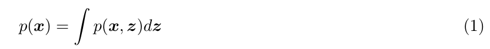
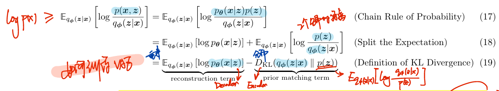

# Understanding Diffusion Models: A Unified Perspective

> "Understanding Diffusion Models: A Unified Perspective" Arxiv, 2022 Aug 25
> [paper](http://arxiv.org/abs/2208.11970v1) [code]() [pdf](./2022_08_Arxiv_Understanding-Diffusion-Models--A-Unified-Perspective.pdf) [note](./2022_08_Arxiv_Understanding-Diffusion-Models--A-Unified-Perspective_Note.md)
> Authors: Calvin Luo

本文档用于整理 Diffusion 基础知识，便于后续复习！:construction_worker:

## Key-point

- Task: survey
- Problems
- :label: Label:


## related survey

- "Diffusion Models: A Comprehensive Survey of Methods and Applications" ACM-Computing-Surveys, 2023
  [paper](https://arxiv.org/pdf/2209.00796.pdf)

> [What are Diffusion Models?](https://lilianweng.github.io/posts/2021-07-11-diffusion-models/)
> [知乎 Diffusion 博客](https://zhuanlan.zhihu.com/p/587727367)
>
> [survey github repo](https://github.com/chq1155/A-Survey-on-Generative-Diffusion-Model)
> [Diffusion Models in Vision: A Survey](https://ieeexplore.ieee.org/abstract/document/10081412)


## Introduction

生成模型目标是建模数据分布 p(x)

>  Given observed samples x from a distribution of interest, the goal of a generative model is to learn to model its true data distribution p(x).

常见生成模型

- GAN
- "likelihood-based": **VAE，DDPM(Denoising diffusion probabilistic models)**
- energy-based modeling: **Score-based generative models**


**先从概率模型作为切入点。**

对于许多类型的数据，可以用其更高维度的特征 z （latent variables ），来表示数据

> For many modalities, we can think of the data we observe as represented or generated by an associated unseen latent variable, which we can denote by random variable z. 

- Q：特征 z 怎么获取呢 -> **构造特征空间**？:star:

通过下面的 ELBO 来优化


### ELBO(Evidence Lower Bound)

likelihood-based 模型的目标是学习一个模型，**让每个数据 x 在数据分布中的概率 p(x) 最大化**

>  Recall one approach of generative modeling, termed "likelihood-based", is to learn a model to maximize the likelihood p(x) of all observed x.

- Q：怎么表示数据 x 的概率 p(x) 呢？

1. 学习联合概率，积分
2. 用条件概率 + 链式法则

> There are two ways we can manipulate this joint distribution to recover the likelihood of purely our observed data p(x); we can explicitly **marginalize out the latent variable z**
>
>  or, we could also appeal to the chain rule of probability:




- Q：上面两个方式直接算 p(x) 很难。。。

eq1 中使用联合概率的方式，里面有**积分**，实现的时候需要遍历所有特征 z，遍历的计算量太大。
eq2 里面的条件概率，就需要有 GT 编码器 p(z|x) 来获取到每个数据的特征

>  Directly computing and maximizing the likelihood p(x) is difficult because it either involves integrating out all latent variables z in Equation 1, which is intractable for complex models, or it involves having access to a ground truth latent encoder p(zx) in Equation 2

- Q：What's `marginalize out`？

> [What does it mean to "marginalise out" something?](https://math.stackexchange.com/questions/1511622/what-does-it-mean-to-marginalise-out-something)
>
> [marginal distribution](https://en.wikipedia.org/wiki/Marginal_distribution)

$p(x) = \int{ p(x|z) dz }$ .  可以**将 x, z 分别为 2D 表格的两个轴**，可以对每行 or 每列加起来的概率 = 1


但是可以把上面式子改一下，推出来一个叫做 ELBO 的优化目标，来代替 "最大化 p(x)" 的目标

> However, using these two equations, we can derive a term called the Evidence Lower Bound (ELBO), which as its name suggests, is a lower bound of the evidence. The evidence is quantified in this case as the log likelihood of the observed data. Then, maximizing the ELBO becomes a proxy objective with which to optimize a latent variable model


使用 ELBO 去优化模型，让 eq3 最大化，最好的情况是 p(x) 本身

> in the best case, when the ELBO is powerfully parameterized and perfectly optimized, it becomes exactly equivalent to the evidence.

因为取了 log 所以要比 logP(x) 小一些，有一个不等式。eq3 的优化到最好，就是 eq4 右边的一个下届 lower bound.


这里编码器模型 $q_{\phi}(z | x)$ 是我们要学习的 model，这里可以**引入后续的 VAE**；可以 max ELBO 这个目标去试着去优化模型。

> Intuitively, it can be thought of as a parameterizable model that is learned to estimate the true distribution over latent variables for given observations x; in other words, it seeks to approximate true posterior p(z|x)

通过优化 ELBO，我们可以学一个编码器模型 （**VAE: Variational Autoencoder**）把数据 x 映射为特征 z**。现在得到了一个高维度特征空间，解决了先前特征 z 不好获取的问题。:star:**

> As we will see when exploring the **Variational Autoencoder**, as we increase the lower bound by tuning the parameters φ to maximize the ELBO, we gain access to components that can be used to model the true data distribution and sample from it, thus learning a generative model


- Q：推导一下，看下**为什么可以用 ELBO 作为优化的下界？**

>  For now, let us try to dive deeper into why the ELBO is an objective we would like to maximize

使用 Jensen 不等式方式推导


- Q：虽然是下界，但缺了啥？


**ELBO 和原始数据分布 $\log{p(x)}$ 差距在于一个 KL 散度 $D_{KL}({q_{{\phi}}(z|x)} || {p(z|x)})$。** :star:

> From this derivation, we clearly observe from Equation 15 that the evidence is equal to the **ELBO plus the KL Divergence between the approximate posterior qφ(z|x) and the true posterior p(z|x).**

1. 了解 ELBO 和 $\log{p(x)}$ 的关系，差了一个 KL 散度项
2. ELBO 是一个优化目标 max p(x) 的下界。可以用这个优化目标学习 VAE

> Understanding this term is the key to understanding not only the **relationship between the ELBO and the evidence**, but also the reason why optimizing the ELBO is an appropriate objective at all.


这里用 VAE $q_{\phi}(z | x)$ 去拟合 $p(z|x)$，存在一个预测的特征分布、真实特征分布之间的距离
$$
\log{p(x)}  = \mathbb{E}_{q_{{\phi}}(z|x)}\left[\log\frac{p(x, z)}{q_{{\phi}}(z|x)}\right] + D_{KL}({q_{{\phi}}(z|x)} || {p(z|x)}) \geq \mathbb{E}_{q_{{\phi}}(z|x)}\left[\log\frac{p(x, z)}{q_{{\phi}}(z|x)}\right]
$$
真实分布 $\log{p(x)}$ 是固定的，**因此最大化 ELBO 等价于去最小化 KL Divergence（最好情况 KL 散度=0）** :star:


- Q：为什么称作 lower bound 下界?  

这个预测&真实分布的 KL 散度 $D_{KL}({q_{{\phi}}(z|x)} || {p(z|x)}) \geq 0$，和真实分布  $\log{p(x)}$ 永远差一丢丢，因此是一个下届

> Firstly, we now know **why the ELBO is indeed a lower bound**: the difference between the evidence and the ELBO is a strictly non-negative KL term, thus the value of the ELBO can never exceed the evidence.


- Q：另一种角度看下为什么优化 ELBO

目标是训练一个模型 $\phi$ 对 x 建模一个高维度特征 z，**为了优化模型，就要去最小化 KL 散度**。让 $q_\phi{(z|x)} \to p{(z|x)}$；

> Secondly, we explore why we seek to maximize the ELBO. Having introduced latent variables z that we would like to model, our goal is to learn this underlying latent structure that describes our observed data. In other words, we want to optimize the parameters of our variational posterior qφ(z|x) to exactly match the true posterior distribution p(z|x), which is achieved by minimizing their KL Divergence (ideally to zero).

**但因为 $p{(z|x)}$ 没有 GT 数据，导致 KL 散度很难去优化！** :star:

> Unfortunately, it is intractable to minimize this KL Divergence term directly, as we do not have access to the ground truth p(z|x) distribution.

因此这个 ELBO 就作为代理的 loss 去优化模型，**原始数据分布 p(x) 不变，最大化 ELBO $\mathbb{E}_{q_{{\phi}}(z|x)}\left[\log\frac{p(x, z)}{q_{{\phi}}(z|x)}\right]$ ，等价与优化 KL 散度** :star:
$$
\log{p(x)}  = \mathbb{E}_{q_{{\phi}}(z|x)}\left[\log\frac{p(x, z)}{q_{{\phi}}(z|x)}\right] + D_{KL}({q_{{\phi}}(z|x)} || {p(z|x)})
$$

> the more we optimize the ELBO, the closer our approximate posterior gets to the true posterior. Additionally, once trained, the ELBO can be used to estimate the likelihood of observed or generated data as well, since it is learned to approximate the model evidence log p(x).


- Q: ELBO 这个式子，分母通过训练编码器得到，分子 p(x,z) 咋搞？

$$
\log{p(x)}  = \mathbb{E}_{q_{{\phi}}(z|x)}\left[\log\frac{p(x, z)}{q_{{\phi}}(z|x)}\right] + D_{KL}({q_{{\phi}}(z|x)} || {p(z|x)})
$$

一般分布 p(x) p(x,z) 相对于模型 $\phi$ 都是一个常数，和模型无关。不影响优化

> However, notice that on the left hand side of Equation 15, the likelihood of our data (and therefore our evidence term log p(x)) is always a constant with respect to φ, as it is computed by marginalizing out all latents z from the joint distribution p(x, z) and does not depend on φ whatsoever.


- 小结
  - 使用 ELBO 来学习 VAE 编码器，**max ELBO 等价于最小化 KL 散度**（让特征分布和真实数据分布尽可能接近），KL 散度不好计算啊！
  - 理解了为什么 ELBO 可以用来优化 max p(x)
  - 引出后续 VAE


### VAE


> In the default formulation of the Variational Autoencoder (VAE) [1], we directly maximize the ELBO

- Q：为什么叫 variational？

因为要**同时优化一堆数据的分布** $q_{{\phi}}(z|x)$ （根据模型 $\phi$ 参数化）

> This approach is variational, because we optimize for the best qφ(z|x) amongst a family of potential posterior distributions parameterized by φ.

- Q：为什么叫 autoencoder？

模型结构很像

> It is called an autoencoder because it is reminiscent of a traditional autoencoder model, where input data is trained to predict itself after undergoing an intermediate bottlenecking representation step.


- Q: 如何训练 VAE？需要什么结构？

**把 ELBO 公式拆解下，能看出来更多结论**：ELBO 式子，可以拆解为**重建项 （Decoder） + KL散度项 （Encoder）**




**就是说最大化 ELBO，等价于优化 2 项 **:star:

1. VAE **Encoder**  $\phi$ (最小化 z 特征分布之间的差距)
2. VAE **Decoder**  $\theta$( 最大化 z 重建效果 )

$$
\begin{align}
\mathbb{E}_{q_{{\phi}}(z|x)}\left[\log\frac{p(x, z)}{q_{{\phi}}(z|x)}\right] = 
\underbrace{{\mathbb{E}_{q_{{\phi}}(z|x)}\left[\log p_{{\theta}}(x|z)\right]}}_\text{reconstruction term(Decoder)} - 

\underbrace{{D_{KL}{q_{{\phi}}(z|x)}{p(z)}}}_\text{prior matching term(Encoder)}
\end{align}
$$

> The two terms in Equation 19 each have intuitive descriptions: the first term measures the **reconstruction likelihood of the decoder from our variational distribution**; this ensures that the learned distribution is modeling effective latents that the original data can be regenerated from.


优化 ELBO，避免 Encoder 学习到的特征分布变成 Dirac delta function :star:

> The second term measures how similar the learned variational distribution is to a prior belief held over latent variables. Minimizing this term **encourages the encoder to actually learn a distribution rather than collapse into a Dirac delta function**

- Q：Dirac delta function 是啥？

一个点 = 1 其余点为 0

> https://www.sciencedirect.com/topics/engineering/dirac-delta-function


- Q： VAE Encoder $\phi$, Decoder $\theta$  得到特征的分布是啥？

定义一下：VAE Encoder 的**概率分布一般选取多元高斯分布**，特征 z 分布 $p(z)$ 选取为标准多元高斯分布；后面可以看到**标准高斯分布有一些性质利于推导公式**

> The encoder of the VAE is commonly chosen to model a multivariate Gaussian with diagonal covariance, and the prior is often selected to be a standard multivariate Gaussian

**定义为标准高斯分布后，改写下ELBO 公式**

1. KL 散度可以用数学公式表示去计算
2. Decoder 重建项可以用 `Monte Carlo estimate` 方法去采样 :warning:

> Then, the KL divergence term of the ELBO can be computed analytically, and the reconstruction term can be approximated using a Monte Carlo estimate. Our objective can then be rewritten as:


- Q：为啥 x->z 需要随机采样？

 $q_{\phi}(z|x)$ 编码器把训练数据 x （理解为图像）编码得到一堆 z，**z 就从这个集合里面选取**；同时按照前面设定，这里的 $p(z)$ 是符合标准多元高斯分布的，**z 是需要随机采样来生成的（约束了 Encoder 生成 z 的方式）**。因此**采用 Monte Carlo estimate 方法，从标准多元高斯分布随机采样一个 z** ，所以需要 Encoder 去模拟随机采样的过程来从 x 生成 z

或者说：x 图像本身有一个分布，这里就有随机性。需要把x每个样本都映射到唯一的一个 z，所以 z 也需要随机性。


- Q：Decoder 优化项中的 z，`Monte Carlo estimate` 采样 -> **需要随机采样的操作不可微分咋办**？

**利用 parameterization trick 解决： 使用一个噪声项表示随机性。同时公式里面有确定项 $\mu$ ，可以通过梯度反传的方式被优化，解决 ELBO 中 decoder 随机采样不可微分，导致不好训练的问题；** :star:

> Fortunately, this can be addressed via the **reparameterization trick** when qφ(z|x) is designed to model certain distributions, including the multivariate Gaussian
>
> **The reparameterization trick rewrites a random variable as a deterministic function of a noise variable**; this allows for the optimization of the non-stochastic terms through gradient descent.

就这样把数据拆解为确定项（均值 ） & 随机项（噪声）。**确定项（均值 ）可以用梯度下降去优化了**


另一个角度，**通过 parameterization trick 实现将任意高斯分布，转化到有更多性质的标准高斯分布**

> In other words, arbitrary Gaussian distributions can be interpreted as standard Gaussians (of **which $\epsilon$ is a sample)** that have their mean shifted from zero to the target mean µ by addition, and their variance stretched by the target variance σ 2 . Therefore, **by the reparameterization trick, sampling from an arbitrary Gaussian distribution can be performed by sampling from a standard Gaussian**, scaling the result by the target standard deviation, and shifting it by the target mean.

**回到 VAE 提取高维度特征**，用 parameterization trick 公式实现 Monte Carlo 采样，把随即向放入噪声中，这下可以用梯度优化了


#### Reparameterization Trick

> [博客参考](https://lilianweng.github.io/posts/2018-08-12-vae/#reparameterization-trick)
>
> - isotropic Gaussian distribution
>
>   isotropic (having uniform physical properties in all directions) 各同向性，**isotropic distribution 在不同方向上的分布都很均匀**，这应该是”各向同性“的直观解释。
>
>   
>
>   `isotropic random vector` 指的就是每个方向上方差为 1，不同方向上协方差为 0 的随机向量。**VAE的reparameterization那一层其实就是isotropic random vector**
>   $$
>   Definition:~\text{A random vector X in } R^n \text{is called isotropic if} \\
>   Cov(X) = E(XX^T) = I_n
>   $$
>
>   1. 判定X是否为 isotropic
>      isotropic 的随机向量与任意向量的内积都等于那个向量的 L2-norm
>   2. 高维的 isotropic random vector 几乎正交（向量内积==0）

Sampling is a stochastic process and therefore we cannot backpropagate the gradient. To make it trainable, the reparameterization trick is introduced. 
$$
z \sim q_{\phi}(z | x) = \mathcal{N}(z;\mu^{(i)},\sigma^{2(i)}I)\\
z = \mu + \sigma \bigodot \epsilon , where ~\epsilon\sim N(0,I)
$$
In the multivariate Gaussian case, we make the model trainable by **learning the mean and variance of the distribution, $\mu$ and $\sigma$,** explicitly using the reparameterization trick, while the stochasticity remains in the random variable $\epsilon\sim N(0,I)$. 

> 随机采样，转化为 $z = \mu + \sigma \bigodot \epsilon$ 形式，能够去学习 $\mu, \sigma$


### Hierarchical VAE （Markovian MHVAE）

更高维度的特征 z 认为是更高更高维度的空间表示，这里想要提取比之前 VAE 更高维度的表示 **（不只是用一个维度的 z，而用 z1,z2,... 来表示 x）**

> A Hierarchical Variational Autoencoder (HVAE) [2, 3] is a generalization of a VAE that extends to multiple hierarchies over latent variables

HVAE 各个step 的特征可以依赖与其他所有 step 的特征，**但这里先只研究特殊情况 Markovian HVAE** :warning:  （后面 DDIM 就是改掉了这个性质！）

> Whereas in the general HVAE with T hierarchical levels, each latent is allowed to condition on all previous latents, in this work we focus on a special case which we call a Markovian HVAE (MHVAE)


**MHVAE** 图示；**Diffusion Model 可以认为是加了一些限定的 MHVAE** :star:


> In a MHVAE, the generative process is a Markov chain; that is, each transition down the hierarchy is Markovian, where decoding each latent $z_t$ only conditions on previous latent $z_{t+1}$

**MHVAE 的 Encoder 和 Decoder 对应的概率公式**

:warning: 注意这里的公式，类似后续 diffusion 的加噪去噪公式

> Mathematically, we represent the joint distribution and the posterior of a Markovian HVAE as


**改写下 ELBO 到对应的 MHVAE**
$$
\mathbb{E}_{q_{{\phi}}(z|x)}\left[\log\frac{p(x, z)}{q_{{\phi}}(z|x)}\right] \to 
\mathbb{E}_{q_{{\phi}}(z_{1:T}|x)}\left[\log\frac{p(x, z_{1:T})}{q_{{\phi}}(z_{1:T}|x)}\right]
$$

- 原先单步 VAE 的 ELBO，上面是联合概率，下面是 encoder 分布 （后验概率）


- **Extended ELBO** 


### summary :star:

- **引入 ELBO 的原因：最大化 p(x) ，学习一个特征分布**。但公式里面有积分不好求解；因此引入 ELBO 作为代替的目标去优化 VAE 模型 $q_{\phi}(z|x)$
  $$
  \log{p(x)}  = \mathbb{E}_{q_{{\phi}}(z|x)}\left[\log\frac{p(x, z)}{q_{{\phi}}(z|x)}\right] + D_{KL}({q_{{\phi}}(z|x)} || {p(z|x)}) \geq \mathbb{E}_{q_{{\phi}}(z|x)}\left[\log\frac{p(x, z)}{q_{{\phi}}(z|x)}\right]
  $$
  
- 为什么 ELBO 是下界？

  **ELBO 和原始数据分布 $\log{p(x)}$ 差距在于一个 KL 散度 $D_{KL}({q_{{\phi}}(z|x)} || {p(z|x)})$。** :star: 这个**KL散度是非负的**，所以和真实数据分布 $\log p(x)$ 会一直差一丢丢，因此称作 lower bound 下届！

  优化 ELBO 等价于去优化 KL 散度（预测特征 z 的分布 <-> z 的真实分布的差距）让其越来越小

- 拆解下 ELBO 包含 2 项：**VAE Encoder** (最小化 z 特征分布之间的差距) && **VAE Decoder**( 最大化 z 重建效果 )


- **parameterization trick** 使用一个噪声项表示随机性。同时公式里面有确定项 $\mu$ ，可以通过梯度反传的方式被优化；**解决 ELBO 中 decoder 随机采样不可微分，导致不好训练的问题**

- Markovian HVAE 中改写的 ELBO 公式
  $$
  \mathbb{E}_{q_{{\phi}}(z|x)}\left[\log\frac{p(x, z)}{q_{{\phi}}(z|x)}\right] \to 
  \mathbb{E}_{q_{{\phi}}(z_{1:T}|x)}\left[\log\frac{p(x, z_{1:T})}{q_{{\phi}}(z_{1:T}|x)}\right]
  $$
  


## Variational Diffusion Models

### DDPM origin :orange:

> - "Deep Unsupervised Learning using Nonequilibrium Thermodynamics" ICML, 2015 Mar 12
>   [paper](http://arxiv.org/abs/1503.03585v8) [code]() [pdf](./2015_03_ICML_Deep-Unsupervised-Learning-using-Nonequilibrium-Thermodynamics.pdf) [note](./2015_03_ICML_Deep-Unsupervised-Learning-using-Nonequilibrium-Thermodynamics_Note.md)
>   Authors: Jascha Sohl-Dickstein, Eric A. Weiss, Niru Maheswaranathan, Surya Ganguli
>
> 参考非均匀热力学，提出 Diffusion forward process 去模拟数据分布，做了 CIFAR 上的图像重建实验 :sun_with_face:
>
> - "Denoising Diffusion Probabilistic Models" NIPS, 2020 Jun 19, `DDPM`
>   [paper](http://arxiv.org/abs/2006.11239v2) [code](https://github.com/hojonathanho/diffusion) [pdf](./2020_06_NIPS_Denoising-Diffusion-Probabilistic-Models.pdf) [note](./2020_06_NIPS_Denoising-Diffusion-Probabilistic-Models_Note.md)
>   Authors: Jonathan Ho, Ajay Jain, Pieter Abbeel
>
> - "Denoising Diffusion Implicit Models" ICLR, 2020 Oct 6, `DDIM`
>   [paper](http://arxiv.org/abs/2010.02502v4) [code](https://github.com/ermongroup/ddim) [pdf](./2020_10_ICLR_Denoising-Diffusion-Implicit-Models.pdf) [note](./2020_10_ICLR_Denoising-Diffusion-Implicit-Models_Note.md)
>   Authors: Jiaming Song, Chenlin Meng, Stefano Ermon
>
> 去噪加速
>
> - "Variational Diffusion Models" NIPS, 2021 Jul 1, `VDM`
>   [paper](https://arxiv.org/abs/2107.00630) [code](https://github.com/google-research/vdm)
>
> 降低计算量


VDM 可以看作 MHVAE 上加了一些限定

1. 特征空间维度 和 **数据维度一样**。或者说：直接去对特征空间建模

   > :warning: 这里说的特征空间是原始的 RGB 图像空间。把 RGB 图像提取特征压缩的那个 diffusion 是 latent DM

2. 每个 timestep 用同一个模型（与 HVAE 不同的是，VDM 中每一个 timestep 的模型不是一个单独的模型，而是一个**线性高斯模型**），输出特征符合高斯分布

3. 最后一个 Timestep 的特征是纯高斯噪声（标准高斯分布）

> - The latent dimension is exactly equal to the data dimension
> - The structure of the **latent encoder at each timestep is not learned; it is pre-defined as a linear Gaussian model.** In other words, it is a **Gaussian distribution** centered around the output of the previous timestep
> - The Gaussian parameters of the latent encoders vary over time in such a way that the distribution of the **latent at final timestep T is a standard Gaussian**


- Q:3 个限定能看出啥？

用来**引出后续加噪去噪的数学公式**的。

各个timestep 的特征符合 Markov Chain，可以用一个公式写出来. 第 0 步特征是数据自身，后续逐步关联提取特征

>  From the first restriction, with some abuse of notation, we can now represent both true data samples and latent variables as xt, where t = 0 represents true data samples and t [1T] represents a corresponding latent with hierarchy indexed by t. 


- Q：与 HVAE 不同的是，VDM 中每一个 timestep 的模型不是一个单独的模型，而是一个**线性高斯模型**

每个 timestep 用同一个模型。每步的特征符合高斯分布，可以表示为均值 + 方差的形式。

> Unlike a Markovian HVAE, **the structure of the encoder at each timestep t is not learned; it is fixed as a linear Gaussian model,** where the mean and standard deviation can be set beforehand as hyperparameters [5], or learned as parameters [6].


- Q：方差为什么这么取？

保证相邻 timestep 的特征的噪声强度类似。**这里参数 $\alpha_t$ 用来控制噪声强度，在每个 timestep 是固定的，有一个表**

>  where the form of the coefficients are chosen such that the variance of the latent variables stay at a similar scale
>
>  From the third assumption, we know that t evolves over time according to a fixed or learnable schedule structured such that the distribution of the final latent p(xT) is a standard Gaussian.


联系到后续 DDPM的加噪去噪


因此 **加噪一步**可以表示为


多步去噪


整体来看，就是逐步加高斯噪声到图像上，使得 xT 变为纯高斯噪声 :star:

> Collectively, what this set of assumptions describes is a steady noisification of an image input over time; we progressively corrupt an image by adding Gaussian noise until eventually it becomes completely identical to pure Gaussian noise. Visually, this process is depicted in Figure 3.

这里 diffusion model 学习的是相邻 timestep 特征的变化 or 条件概率，这样才能**从纯噪声一步步到图像，实现生成。**

> Note that our encoder distributions q(xt|xt−1) are no longer parameterized by φ, as they are completely modeled as Gaussians with defined mean and variance parameters at each timestep. Therefore, in a VDM, we are only interested in learning conditionals pθ(xt−1|xt), so that we can simulate new data


- Q：Diffusion Model 和 VAE 一样也可以用 ELBO 来优化

最后有 3 项

1. 只加噪去噪一步的 reconstruction term, x0 <-> x1
2. 加噪的 KL 散度：t 步的特征，和 t-1 加噪得到的特征分布接近
3. 同一个 timestep ，从 T+1 去噪 & T-1 加噪得到的两个特征分布是接近的


- Q: 用 ELBO 可能训练不出来？

毕竟是 Lower Bound 还是差一些的

实际每一步的噪声变化，可能不是等类似的，可能比模型预测的大，导致加噪 T 步噪声的方差会比预期大一些

> However, actually optimizing the ELBO using the terms we just derived might be suboptimal;
>
> because the consistency term is computed as an expectation over two random variables {xt−1, xt+1} for every timestep, the variance of its Monte Carlo estimate could potentially be higher than a term that is estimated using only one random variable per timestep. As it is computed by summing up T −1 consistency terms, the final estimated value of the ELBO may have high variance for large T values.


重点是看一下加噪去噪公式！:star:

> The key insight is that we can rewrite encoder transitions as q(xt|xt−1) = q(xt|xt−1, x0)

推导一下 ELBO


### Forward diffusion process

重点是看一下加噪去噪公式！:star: 回顾一下设置为高斯分布的加噪公式

> The key insight is that we can rewrite encoder transitions as q(xt|xt−1) = q(xt|xt−1, x0)


用 reparameterization trick 改写一下（把分布写成 `均值 + 方差`的形式）


- Q：单步加噪公式？**一步加噪公式**？

单步加噪公式


推导一下


- Q：去噪公式？

bayes 公式，可以表示为 3 个加噪公式 :star:


。。。

**这里就是去噪一步的公式，code 里面训练一步要用的！:star:**

1. 得到了去噪一步的公式
2. 方差为常量，模型学习这个均值项，里面的 $\hat{x_0}$


- Q：注意这里**去噪公式里面的 x0 是要模型预测的**，要学个模型 :warning: 。如何得到 x0 呢？

> We must parameterize its mean µθ(xt, t) as a function of xt, however, since pθ(xt−1|xt) does not condition on x0.

用下面 MSE loss 优化，让模型基于当前 xt ，去预测x0 :star:  :star:**（代码里面实际用到的 MSE loss）**

MSE loss 本质上是 KL 散度，优化两个特征的均值，让其分布接近

> KL Divergence term reduces to minimizing the difference between the means of the two distributions:


带入发现最终的 loss 是训练 x0 的MSE loss :star:

> Therefore, optimizing a VDM boils down to learning a neural network to predict the original ground truth image from an arbitrarily noisified version of it [5]


#### learn noise

- Q：已经知道了模型训练 x0 的 MSE loss，为啥代码里面是对加的 noise 做 MSE loss？

看这个一步加噪公式，因为训练 t 步的话有 xt，这个公式 x0 可以用 noise $\epsilon$ 表示，所以训练 noise 是一样的
$$
x_t = \sqrt{\overline{\alpha}} \cdot x_0 + \sqrt{1- \overline{\alpha}} \cdot \epsilon_0 
= \sqrt{\alpha_0 \ldots\alpha_{t-(T-1)}} x_{t-T} + \sqrt{1-(\alpha_0 \ldots\alpha_{t-(T-1)})} \epsilon_{t-T}  ~~where~timestamp=T
$$


#### code

单步训练

```python
        @dataclass
        class UNet3DConditionOutput(BaseOutput):
            sample: torch.FloatTensor
        def main():
			noise_scheduler: DDPMScheduler = DDPMScheduler.from_pretrained(config.model.pretrained_model_path, subfolder="scheduler")
    		
            
            # ....
            

            # VAE
            # Convert GT images to latent space
            # latents = vae.encode(rearrange(gt_frames, 'b t c h w -> (b t) c h w')).latent_dist.sample()
            latents = vae.encode(gt_frames).latent_dist.sample()
            latents = latents * vae.config.scaling_factor
            latents = rearrange(latents, '(b t) c h w -> b c t h w', b=b)
            
            
            # timestep
            timesteps = torch.randint(0, noise_scheduler.config.num_train_timesteps, (bsz,), device=latents.device)
            timesteps = timesteps.long()

            # Add noise to the latents according to the noise magnitude at each timestep
            # (this is the forward diffusion process)
            noisy_latents = noise_scheduler.add_noise(latents, noise, timesteps)  # z_t


            # model
            # ...
            # Predict the noise residual
            noise_pred = unet(
                noisy_latents,  # b c t h w
                timesteps,
                encoder_hidden_states=global_prompt_embedding,
                down_block_additional_residuals=down_block_res_samples,
                mid_block_additional_residual=mid_block_res_sample,
            ).sample
            
            
            # loss
            # Get the target for loss depending on the prediction type
            if noise_scheduler.config.prediction_type == "epsilon":
                target = noise
            elif noise_scheduler.config.prediction_type == "v_prediction":
                target = noise_scheduler.get_velocity(latents, noise, timesteps)
            else:
                raise ValueError(f"Unknown prediction type {noise_scheduler.config.prediction_type}")
            
            loss = F.mse_loss(noise_pred.float(), target.float(), reduction="mean")
            accelerator.backward(loss)
            optimizer.step()
            lr_scheduler.step()
            optimizer.zero_grad(set_to_none=args.set_grads_to_none)
            
```

- Q：加噪公式？

```python
from diffusers import DDPMScheduler, DDIMScheduler
noise_scheduler: DDPMScheduler = DDPMScheduler.from_pretrained(config.model.pretrained_model_path, subfolder="scheduler")
```

DDPM 噪声表

```python
    @register_to_config
    def __init__(
        self,
        num_train_timesteps: int = 1000,
        beta_start: float = 0.0001,
        beta_end: float = 0.02,
        beta_schedule: str = "linear",
        trained_betas: Optional[Union[np.ndarray, List[float]]] = None,
        variance_type: str = "fixed_small",
        clip_sample: bool = True,
        prediction_type: str = "epsilon",
        thresholding: bool = False,
        dynamic_thresholding_ratio: float = 0.995,
        clip_sample_range: float = 1.0,
        sample_max_value: float = 1.0,
        timestep_spacing: str = "leading",
        steps_offset: int = 0,
        rescale_betas_zero_snr: int = False,
    ):
        if trained_betas is not None:
            self.betas = torch.tensor(trained_betas, dtype=torch.float32)
        elif beta_schedule == "linear":
            self.betas = torch.linspace(beta_start, beta_end, num_train_timesteps, dtype=torch.float32)
        else:
            raise NotImplementedError(f"{beta_schedule} does is not implemented for {self.__class__}")

        # Rescale for zero SNR
        if rescale_betas_zero_snr:
            self.betas = rescale_zero_terminal_snr(self.betas)

        self.alphas = 1.0 - self.betas
        self.alphas_cumprod = torch.cumprod(self.alphas, dim=0)
```


DDPM 加噪

```python
# DDPM
    
    def add_noise(
        self,
        original_samples: torch.FloatTensor,
        noise: torch.FloatTensor,
        timesteps: torch.IntTensor,
    ) -> torch.FloatTensor:
        # Make sure alphas_cumprod and timestep have same device and dtype as original_samples
        alphas_cumprod = self.alphas_cumprod.to(device=original_samples.device, dtype=original_samples.dtype)
        timesteps = timesteps.to(original_samples.device)

        sqrt_alpha_prod = alphas_cumprod[timesteps] ** 0.5
        sqrt_alpha_prod = sqrt_alpha_prod.flatten()
        while len(sqrt_alpha_prod.shape) < len(original_samples.shape):
            sqrt_alpha_prod = sqrt_alpha_prod.unsqueeze(-1)

        sqrt_one_minus_alpha_prod = (1 - alphas_cumprod[timesteps]) ** 0.5
        sqrt_one_minus_alpha_prod = sqrt_one_minus_alpha_prod.flatten()
        while len(sqrt_one_minus_alpha_prod.shape) < len(original_samples.shape):
            sqrt_one_minus_alpha_prod = sqrt_one_minus_alpha_prod.unsqueeze(-1)

        noisy_samples = sqrt_alpha_prod * original_samples + sqrt_one_minus_alpha_prod * noise
        return noisy_samples
```

对应
$$
x_t = \sqrt{\overline{\alpha}} \cdot x_0 + \sqrt{1- \overline{\alpha}} \cdot \epsilon_0 
= \sqrt{\alpha_0 \ldots\alpha_{t-(T-1)}} x_{t-T} + \sqrt{1-(\alpha_0 \ldots\alpha_{t-(T-1)})} \epsilon_{t-T}  ~~where~timestamp=T
$$


### 公式 summary

- 单步加噪


$$
q(x_t | x_{t-1}) = \mathcal{N}(x_t; \sqrt{1- \beta_t} x_{t-1}, \beta_tI)
$$

- 确定加噪等级的参数 $\beta$，改掉上面公式的 $\alpha_t = 1-\beta_t$ 

均值 $\mu= \sqrt{1- \beta_t}，\sigma^2= \beta_t$ ，Let $\alpha_t = 1-\beta_t >> \mu = \sqrt{1 - \alpha_t}, \sigma=\sqrt{1-\alpha_t}$ .
根据 Reparameterization Trick，$z = \mu + \sigma \bigodot \epsilon$ ，得到 $x_t = \sqrt{1 - \alpha_t} + \sqrt{1-\alpha_t} * \epsilon_{t-1}, ~where~\epsilon\sim\mathcal{N}(0,I)$ :star:

- 1 步加噪

$$
x_t = \sqrt{\overline{\alpha}} \cdot x_0 + \sqrt{1- \overline{\alpha}} \cdot \epsilon_0 
= \sqrt{\alpha_0 \ldots\alpha_{t-(T-1)}} x_{t-T} + \sqrt{1-(\alpha_0 \ldots\alpha_{t-(T-1)})} \epsilon_{t-T}  ~~where~timestamp=T
$$

- 单步去噪

$q(x_{t-1} | x_t, x_0) =$


模型实际与猜测的是里面的 $\hat{x0}$ :star:

- 单步训练，训练 noise 的 MSE loss，和训练 x0 MSE loss 等价


### [Reverse diffusion process](https://lilianweng.github.io/posts/2021-07-11-diffusion-models/#parameterization-of-l_t-for-training-loss)

reverse the above process and sample from $q(x_{t-1} | x_t)$， we will be able to recreate the true sample from a Gaussian noise input $x_T \sim \mathcal{N}(0,1)$. Unfortunately, we **cannot easily estimate $q(x_{t-1} | x_t)$ because it needs to use the entire dataset** 

Thus we need to learn a neural network to approximate the conditioned probability distributions in the reverse diffusion process, $q(x_{t-1} | x_t) = \mathcal{N}(x_t; \mu_{\theta}(x_t,t), \Sigma_{\theta}(x_t,t))$. 

**We would like to train $\mu_{\theta}$ to predict $\tilde{\mu_t} = \frac{1}{\sqrt{\alpha_t}}\cdot(x_t - \frac{1-\alpha_t}{\sqrt{1-\bar{\alpha}_t}}\cdot\epsilon_t)$** :star:

- model predict $\epsilon_{t}$ from input $x_t$ at timestep=t
  $$
  \mu_{\theta} = \frac{1}{\sqrt{\alpha_t}}\cdot(x_t - \frac{1-\alpha_t}{\sqrt{1-\bar{\alpha}_t}}\cdot \epsilon_{\theta}(x_t,t))
  $$


  真实值根据 forward Diffusion process 的公式逆推得到 $\tilde{\mu_t} = \frac{1}{\sqrt{\alpha_t}}\cdot(x_t - \frac{1-\alpha_t}{\sqrt{1-\bar{\alpha}_t}}\cdot\epsilon_t)$

使用 $L_t$ （细节后续补）优化模型，使得预测的 $\mu_{\theta}$ 与 $\tilde{\mu_t}$ 差别最小


- 小结

  1. Forward diffusion process

     对原图 x0 **逐步（Timestep t）**施加一个**少量（通过 $\beta_i$ 来控制）**的高斯噪声，使得原图逐渐失去特征，得到 noise map
     $$
     q(x_t | x_{t-1}) = \mathcal{N}(x_t; \sqrt{1- \beta_t} x_{t-1}, \beta_tI) \\
     x_t = \sqrt{1 - \alpha_t} + \sqrt{1-\alpha_t} * \epsilon_{t-1}, ~where~\epsilon\sim\mathcal{N}(0,I)
     $$

  2. Reverse diffusion process

     希望根据  $q(x_{t-1} | x_t) = \mathcal{N}(x_t; \mu_{\theta}(x_t,t), \Sigma_{\theta}(x_t,t))$ 采样来逆转上述加噪声过程，得到原图。模型预测 $\mu_{\theta}$ 

  3. 加速 Diffusion Process

     - DDIM samples only a subset of S diffusion steps

     - LDM(*Latent diffusion model*) runs the diffusion process in the latent space instead of pixel space, making training cost lower and inference speed faster. 


## DDPM 

> [2020_NeurIPS_DDPM_Denoising-diffusion-probabilistic-models.pdf](./2020_NeurIPS_DDPM_Denoising-diffusion-probabilistic-models.pdf)
> [博客参考](https://zhuanlan.zhihu.com/p/563661713)
> [Markov Chain 博客参考](https://zhuanlan.zhihu.com/p/274775796)
> [DDPM B站视频](https://www.bilibili.com/video/BV1b541197HX/?spm_id_from=333.337.search-card.all.click&vd_source=eee3c3d2035e37c90bb007ff46c6e881)  [DDPM 数学基础](https://zhuanlan.zhihu.com/p/530602852)

- "Denoising Diffusion Probabilistic Models" NIPS, 2020 Jun 19
  [paper](http://arxiv.org/abs/2006.11239v2) [code](https://github.com/hojonathanho/diffusion) [pdf](./2020_06_NIPS_Denoising-Diffusion-Probabilistic-Models.pdf) [note](./2020_06_NIPS_Denoising-Diffusion-Probabilistic-Models_Note.md)
  Authors: Jonathan Ho, Ajay Jain, Pieter Abbeel


## DDIM

> [keras implementation](https://keras.io/examples/generative/ddim/):+1:

- "Denoising Diffusion Implicit Models" ICLR, 2020 Oct 6, `DDIM`
  [paper](http://arxiv.org/abs/2010.02502v4) [code](https://github.com/ermongroup/ddim) [pdf](./2020_10_ICLR_Denoising-Diffusion-Implicit-Models.pdf) [note](./2020_10_ICLR_Denoising-Diffusion-Implicit-Models_Note.md)
  Authors: Jiaming Song, Chenlin Meng, Stefano Ermon

1. 训练 loss 证明了和 DDPM 是一样的

2. 加噪去噪改成了 non-Markovian process

   **每一步加噪 or 去噪都会用到上一步和 x0**，例如加噪 $x_t$ 要用 $x_0, x_{t-1}$，因此每一步加噪去噪就不是 Markovian 了

去噪一步的公式


## Score-based

> [参考](https://zhuanlan.zhihu.com/p/551139290)  [Stochastic Differential Equations and Diffusion Models](https://www.vanillabug.com/posts/sde/)
> 
>- "Generative Modeling by Estimating Gradients of the Data Distribution" NIPS, 2019 Jul 12, `NCSN` :star:
>   [paper](http://arxiv.org/abs/1907.05600v3) [code]() [pdf](./2019_07_NIPS_Generative-Modeling-by-Estimating-Gradients-of-the-Data-Distribution.pdf) [note](./2019_07_NIPS_Generative-Modeling-by-Estimating-Gradients-of-the-Data-Distribution_Note.md)
>  Authors: Yang Song, Stefano Ermon
> 
> - "Score-Based Generative Modeling through Stochastic Differential Equations" ICLR, 2020 Nov 26
>   [paper](http://arxiv.org/abs/2011.13456v2) [code]() [pdf](./2020_11_ICLR_Score-Based-Generative-Modeling-through-Stochastic-Differential-Equations.pdf) [note](./2020_11_ICLR_Score-Based-Generative-Modeling-through-Stochastic-Differential-Equations_Note.md)
>  Authors: Yang Song, Jascha Sohl-Dickstein, Diederik P. Kingma, Abhishek Kumar, Stefano Ermon, Ben Poole
> 
> - "Improved Techniques for Training Score-Based Generative Models" NIPS, 2020 Jun 16
>   [paper](http://arxiv.org/abs/2006.09011v2) [code]() [pdf](./2020_06_NIPS_Improved-Techniques-for-Training-Score-Based-Generative-Models.pdf) [note](./2020_06_NIPS_Improved-Techniques-for-Training-Score-Based-Generative-Models_Note.md)
>  Authors: Yang Song, Stefano Ermon
> 


使用 Langevin dynamics 随机生成混合高斯分布，从一点生成一个轨迹。有一种 score function 其大小 & 方向与轨迹类似。

- Q：什么是 Langevin dynamics？

用来生成数据分布的方法。

> https://zhuanlan.zhihu.com/p/545910038
>
> - "Generative Modeling by Estimating Gradients of the Data Distribution" NIPS, 2019 Jul 12, `NCSN`
>   [paper](http://arxiv.org/abs/1907.05600v3) [code]() [pdf](./2019_07_NIPS_Generative-Modeling-by-Estimating-Gradients-of-the-Data-Distribution.pdf) [note](./2019_07_NIPS_Generative-Modeling-by-Estimating-Gradients-of-the-Data-Distribution_Note.md)
>   Authors: Yang Song, Stefano Ermon


### energy-based

- "A tutorial on energy-based learning."
- "How to train your energy-based models"


## Loss

- "Progressive Distillation for Fast Sampling of Diffusion Models" ICLR, 2022 Feb 1, `v-prediction`
  [paper](http://arxiv.org/abs/2202.00512v2) [code]() [pdf](./2022_02_ICLR_Progressive-Distillation-for-Fast-Sampling-of-Diffusion-Models.pdf) [note](./2022_02_ICLR_Progressive-Distillation-for-Fast-Sampling-of-Diffusion-Models_Note.md)
  Authors: Tim Salimans, Jonathan Ho


