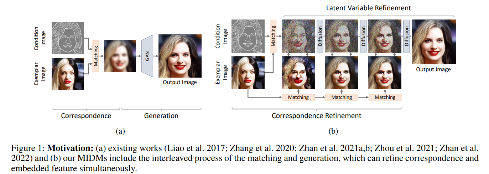
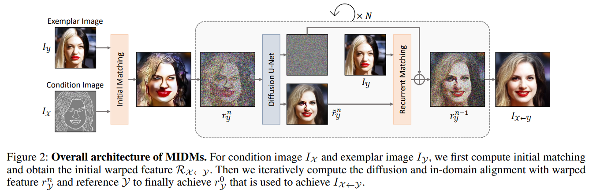
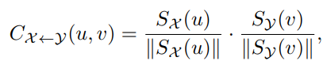
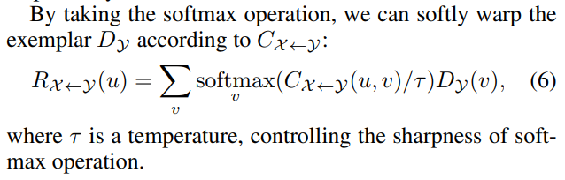
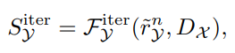
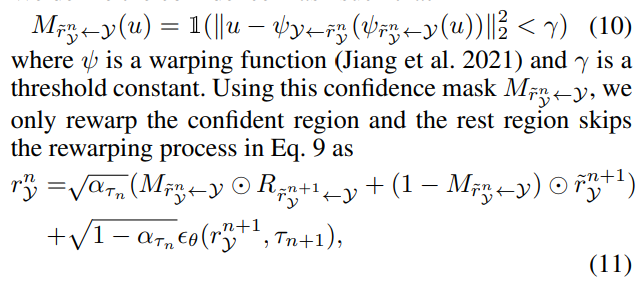

# MIDMs: Matching Interleaved Diffusion Models for Exemplar-based Image Translation

> "MIDMs: Matching Interleaved Diffusion Models for Exemplar-based Image Translation" AAAI, 2022 Sep
> [paper](http://arxiv.org/abs/2209.11047v3) [code](https://github.com/KU-CVLAB/MIDMs/) [website](https://ku-cvlab.github.io/MIDMs/)
> [pdf](./2022_09_AAAI_MIDMs--Matching-Interleaved-Diffusion-Models-for-Exemplar-based-Image-Translation.pdf)
> Authors: Junyoung Seo, Gyuseong Lee, Seokju Cho, Jiyoung Lee, Seungryong Kim

## Key-point

- Task:  exemplar-based image translation
- Problems
- :label: Label:

## Contributions

## Introduction

Most existing methods for this task were formulated as GANbased matching-then-generation framework.

> 参考 Bi-Level, SPADE

- Motivation

  Motivated by the recent success of diffusion models overcoming the shortcomings of GANs, we incorporate the diffusion models to overcome these limitations. 

  先前框架里面用的 GAN

## methods

Motivation: 先前方法先对齐将 exemplar warp 到于 condition 结构相似，然后再用 GAN 生成最终图像；

- 存在的问题

  先前工作直接用 encoder 同时对 condition 和 exemplar 提取公共的特征 domain-invariant features (condition 一般为分割图，和自然图像跨域)，然后直接做匹配去 warp；**由于跨域，很难提取 domain-invariant features 特征**

  directly estimating cross-domain correspondence (e.g., sketch-photo) is much **more complicated and erroneous** than in-domain correspondence. 

  **很难直接预测跨域的匹配**，有噪声下 warp 出来的图不好。再基于这个图直接用 GAN 生成，又融合了 GAN 本身的缺陷，例如  less diversity or mode drop in the output distribution

**framework**

MIDMs 利用 diffusion 替换先前方法第二阶段的 GAN，先进行 warp 后，不是直接 GAN 生成，而是在逐步去噪过程中，预测的 x0 图像和上一次 warped exemplar，再次计算 correspondence 进行 warp 更新 x0，从 $x_t \to x_{t-1}$；最终去噪得到 x0. 
可以理解整个流程是**迭代进行 refinement 对 warp 结果修正 + 生成的过程**，逐步更新 warp 的结果，逐步生成

### Cross-Domain Correspondence and Warping

For the cross-domain correspondence, our framework reduces a domain discrepancy by introducing two additional encoders 

先用预训练的 VQ-VAE 提取对图像提取特征 $D_x, D_y$，再用 encoder 提取特征 $S_x, S_y$
$$
I_x 为 condition 图，I_y 为exemplar\\
D_x=\epsilon(I_x),~ D_y=\epsilon(I_y),\\
SX = FX (DX ) ~and~ SY = FY (DY )
$$
**就是做了一个类似 attention 的操作，将 exemplar 图像 warp 到 condition**

> - :question: 特征 S_x 形式？看起来是有 index，每个 index 下去和其他所有 condition 特征计算相似度

用两个特征计算余弦相似度，得到  correlation map

> By taking the softmax operation, we can softly warp the exemplar DY according to CX←Y

### Interleaving Correspondence and Reverse Process

使用 DDPM 作为先验，使用 standard forward process of DDPMs & DDIM 加速，**每一步去 refined warped exemplar**

> 对 Diffusion finetune

1. first feed the initially-warped exemplar $R_{y\to x}$ to a noising process to get $r^N_y$
2. 预测 $\hat{x_0}$ 作为优化后的 warped 图，去和融合了这个 warp 和 condition 的特征 $S_y$ 再次匹配，优化 warp

> observe that injecting the condition DX into the feature extractor can help to align the features :star:

### Confidence-Aware Matching

问题：condition image having earrings that do not exist in exemplar image 

用阈值限制一下 correspondence map，对某些差异较大区域不 warp

only rewarp the confident region and the rest region skips the rewarping process

## Experiment

> ablation study 看那个模块有效，总结一下

## Limitations

## Summary :star2:

> learn what & how to apply to our task

1. observe that injecting the condition DX into the feature extractor can help to align the features :star:
2. 使用 DDPM 逐步去噪，去优化 alignment
