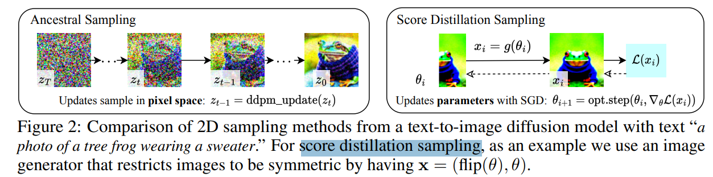
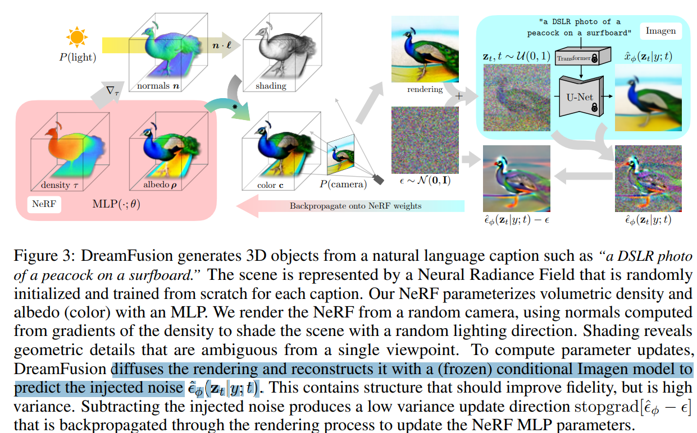

# DreamFusion: Text-to-3D using 2D Diffusion

> "DreamFusion: Text-to-3D using 2D Diffusion" Arxiv, 2022 Sep 29
> [paper](http://arxiv.org/abs/2209.14988v1) [code]() [pdf](./2022_09_Arxiv_DreamFusion--Text-to-3D-using-2D-Diffusion.pdf) [note](./2022_09_Arxiv_DreamFusion--Text-to-3D-using-2D-Diffusion_Note.md)
> Authors: Ben Poole, Ajay Jain, Jonathan T. Barron, Ben Mildenhall

## Key-point

- Task
- Problems
- :label: Label:

## Contributions

## Introduction

## methods

## setting

## Experiment

> ablation study 看那个模块有效，总结一下

## Limitations

## Summary :star2:

> learn what

### how to apply to our task

