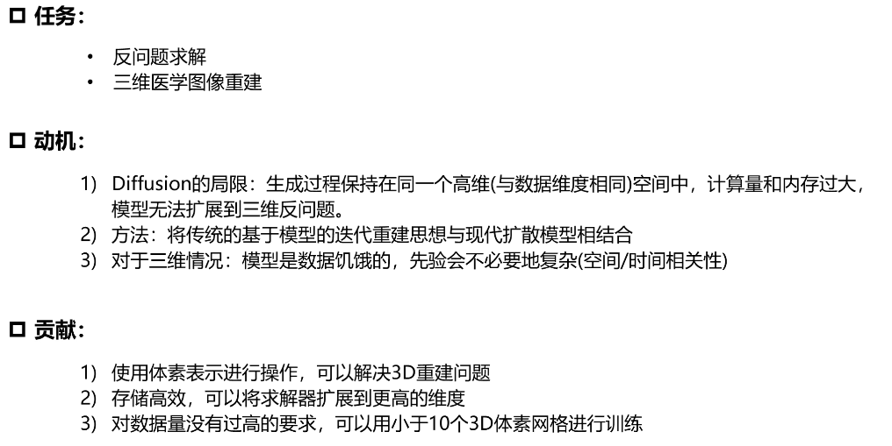

# Solving 3D Inverse Problems using Pre-trained 2D Diffusion Models

> "Solving 3D Inverse Problems using Pre-trained 2D Diffusion Models" Arxiv, 2022 Nov
> [paper](http://arxiv.org/abs/2211.10655v1) [code]() [pdf](./2022_11_Arxiv_Solving-3D-Inverse-Problems-using-Pre-trained-2D-Diffusion-Models.pdf) [note](./2022_11_Arxiv_Solving-3D-Inverse-Problems-using-Pre-trained-2D-Diffusion-Models_Note.md)
> Authors: Hyungjin Chung, Dohoon Ryu, Michael T. McCann, Marc L. Klasky, Jong Chul Ye

## Key-point

- Task
- Problems
- :label: Label:

## Contributions

## Introduction

## methods

## Experiment

> ablation study 看那个模块有效，总结一下

## Limitations

## Summary :star2:

> learn what & how to apply to our task

