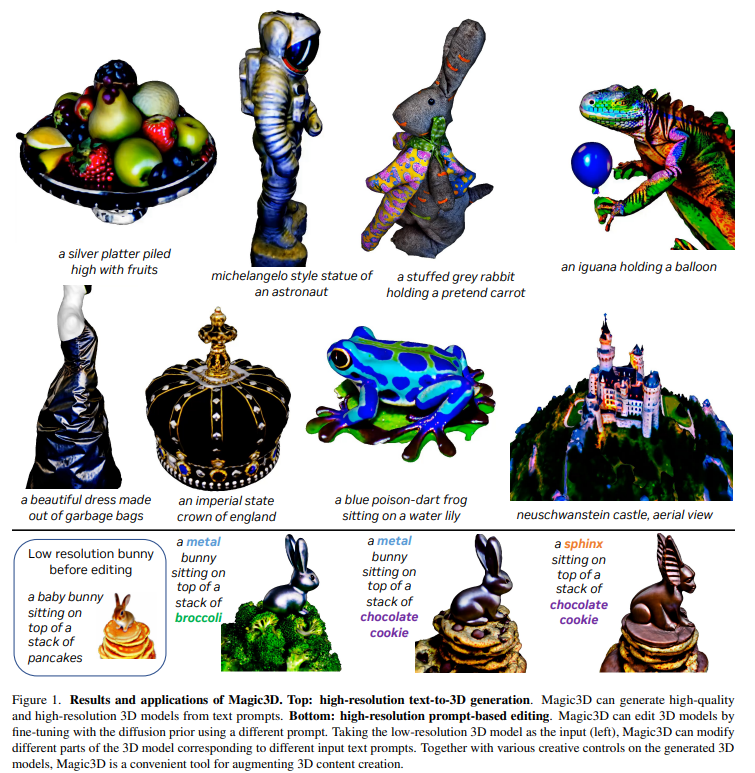
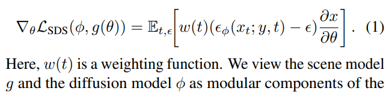
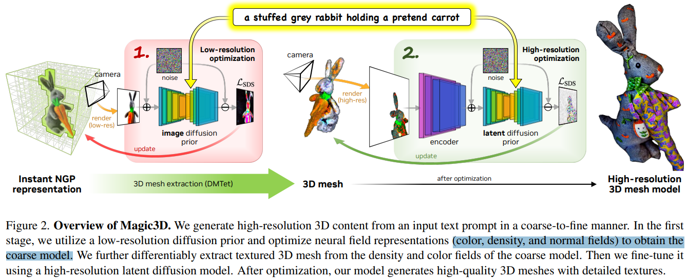
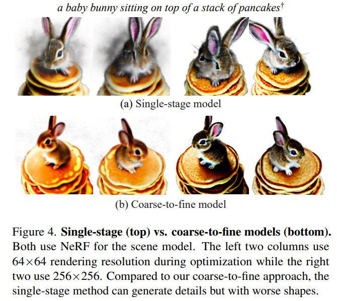

# Magic3D: High-Resolution Text-to-3D Content Creation

> "Magic3D: High-Resolution Text-to-3D Content Creation" CVPR, 2022 Nov 18
> [paper](http://arxiv.org/abs/2211.10440v2) [code]() [pdf](./2022_11_CVPR_Magic3D--High-Resolution-Text-to-3D-Content-Creation.pdf) [note](./2022_11_CVPR_Magic3D--High-Resolution-Text-to-3D-Content-Creation_Note.md)
> Authors: Chen-Hsuan Lin, Jun Gao, Luming Tang, Towaki Takikawa, Xiaohui Zeng, Xun Huang, Karsten Kreis, Sanja Fidler, Ming-Yu Liu, Tsung-Yi Lin

## Key-point

- Task: text-to-3D

- Problems

  DreamFusion 的问题

  - extremely slow optimization of NeRF
  - low-resolution image space supervision on NeRF, leading to low-quality 3D models with a long processing time.

- :label: Label:

## Contributions

- 提出一个 2 阶段模型，实现 DreamFusion 的加速
  - 用 low-resolution 的 DIffusion 生成一个粗糙的 3D grid 结构，作为**初始化**
  - 用高清的 diffusion 优化细节

> In this paper, we address these limitations by utilizing a two-stage optimization framework.
>
> we obtain a coarse model using a low-resolution diffusion prior and accelerate with a sparse 3D hash grid structure.
>
> Using the coarse representation as the initialization, we further optimize a textured 3D mesh model with an efficient differentiable renderer interacting with a high-resolution latent diffusion model

- 提速 2x & 分辨率更高

>  Our method, dubbed Magic3D, can create high quality 3D mesh models in 40 minutes, which is 2× faster than DreamFusion (reportedly taking 1.5 hours on average),

- 关注一下 3D 生成如何 control

## Introduction

### DreamFusion

> - "DreamFusion: Text-to-3D using 2D Diffusion" Arxiv, 2022 Sep 29
>   [paper](http://arxiv.org/abs/2209.14988v1) [code]() [pdf](./2022_09_Arxiv_DreamFusion--Text-to-3D-using-2D-Diffusion.pdf) [note](./2022_09_Arxiv_DreamFusion--Text-to-3D-using-2D-Diffusion_Note.md)
>   Authors: Ben Poole, Ajay Jain, Jonathan T. Barron, Ben Mildenhall

将 text2image 模型用于 NeRF

> DreamFusion [33] has recently demonstrated the utility of a pre-trained text-to-image diffusion model to optimize Neural Radiance Fields (NeRF) [25], achieving remarkable text-to-3D synthesis results

提出 SDS，是后续训练的基础 :star:

> Specifically, DreamFusion introduces Score Distillation Sampling (SDS), which computes the gradient

## methods

- Low-resolution 先处理一个粗糙的 3D grid
- 微调一个 LDM 去细化细节

DreamFusion 的 3D 结构基于 Mip-NeRF。Mip-NeRF 的坐标 MLP 需要训练很久。。

> In DreamFusion [33], the scene model is a neural field (a coordinate-based MLP) based on Mip-NeRF 360 [3] that predicts albedo and density
>
> This is a suitable choice as neural fields can handle topological changes in a smooth, continuous fashion. However, Mip-NeRF 360 [3] is computationally expensive as it is based on a large global coordinate-based MLP.

使用 Instant-NGP 的 hash encoding 实现加速

> For this reason, we opt to use the hash grid encoding from Instant NGP [27], which allows us to represent highfrequency details at a much lower computational cost.

两个网络，一个预测（反射率 & 密度）另一个预测法向量；使用基于密度的 voxel，八叉树？？

> We use the hash grid with two single-layer neural networks,one predicting albedo and density and the other predicting normals. 
>
> Specifically, we use the density-based voxel pruning approach from Instant NGP [27] with an octreebased ray sampling and rendering algorithm [46]

使用 Stage1 场景表示(NeRF) 保存在模型里的，可以继续训练！**虽然对于一些 pose 还可以，但对于高分辨率就挂了**

> Using the same sce ne representation (the neural field) from the initial coarse stage of optimization could be a natural choice since the weights of the model can directly carry over. Although this strategy can work to some extent (Figs. 4 and 5), it struggles to render very high-resolution (e.g., 512 × 512) images within reasonable memory constraints and computation budgets.

为了实现精致细节，用**有纹理的 3D meshes 作为 3D 结构**

> To resolve this issue, we use textured 3D meshes as the scene representation for the fine stage of optimization.

效率比构造 volume 高

> In contrast to volume rendering for neural fields, rendering textured meshes with differentiable rasterization can be performed efficiently at very high resolutions, making meshes a suitable choice for our high-resolution optimization stage.

## setting

## Experiment

> ablation study 看那个模块有效，总结一下

## Limitations

## Summary :star2:

> learn what

### how to apply to our task

