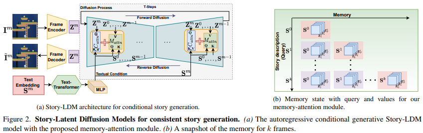

# Make-A-Story: Visual Memory Conditioned Consistent Story Generation

> "Make-A-Story: Visual Memory Conditioned Consistent Story Generation" CVPR, 2022 Nov
> [paper](https://arxiv.org/abs/2211.13319) [code](https://github.com/ubc-vision/Make-A-Story)
> [paper local pdf](./2022_11_CVPR_Make-A-Story--Visual-Memory-Conditioned-Consistent-Story-Generation.pdf)

**Key-point**

针对 text-condition diffusion 用于 story visualization 生成内容一致性问题，在 LDM 基础上，提出一个 visual-memory module 加入到 U-net 里面。具体来说是，在上采样or下采样后增加 memory attn. 

与 LDM 对比，对输入文本有指代 they 的情况，前后生成的图一致性更好。

> 作者在 Stable Diffusion 基础上改进，直接用 LDM 效果就比 SOTA 更好。之后找了一个 reference resolution 指代识别的点，对数据集增加难度，来体现 memory 机制的优势

**Contributions**

- 对数据集进行修改：增加人物、背景，替换指代（人名换成 they etc.）
- 在 LDM 基础上增加 memory attn
- 增加指标衡量生成故事图 和文本对应的效果（预训练 InceptionV3 评估任务、背景准确率）

**Related Work**

- Coreference resolution

  > [doc](https://blog.csdn.net/github_36088377/article/details/52496142)

  将同一个物体不同的 mention（Kobe, 篮球全明星, 他）识别并归类

- Story Generation 任务背景

  给 M 个文本，生成对应的 M 张图

## **methods**

### memory attn module

在 LDM 基础上改的，**正常 U-net cross attn ($Query,Key = S^m$)之后加一层这个 memory attn module（当前和之前的文本，先前生成结果一起后处理一下）** :star:

当前文本作为 $Query = S^m$, 之前的文本作为 $Key = S^{<m}$, 之前生成的图像 latent code 作为 $Value=Z^{<m}$

Stable Diffusion 去噪 T 步的每一步，都用这个 memory attn：意思就是说 U-net 正常 cross-attn 后加一个这个memory layer

> 在 MUGEN 数据集上生成的各帧结果，相比 LDM 提升了一致性

## **Experiment**

> ablation study 看那个模块有效，总结一下

去掉 memory attn 就和 LDM 类似，针对将明确的人名，换为 reference 的情况效果有提升

## **Limitations**

## **Summary :star2:**

> learn what & how to apply to our task

1. **正常 U-net cross attn ($Query,Key = S^m$)之后加一层这个 memory attn module** :star: 直接替换 QKV 为先前结果，能够提升 LDM 生成的一致性
2. 相比于先前方法，用 LDM 生成内容具有多样性，在 exp 里面也可以展示一下