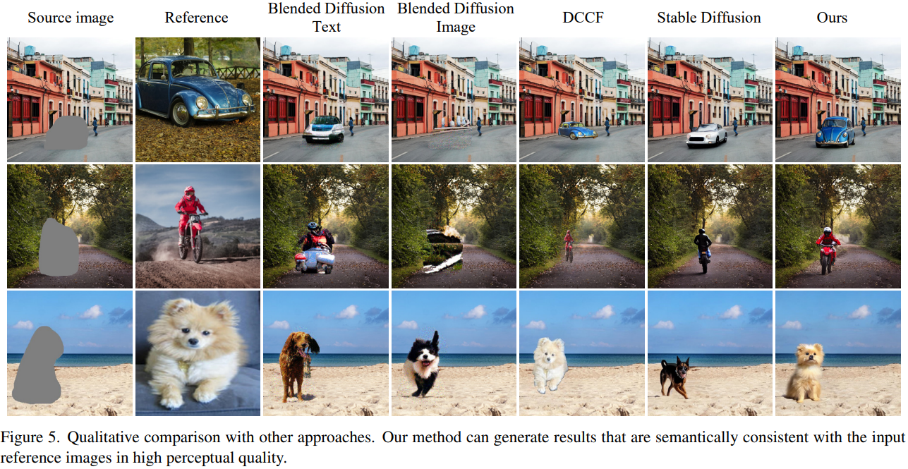

# Paint by Example: Exemplar-based Image Editing with Diffusion Models

> "Paint by Example: Exemplar-based Image Editing with Diffusion Models" CVPR, 2022 Nov
> [paper](http://arxiv.org/abs/2211.13227v1) [code](https://github.com/Fantasy-Studio/Paint-by-Example) 
> [pdf](./2022_11_CVPR_Paint-by-Example--Exemplar-based-Image-Editing-with-Diffusion-Models.pdf) [note](./2022_11_CVPR_Paint-by-Example--Exemplar-based-Image-Editing-with-Diffusion-Models_Note.md)
> Authors: Binxin Yang, Shuyang Gu, Bo Zhang, Ting Zhang, Xuejin Chen, Xiaoyan Sun, Dong Chen, Fang Wen

## Key-point

- Task
- Problems
- :label: Label:

## Contributions

## Introduction

## methods

对于参考图像使用 CLIP Image Encoder 提取特征，只是训练几个 MLP 达到迁移的目的 :+1:

## Experiment

> ablation study 看那个模块有效，总结一下

## Limitations

## Summary :star2:

> learn what & how to apply to our task

