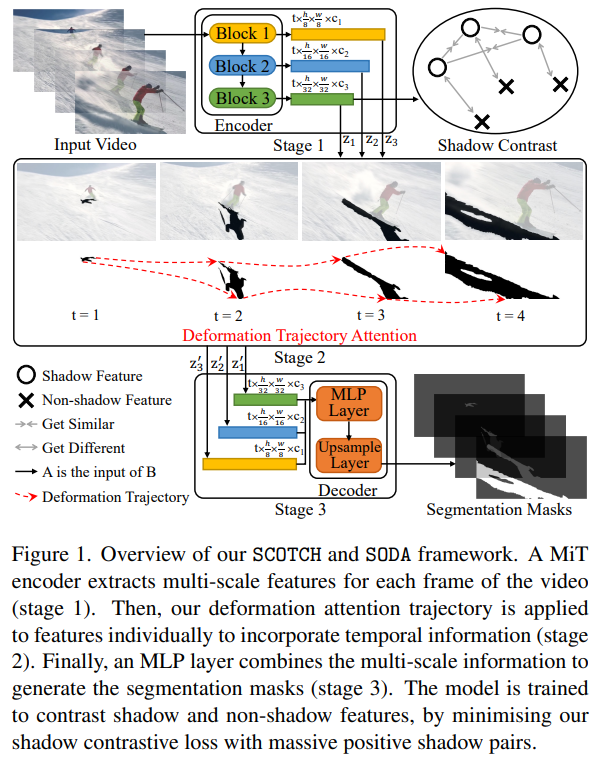
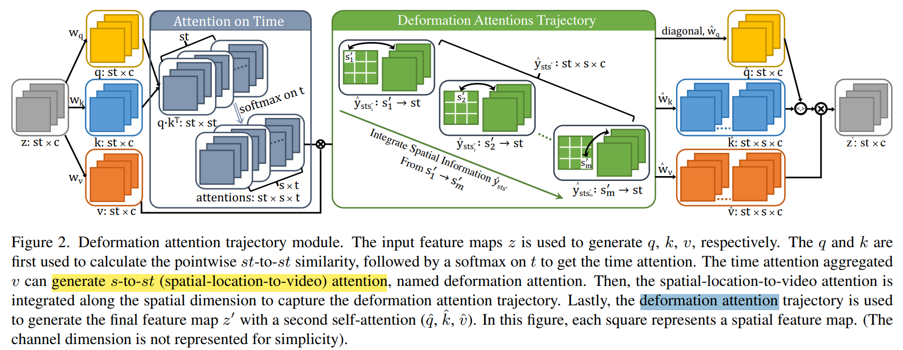

# SCOTCH and SODA: A Transformer Video Shadow Detection Framework

> "SCOTCH and SODA: A Transformer Video Shadow Detection Framework" CVPR, 2022 Nov
> [paper](http://arxiv.org/abs/2211.06885v2) [code](https://github.com/lihaoliu-cambridge/scotch-and-soda) [website](https://lihaoliu-cambridge.github.io/scotch_and_soda/) 
> [pdf](./2022_11_CVPR_SCOTCH-and-SODA--A-Transformer-Video-Shadow-Detection-Framework.pdf)
> Authors: Lihao Liu, Jean Prost, Lei Zhu, Nicolas Papadakis, Pietro Liò, Carola-Bibiane Schönlieb, Angelica I Aviles-Rivero

## Key-point

- Task
- Problems
- :label: Label:

关注如何提取 shadow，类似老电影修复中的划痕

## Contributions

1. SODA, our new video self-attention module
2. shadow contrastive learning mechanism (SCOTCH) which aims at guiding the network to learn a unified shadow representation

## Introduction

- "Detect Any Shadow: Segment Anything for Video Shadow Detection"
  [paper](https://arxiv.org/abs/2305.16698)

- "SegFormer: Simple and Efficient Design for Semantic Segmentation with Transformers"
  [paper](https://arxiv.org/abs/2105.15203)

  SegFormer包含了一个新的分层结构的transformer编码器，可以输出多尺度特征。**该算法不需要位置编码，避免了在测试分辨率与训练分辨率不同时对位置码进行插值导致性能下降的问题**

## methods

 Mix Transformer (MiT) 提取多尺度特征

## Experiment

> ablation study 看那个模块有效，总结一下

## Limitations

## Summary :star2:

> learn what & how to apply to our task

