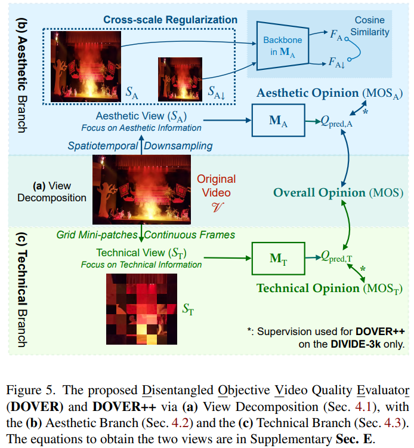

# Exploring Video Quality Assessment on User Generated Contents from Aesthetic and Technical Perspectives

> "Exploring Video Quality Assessment on User Generated Contents from Aesthetic and Technical Perspectives" ICCV, 2022 Nov 9, `DOVER`
> [paper](http://arxiv.org/abs/2211.04894v3) [code](https://github.com/VQAssessment/DOVER) [pdf](./2022_11_ICCV_Exploring-Video-Quality-Assessment-on-User-Generated-Contents-from-Aesthetic-and-Technical-Perspectives.pdf) [note](./2022_11_ICCV_Exploring-Video-Quality-Assessment-on-User-Generated-Contents-from-Aesthetic-and-Technical-Perspectives_Note.md)
> Authors: Haoning Wu, Erli Zhang, Liang Liao, Chaofeng Chen, Jingwen Hou, Annan Wang, Wenxiu Sun, Qiong Yan, Weisi Lin

## Key-point

- Task
- Problems
- :label: Label:

## Contributions

## Introduction

## methods

> In the aesthetic branch, we use **SA with size 224 × 224 during inference** and overdownsampled SA↓ size 128×128 to better exclude technical quality issues. 
>
> N = 32 frames are sampled uniformly from each video and the backbone is inflated-ConvNext [70] Tiny pre-trained with AVA [22]. In the technical branch, we crop single patches at size Sf = 32 from 7 × 7 spatial grids and sample a clip of 32 continuous frames during training, and three clips during inference

## setting

## Experiment

> ablation study 看那个模块有效，总结一下

## Limitations

## Summary :star2:

> learn what

### how to apply to our task

