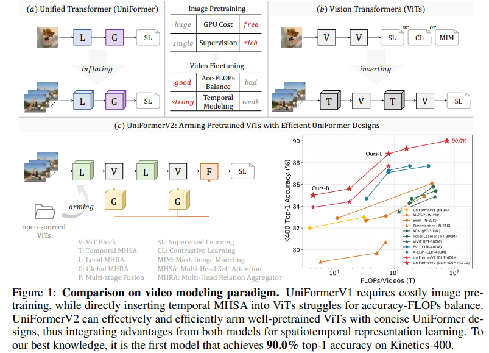
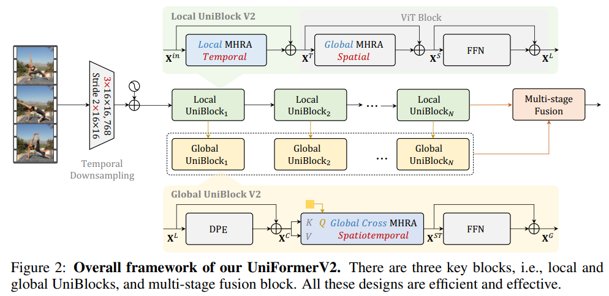
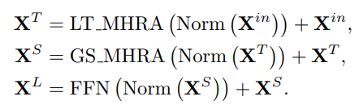
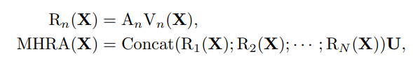

# UniFormerV2: Spatiotemporal Learning by Arming Image ViTs with Video UniFormer

> "UniFormerV2: Spatiotemporal Learning by Arming Image ViTs with Video UniFormer" ICCV, 2022 Nov
> [paper](http://arxiv.org/abs/2211.09552v1) [code](https://github.com/OpenGVLab/UniFormerV2.) [author_blog](https://zhuanlan.zhihu.com/p/584669411) :star:
> [pdf](./2022_11_ICCV_UniFormerV2--Spatiotemporal-Learning-by-Arming-Image-ViTs-with-Video-UniFormer.pdf)
> Authors: Kunchang Li, Yali Wang, Yinan He, Yizhuo Li, Yi Wang, Limin Wang, Yu Qiao

## Key-point

- Task: 视频分类

- Problems

  当时最大的模型为UniFormer-B（50M参数），输入32帧，需要使用32张V100在Kinetics上训练约2周。**那么有没有更好的结构设计与训练方案，一来能保证模型的性能足够好，另外又能节省训练开销，让一般的实验室算力，也能进行2022年的视频框架探索呢？**

  基于图像预训练ViT的方法，难以真正地提升时序建模能力，在Something-Something等强时序相关数据集上效果较差（甚至不如基于ResNet的轻量模型）

- :label: Label:

设计了**通用高效的时序建模模块**，可以无缝插入到各种开源预训练图像ViT中

参考作者的知乎博客

## Contributions

1. the first model that achieves 90.0% top-1 accuracy on Kinetics-400

## Introduction

- "ViViT: A Video Vision Transformer"
  [paper](https://arxiv.org/abs/2103.15691)
  
- "Multiscale Vision Transformers" ICCV, 2021 Apr
  [paper](https://arxiv.org/abs/2104.11227)
  
- "Uniformer: Unified transformer for efficient spatial-temporal representation learning."

- TimeSFormer

- "Multiview transformers for video recognition" CVPR, 2022 Jan
  [paper](https://arxiv.org/abs/2201.04288)
  
  

## methods

- MHRA: Multi-Head Relation Aggregator
- MHSA: Multi-Head Self-Attention

UniformerV2 框架

1. leverage the robust spatial representation of ViT

2. 使用 Uniformer 中提出的 MHRA reduce local temporal redundancy。

   introduce a global UniBlock on top of each local UniBlock, which can capture full spatiotemporal dependency. 

3. 3 个主要模块，local & global MHRA, fusion block

> Video SR 目标利用冗余信息来恢复，与视频分类的目标不一致

### LOCAL UNIBLOCK

在**保留原始ViT对空间的全局建模的前提下（提取空间上的特征）**，我们额外引入局部时间建模，该模块遵循UniFormer局部模块的设计，但depth-wise卷积仅在时间维度操作。在较小计算量的前提下提升骨架网络的时序建模能力

`LT_MHRA` 为时序注意力，`GS_MHRA` 为 ViT 中空间注意力

Uniformer 中提出的 ZMHRA

相比 Uniformer，abandon its Dynamic Position Encoding (DPE) in the local UniBlock, since the position encoding in the **ViT block has characterized token locations**

### GLOBAL UNIBLOCK

long-range dependency modeling

### FUSION BLOCK

将不同层的 informative token 融合，得到更复杂的表征，我们探索了包括串行、并行、层次化等几种融合方式

## Experiment

> ablation study 看那个模块有效，总结一下

- 发现 :star:

  - **对于Kinetics系列等场景相关视频**，也即单图即可较好判断行为的前提下，模型只需要在深层额外插入Global UniBlock，便可以满足这一大类数据的需求。
  - **对于Something-Something这类强时序相关视频**，对模型的时序建模能力要求极高，除了在Patch Embedding引入temporal downsampling之外，我们还在每层插入Local UniBlock，在网络的中层和深层插入Global UniBlock，方能实现强大的时序判别。

  > 在时序做降采样，默认各帧权值相同？

- UniFormerV2只需要在单个视频数据上训练少量epoch，而以往方法往往需要先在K400上预训练，或者进行数千个epoch的自监督训练，才能达到最好的性能。

## Limitations

## Summary :star2:

> learn what & how to apply to our task

