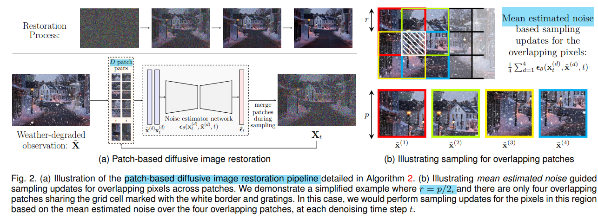

# Restoring Vision in Adverse Weather Conditions with Patch-Based Denoising Diffusion Models

>"Restoring Vision in Adverse Weather Conditions with Patch-Based Denoising Diffusion Models" TPAMI, 2022 Jul
>[paper](https://arxiv.org/abs/2207.14626) [code](https://github.com/igitugraz/weatherdiffusion)
>[paper local pdf](./2022_11_TPAMI_Restoring-Vision-in-Adverse-Weather-Conditions-with-Patch-Based-Denoising-Diffusion-Models.pdf)

## **Key-point**

- Task: Image restoration under adverse weather conditions 去雨+雾，去雪，去镜头上的雨滴

- Background

  先前 GAN 方法学习数据分布，在 multi-task 多种去噪任务上效果好。还没有工作将 Diffusion 用于 adverse weather conditions 去噪

本文将 DDPM 用于多种退化的 adverse weather conditions 去噪。提出用 patch-based diffusive restoration 方法，推理时候**对重叠 patch 预测的噪声取平均**，实现任意分辨率图像的修复，**解决 DDPM 噪声图尺寸受限问题**。

训练时候随机 crop 去训，**在 test 时候，对任意尺寸图像通过 crop 后输入，在去噪过程预测的噪声进行拼接效果更好！**

## **Contributions**

1. novel **patch-based diffusive image restoration algorithm** for arbitrary sized image
2. **state-of-the-art performance** on both weather-specific and multi-weather restoration tasks.
3. **strong generalization** from synthetic to real-world data

## **Related Work**

- Image Deraining & Dehazing

- Removing Raindrops

- Image Desnowing

- Multi-Weather Restoration

  - "TransWeather: Transformer-based Restoration of Images Degraded by Adverse Weather Conditions"
    [paper](https://arxiv.org/abs/2111.14813)

    > Transformer based SOTA on Multi-Weather Restoration

## **methods**

### crop-training

1. 在全图上随机取 $p \times p$ 的 patch 来训练
2. 训练数据用各类 weather degradation 图像，实现 multi-task 修复

### Patch-based Diffusive Image Restoration

> 直接看 Algorithm 2

在测试时候使用。

常见方法：crop 区域的最终结果拼接起来，重叠区域取平均，拼接的边缘会有伪影。

本文在 DDIM 去噪过程中**对预测的噪声进行拼接**。具体说，对 DDIM 去噪过程 S 步的每一步，按步长 stride=r 取 patch，将各个 patch 预测的噪声 $\epsilon^{(i)}$ 拼接为与输入图同尺寸的噪声图中，再对重叠区域取平均 $\hat{\Omega_t}$ 

 eliminates the restriction for the diffusion model backbone to have a fully-convolutional structure to be able to perform arbitrary sized image processing

## Experiment

> ablation study 看那个模块有效，总结一下

- setting

  Section 4 写的很详细

  1. 设置 patch side `p=64`, stride `r=16`
  2. 超参设置参考 DDPM，DDIM

  train for 2,000,000 iterations, `learning_rate=2e-5` 不衰减

- Test-set

  crop 64x64 数据 WeatherDiff 效果一般更好，或单独在某个数据集上训得效果优于之前 SOTA

  **在 test 时候，对任意尺寸图像通过 crop 后输入，在去噪 denoise 的 noise 部分进行拼接效果更好！**

## **Limitations**

- 推理缓慢

  推理时，输入图 640 × 432 with S = 10 on a single NVIDIA A40 GPU 设置下 WeatherDiff 需要 20.52s

  相比 TransWeather requires 0.88 seconds **慢了 23.31 倍**

- 对没见过的退化，例如低光情况，效果不好（之前 SOTA 同样存在的问题）

## **Summary :star2:**

> learn what & how to apply to our task

- 对于任意分辨率输入，crop 为各个重叠的 patch，在 diffusion 预测噪声部分**合并为一原始图像大小的 noise**，相对于训一个支持大分辨率输入的 diffusion，占用显存更少
- 效果不好时候，diffusion 输入可以尝试多种输入 patch 大小 64x64, 128x128