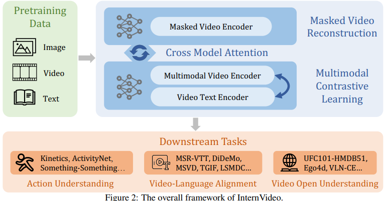

# InternVideo: General Video Foundation Models via Generative and Discriminative Learning

> "InternVideo: General Video Foundation Models via Generative and Discriminative Learning" Arxiv, 2022 Dec
> [paper](http://arxiv.org/abs/2212.03191v2) [code](https://github.com/OpenGVLab/InternVideo) [pdf](./2022_12_Arxiv_InternVideo--General-Video-Foundation-Models-via-Generative-and-Discriminative-Learning.pdf)
> Authors: Yi Wang, Kunchang Li, Yizhuo Li, Yinan He, Bingkun Huang, Zhiyu Zhao, Hongjie Zhang, Jilan Xu, Yi Liu, Zun Wang, Sen Xing, Guo Chen, Junting Pan, Jiashuo Yu, Yali Wang, Limin Wang, Yu Qiao

## Key-point

- Task: Video foundation model

- Problems

  现有基础模型大多只在图像数据上训练，**没有用于视频的基础大模型**

- :label: Label:

提出视频基础模型框架，**验证了 masked video learning (VideoMAE) and video-language contrastive modeling 对于下游任务的有效性**

## Contributions

1. **提出视频基础模型的框架，实验验证了自监督 & 多模态训练框架有用**
   confirm features learned by generative and contrastive training are complementary to experiment 

   exploits a unified video representation based on the cross-model learning between **masked video learning (VideoMAE) and video-language contrastive modeling** along with supervised training

   大量视频理解（action understanding）数据上预训练，能够提升下游任务泛化性能

2. 提出**高效训练**的 Video foundation Model: InternVideo

   训练高效：训练只要 64.5K GPU hours (A100-80G), while CoCa [7] requires 245.76K TPU hours (v4)，对比 CoCa [7] requires 245.76K TPU hours (v4)

   The power consumption of training InternVideo is much lower than CoCa [7], **only taking up 23.19 % of CoCa**

3. 39 个数据集上的 SOTA，泛化性能好

   InternVideo is the **first work to perform best among existing researches on all action understanding**, video-language alignment, and video open understanding tasks

## Introduction

- "UniFormerV2: Spatiotemporal Learning by Arming Image ViTs with Video UniFormer" Arxiv, 2022 Nov
  [paper](https://arxiv.org/abs/2211.09552) [code](https://github.com/OpenGVLab/UniFormerV2)
- "Multiview transformers for video recognition" CVPR
- "Masked feature prediction for self-supervised visual pre-training"
- "Clip4clip: An empirical study of clip for end to end video clip retrieval and captioning" Neurocomputing, 2022.

**Exp 中验证 temporal localization**

- "Tsp: Temporally-sensitive pretraining of video encoders for localization tasks." ICCV, 2021
- "Actionformer: Localizing moments of actions with transformers" ECCV, 2022

###  masked modeling

- "simmim: a simple framework for masked image modeling"

## methods

> :question: 用 SAM 提取分割图，实例之间差异提取划痕

InternVideo 为视频基础网络，使用 ViT, Uniformer 作为 backbone。融合自监督方式预训练（(masked modeling and multimodal learning）和监督训练，再用于下游任务。

### Self-Supervised Video Pretraining

follow VideoMAE 做 video mask

时空 attention 参考

> - "ViViT: A Video Vision Transformer" ICCV, 2021
>   [paper](https://arxiv.org/abs/2103.15691)
> - "Video Swin Transformer" CVPR, 2022

### Video-Language Contrastive Learning

proposed UniformerV2 [56] as the video encoder 更好提取时序信息

cross-modal learning: **align-before-fuse paradigm** ensures the modalities can be aligned into the same single embedding space, which is beneficial for tasks like retrieval

extends the potential of the original CLIP and improves the robustness of multimodality features

 **Cross-Model Interaction**

用于提升分类性能

### Supervised Video Post-Pretraining

> https://github.com/microsoft/DeepSpeed
> DeepSpeed empowers ChatGPT-like model training with a single click, offering 15x speedup over SOTA RLHF systems with unprecedented cost reduction at all scales 训练加速

- Motivation

  action recognition acts well as a **meta task in video downstream applications**, widely validated

  动作分类被验证为下游任务的 meta task，现在上面预训练队之后任务有提升

1. Masked Video Encoder. We finetune the masked video encoder with 32 GPUs on K710

   用 DeepSpeed 加速训练

2. Multimodal Video Encoder

   CLIP-ViT [13] as the backbone by default

   insert the global UniBlocks in the last 4 layers of ViT-B/L

   

预训练的数据集

## Experiment

> ablation study 看那个模块有效，总结一下

### Setting

- 数据 DA 参考 UniFormerV2 :question:

两个预训练模型训练

- Multimodal Training

  400k steps on 128 NVIDIA A100 GPUs in 2 weeks;  The batch size of video-text is 14,336, and the batch size of image-text is 86,016

- Masked Video Training

  e VideoMAE-Huge for 1200 epochs on the UnlabeledHybrid dataset with 64 80G-A100 GPUs

下游分类任务微调，把预训练的两个模型冻住

- Model Interaction

  为了保持原始输出，add tanh gating layers in the extra MHCA and FFN as in Flamingo :question:

  a weight decay of 0.001, a dropout rate of 0.9, and an EMA rate of 0.9999

### **Action Understanding  SOTA 比较**

InternVideo contains **masked video encoder** specializing in spatiotemporal variation characterization and fused multi

**Temporal Action Localization 时序定位**

- 任务介绍

  localizing the start and end points of action clips from the entire untrimmed video with full observation

同样说明 Masked Video Encoder 的有效性

### Video-Language Alignment Tasks

视频 & 文本对齐效果；引入 MultiModal 拓展了使用文本特征，进一步提升泛化性能。

### Video Open Understanding Tasks

Zero-shot 泛化性能，性能超过 SOTA，泛化性能好，进一步说明 Pretrain 的有效性

## Limitations

shows the effectiveness and feasibility of video foundation models  **但训练的数据都是 16 帧左右，无法处理长视频**，例如无法预测电影的情节

已经有方法去处理长视频的视频理解任务

> "VideoChat: Chat-Centric Video Understanding"
> [paper](https://arxiv.org/abs/2305.06355) [code](https://github.com/OpenGVLab/Ask-Anything)

**Future Work**

further extend the generality of the video foundation model

## Summary :star2:

> learn what & how to apply to our task

1. 提出视频基础模型框架，**验证了 masked video learning (VideoMAE) and video-language contrastive modeling 对于下游任务的有效性**

   - 视频任务尝试**用 VideoMAE，多模态预训练，能提升性能&泛化性；再结合监督方式训练**
   - 可以先在视频理解数据上训练，对下游任务有帮助

2. 学习下如何高效训练 >> DeepSpeed

   相比先前方法只要 30% power
