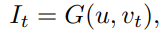
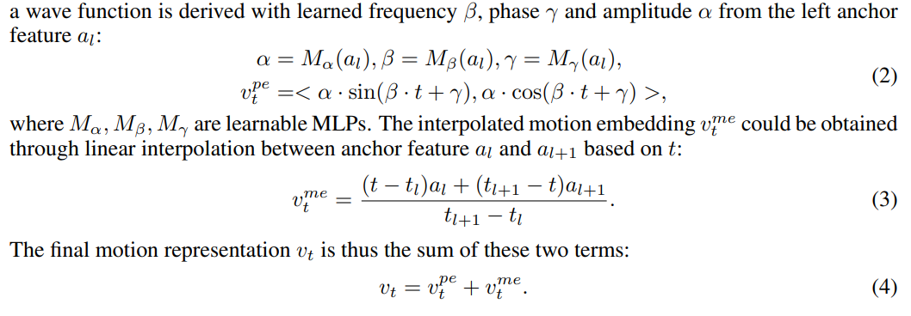
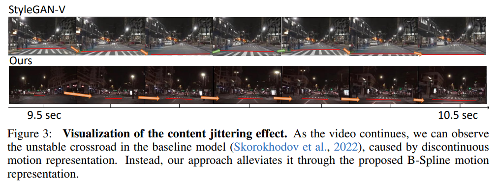
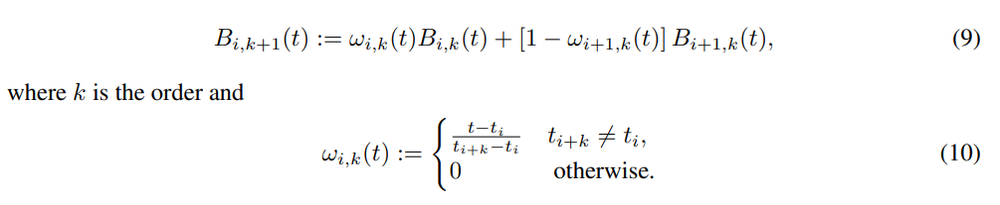
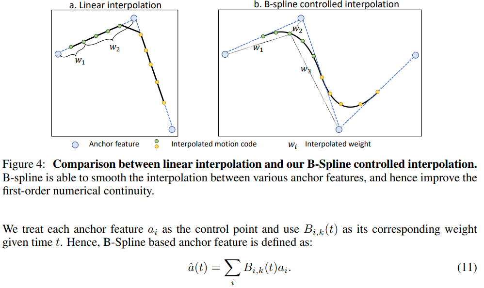
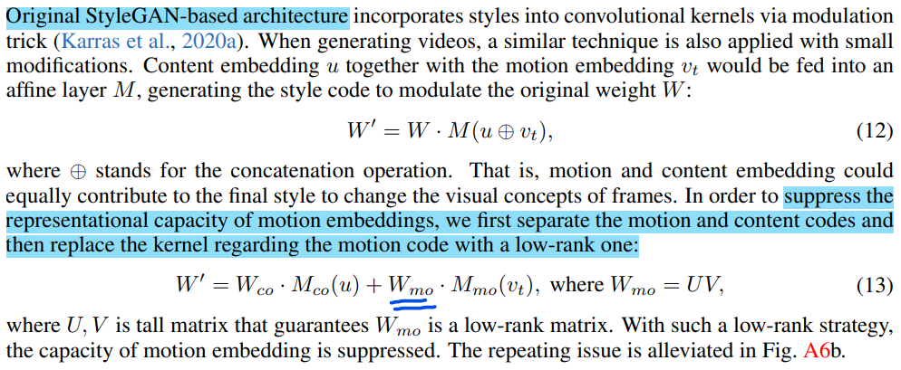
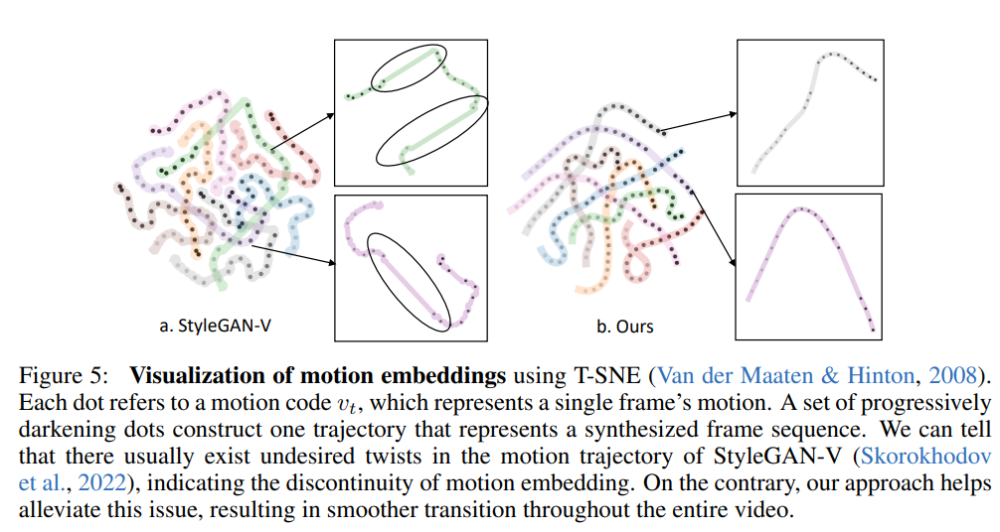

# Towards Smooth Video Composition

> "Towards Smooth Video Composition" Arxiv, 2022 Dec
> [paper](http://arxiv.org/abs/2212.07413v1) [code](https://genforce.github.io/StyleSV) 
> [pdf](./2022_12_Arxiv_Towards-Smooth-Video-Composition.pdf)
> Authors: Qihang Zhang, Ceyuan Yang, Yujun Shen, Yinghao Xu, Bolei Zhou

## Key-point

- Task: Video generation
- Problems
  - synthesizing consistent and persistent frames

- :label: Label:

1. alias-free operation for single image generation, together with adequately pre-learned knowledge
2. incorporating the temporal shift module (TSM)  into the discriminator 保持时序一致性
3. develop a novel B-Spline based motion representation to ensure temporal smoothness 实现任意时长视频的生成
4. A low-rank temporal modulation is also proposed to alleviate repeating contents for long video

## Contributions

## Introduction

1. **Texture sticking** appears in videos generated by StyleGAN-V, where texture sticks to fixed coordinates.

   生成的内容只在某个坐标上的小范围移动，看效果就是物体左右摇晃不变

2. 长视频生成，之前 StyleGAN-V 在 8-9s 会出现卡顿，重复之前生成内容

在时间维度，分为多个尺度：subtle change （面部肌肉运动），global change（第一帧和相隔较远的帧）

### StyleGAN-v

每一帧用 content code $u_t$ 和 motion code $v_t$ 表示；对于 $v_t$ 从 Anchor feature $a_l$ 得到 

## methods

### Alias-free operations

follow the Style-GAN v3 reduces the dependency on absolute pixel coordinates

用图像预训练

### B-Spline

对 anchor feature 做更精细的插值，缓解了 jittering effect

### LowRank

原先将 content code & motion feature concatenate，再进行融合；但发现问题：find that similar content periodically appears as video continues

implies that **motion embedding poorly represents visual concepts.** We thus hypothesize that the new motion embedding might be endowed with a stronger capacity

将 content code 和 motion feature 分解，**对 motion feature 单独压缩一下**，将特征的映射矩阵用 Low Rank 矩阵替换，来达到压缩 motion feature 的目的。 

## Experiment

> ablation study 看那个模块有效，总结一下

- setting

   resize them to 256 × 256 and 512 × 512 resolution respectively

- metrics

  - Frechet Video Distance (FVD)
  - Frechet Inception Distance (FID)

用 T-SNE 路径，证明时序闪烁更小

## Limitations

## Summary :star2:

> learn what & how to apply to our task

