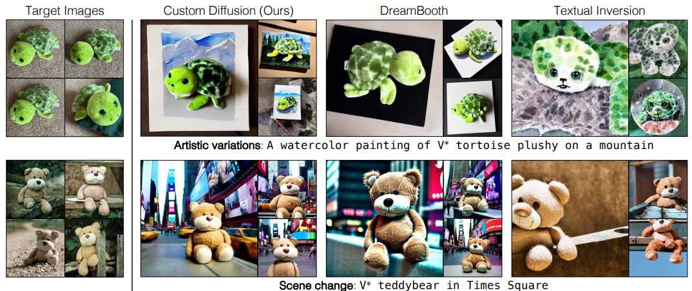

# Multi-Concept Customization of Text-to-Image Diffusion

> "Multi-Concept Customization of Text-to-Image Diffusion" CVPR, 2022 Dec 8
> [paper](http://arxiv.org/abs/2212.04488v2) [code]() [pdf](./2022_12_CVPR_Multi-Concept-Customization-of-Text-to-Image-Diffusion.pdf) [note](./2022_12_CVPR_Multi-Concept-Customization-of-Text-to-Image-Diffusion_Note.md)
> Authors: Nupur Kumari, Bingliang Zhang, Richard Zhang, Eli Shechtman, Jun-Yan Zhu

## Key-point

- Task
- Problems
- :label: Label:

## Contributions

## Introduction

## methods

## Experiment

> ablation study 看那个模块有效，总结一下

## Limitations

## Summary :star2:

> learn what & how to apply to our task

