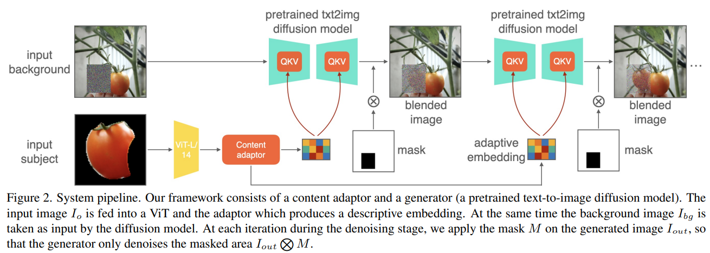
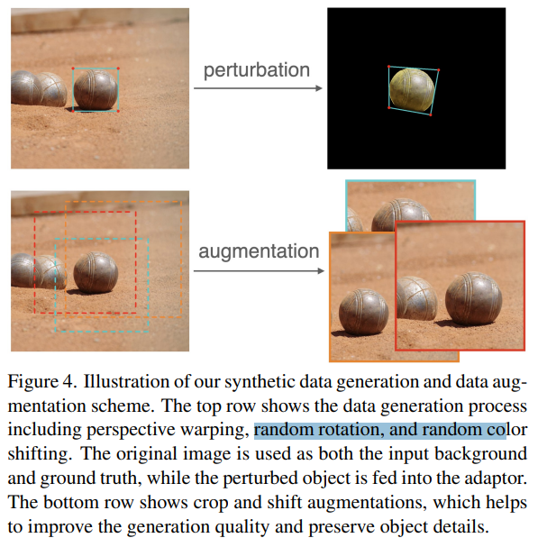

# ObjectStitch: Generative Object Compositing

> "ObjectStitch: Generative Object Compositing" CVPR, 2022 Dec 2
> [paper](http://arxiv.org/abs/2212.00932v2) [code]() [pdf](./2022_12_CVPR_ObjectStitch--Generative-Object-Compositing.pdf) [note](./2022_12_CVPR_ObjectStitch--Generative-Object-Compositing_Note.md)
> Authors: Yizhi Song, Zhifei Zhang, Zhe Lin, Scott Cohen, Brian Price, Jianming Zhang, Soo Ye Kim, Daniel Aliaga

## Key-point

- Task
- Problems
- :label: Label:

## Contributions

## Introduction

## methods

## setting

## Experiment

> ablation study 看那个模块有效，总结一下

## Limitations

## Summary :star2:

> learn what & how to apply to our task

