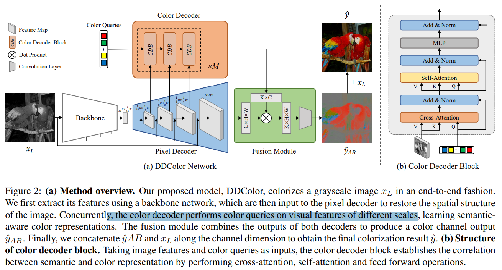

# DDColor: Towards Photo-Realistic Image Colorization via Dual Decoders

> "DDColor: Towards Photo-Realistic Image Colorization via Dual Decoders" ICCV, 2022 Dec
> [paper](http://arxiv.org/abs/2212.11613v5) [code](https://github.com/piddnad/DDColor.) 
> [pdf](./2022_12_ICCV_DDColor--Towards-Photo-Realistic-Image-Colorization-via-Dual-Decoders.pdf)
> Authors: Xiaoyang Kang, Tao Yang, Wenqi Ouyang, Peiran Ren, Lingzhi Li, Xuansong Xie

## Key-point

- Task: Image colorization

- Problems

  

- :label: Label:

## Contributions

## Introduction

- DeOldify 
  [code](https://github.com/jantic/DeOldify) [blog](https://towardsdatascience.com/deoldify-gan-based-image-colorization-d9592704a57d)

NoGAN

- sd-weiui-deoldify 
  [code](https://github.com/SpenserCai/sd-webui-deoldify)

  > This is an extension for StableDiffusion's AUTOMATIC1111 web-ui that allows colorize of old photos and old video

- "A ConvNet for the 2020s" CVPR, 2022 Jan
  [paper](https://arxiv.org/abs/2201.03545)

## methods

e backbone network is designed to extract image semantic embedding, which is crucial for colorization. In this work, we choose ConvNeXt 

## Experiment

> ablation study 看那个模块有效，总结一下

## Limitations

## Summary :star2:

> learn what & how to apply to our task

