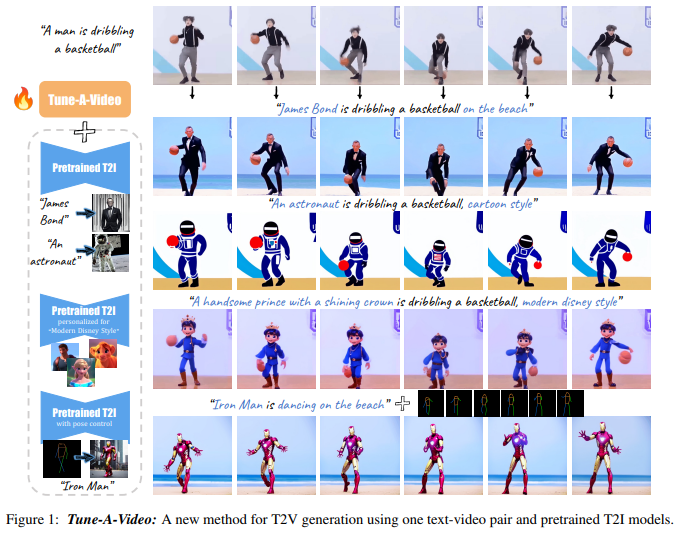

# Tune-A-Video: One-Shot Tuning of Image Diffusion Models for Text-to-Video Generation

> "Tune-A-Video: One-Shot Tuning of Image Diffusion Models for Text-to-Video Generation" ICCV, 2022 Dec
> [paper](http://arxiv.org/abs/2212.11565v2) [code]() 
> [pdf](./2022_12_ICCV_Tune-A-Video--One-Shot-Tuning-of-Image-Diffusion-Models-for-Text-to-Video-Generation.pdf)
> Authors: Jay Zhangjie Wu, Yixiao Ge, Xintao Wang, Weixian Lei, Yuchao Gu, Yufei Shi, Wynne Hsu, Ying Shan, Xiaohu Qie, Mike Zheng Shou

## Key-point

- Task
- Problems
- :label: Label:

## Contributions

## Introduction

## methods

给一个视频 V，对应文本描述 P。希望根据文本 $P^*$ 生成视频 $V^*$

propose a new setting called One-Shot Video Tuning，基于现有 text2image 模型就行，不用重新去训练一个 text2video 模型。

Video2Video 框架，增加一下 temporal layer （右边的小图）

视频帧先用 VAE 映射到 latent space，**用 DDIM 加噪到 zt 作为开始点**，以目标编辑的文本作为 condition 开始去噪

SD 含有两个主要模块

1. AutoEncoder
2. UNet: Each transformer block consists of a spatial self-attention layer, a cross-attention layer, and a feed-forward network (FFN)

> - 如何 inflate 2D Conv 为 3D，如何复制？3D 卷积输出 C 维度，要 C 个卷积核，每一个是 2D 的复制过来？

参考 "Video Diffusion Models", **inflate the 2D convolution layers to pseudo 3D convolution** layers, with 3 × 3 kernels being replaced by 1 × 3 × 3 kernels and append a temporal self-attention layer in each transformer block for temporal modeling. 将原先 2D 卷积换为 3D 卷积 && 原先 attention layer 后面加一个 temporal Transformer block；

propose to use a sparse version of causal attention mechanism, between frame $z_{vi}$ and two previous frames $z_{v1}$ and $z_{vi−1}$

只微调 temporal layer，节省计算量。we finetune the entire temporal self-attention (T-Attn) layers as they are newly added

## Experiment

> ablation study 看那个模块有效，总结一下

### setting

基于 Stable Diffusion v1.4 [code](https://huggingface.co/CompVis/stable-diffusion-v1-4)，

**One-shot 训练**，只对当前视频微调一下就行：We sample 32 uniform frames at resolution of **512 × 512 from input video**, and **finetune the models with our method for 500 steps on a learning rate 3 × 10−5 and a batch size 1**

**inference**，DDIM sampler [43] with classifier-free guidance [17] in our experiments

> For a single video, it takes about 10 minutes for finetuning, and about 1 minute for sampling on a NVIDIA A100 GPU

对于文本，使用现成的 image caption model &&  and manually design 140 edited prompts across our applications；**视频内容单一，用文本 caption 就足够了** （缺陷）

- "Blip-2: Bootstrapping language-image pre-training with frozen image encoders and large language models" CVPR, 2023 Jan
  [paper](https://arxiv.org/abs/2301.12597) [code](https://github.com/salesforce/LAVIS/blob/47e0f3f25ca763975738c7224c8369207812ce6c/projects/blip2/README.md)

## Limitations

1. 对于文本，使用现成的 image caption model &&  and manually design 140 edited prompts across our applications；**视频内容单一，用文本 caption 就足够了** （缺陷）
2. 生产的视频很卡顿

## Summary :star2:

> learn what & how to apply to our task

