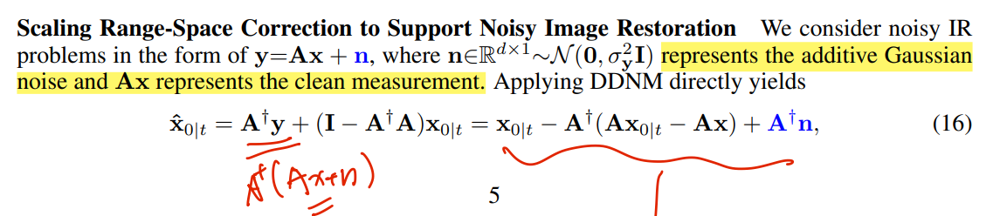

#  DDNM

> "Zero-Shot Image Restoration Using Denoising Diffusion Null-Space Model" ICLR Notable-Top-25%, 2022 Dec, DDNM
> [paper](https://arxiv.org/pdf/2212.00490.pdf) [website](https://wyhuai.github.io/ddnm.io/)
> [pdf](./2022_ICLR_DDNM_Zero-Shot-Image-Restoration-Using-Denoising-Diffusion-Null-Space-Model.pdf)
>
> - Authors: Yinhuai Wang  Jiwen Yu Jian Zhang 

## **Key-point**

- Task: Zero-shot Image Restoration
- Background: 预先指导指定类型的退化，去修复
- :label: Label: diffusion prior, plug&play finetune,


## Contributions

- 把 RangeNull space 分解用于 IR task，结合 pretrained 模型实现 zero-shot
- DDNM+ 针对 noisy IR task （有高斯噪声的情况）对 x0 预测方式进行修改
  - TimeTravel 保证 RangeNull Space 分解一致性
- 模仿 RePaint，对于 IR task 实现任意分辨率的超分（分块&拼接）


## Related Work

- score-based model
  - [ ] Score-Based Generative Modeling through Stochastic Differential Equations
  - [ ] [Generative Modeling by Estimating Gradients of the Data Distribution](https://arxiv.org/abs/1907.05600)
- DDIM
  - [ ] [2020_ICLR_DDIM_Denoising-Diffusion-Implicit-Models.pdf](./2020_ICLR_DDIM_Denoising-Diffusion-Implicit-Models.pdf)
- [ ] Repaint >> TimeTravel
- [ ] https://github.com/wyhuai/RND >> NullSpace
- [ ] https://github.com/bahjat-kawar/ddrm >> DDRM


## methods

### Range-Null Space 理论

将图像 x 分解为 range-space part 和 null-space part


### DDNM

将前面的 A 理解成退化的变换，$y=Ax$ 带入公式 8，实现 diffusion 中融入退化图像先验。由于 ZIR 任务预先知道退化类型，所以能够知道退化 A 的对应修复变换 $A^+$，因此通过 Algorithm1.4 进行修复


- 使用预训练模型得到 x0


- Range-Null Space 分解

  对预训练的结果进行 Range-Null space 分解后，为了保证一致性（$y=Ax$），对 range-space 进行修改得到 $\hat{x_{0|t}}$，**用  $\hat{x_{0|t}}$ 作为 x0 的预测**。带回 reverse diffusion 分布，得到 $x_{t-1}$


### DDNM+

DDNM 考虑 IR 任务为线性的，可表示为  $y=Ax$。**DDNM+ 针对 noisy IR task $y=Ax+n$ 存在高斯噪声的情况**，若直接使用 DDNM 中 RangeNull space 分解方式，存在噪声项



DDNM+ 对 $\hat{x_0}$ **增加一个尺度进行修正**


- Core Implementation of DDNM+, simplified denoising solution (Section 3.3).

  For more accurate denoising, please refer to the paper (Appendix I) and the source code.

```python
def ddnm_plus_core(x0t, y, sigma_y=0, sigma_t, a_t):
    #Eq 19
    if sigma_t >= a_t*sigma_y: 
        lambda_t = 1
        gamma_t = sigma_t**2 - (a_t*lambda_t*sigma_y)**2
    else:
        lambda_t = sigma_t/(a_t*sigma_y)
        gamma_t = 0

    #Eq 17    
    x0t= x0t + lambda_t*Ap(y - A(x0t))

    return x0t, gamma_t
```


### TimeTravel

 For Better Restoration Quality. 发现 DDNM 对于 SR，Inpainting 等任务真实性不好。

- 原因：预训练模型 reverse diffusion 分布 $\mu_t{(x_t,x_0)}$ 依赖精确的 x0。DDNM 中得到的 $\hat{x_{0|t}}$ 由于 **RangeSpace 太 local，与 Null-space 存在不一致**

作者用 $\hat{x_{0|t}}$ 继续 forward diffusion 加噪 L 步得到 $x_{t-1+L}$


#### RePaint

> [github repo](https://github.com/andreas128/RePaint?utm_source=catalyzex.com) [paper](https://arxiv.org/abs/2201.09865)
> [2022_CVPR_RePaint_Inpainting_using_Denoising_Diffusion_Probabilistic_Models.pdf](./2022_CVPR_RePaint_Inpainting_using_Denoising_Diffusion_Probabilistic_Models.pdf)
>
> 作者模仿 RePaint 中的 back and forward strategy for inpainting tasks，将该方法用在 IR 任务上保持 RangeNull Space 协调性


### Make-shift Trick

DDNM 中使用的预训练模型，输出的图像大小受限，对输入图分块处理，实现**任意分辨率输出**。

- Simple methods

  64 x 256 分块为 64 x 64 的块，每一个做 4 SR 再拼接起来。

64 x 256 分为更多小块，例如 64 x 32 的 8 块。

1. 对 y0,y1 平起来做 SR 得到 [x0, x1]
2. 之后取 y1, y2 每两块处理，得到 x^1, x^2 中间结果。将中间结果左边一半替换为 x1 。最终结果再取右边的一半。


## Experiment

- 上色

  原图 256x342 gray_image RGB通道各取 1/3


- Old-photo-restoration

  

  

**Unsolved Limitations & Summary**

> **learn what & how to apply to our task**


## Code

- [ImageNet class label list](https://deeplearning.cms.waikato.ac.nz/user-guide/class-maps/IMAGENET/) >> `--class 265` toy poodle

**Diffusion Model Implementation**

- `class UNetModel(nn.Module)`

  ```python
  # model_channels == 256
  time_embed_dim = model_channels * 4
  self.time_embed = nn.Sequential(
              linear(model_channels, time_embed_dim),  # 256, 1024
              nn.SiLU(),
              linear(time_embed_dim, time_embed_dim),
          )
  ```

  - ResBlock

    [cubic interpolate](https://blog.csdn.net/jiangyutongyangyi/article/details/104470184) 求一个在三阶函数的点，用已知的点来划分区域，形成分段多阶函数。求4n个未知数。列4n个方程，最后用矩阵表示


