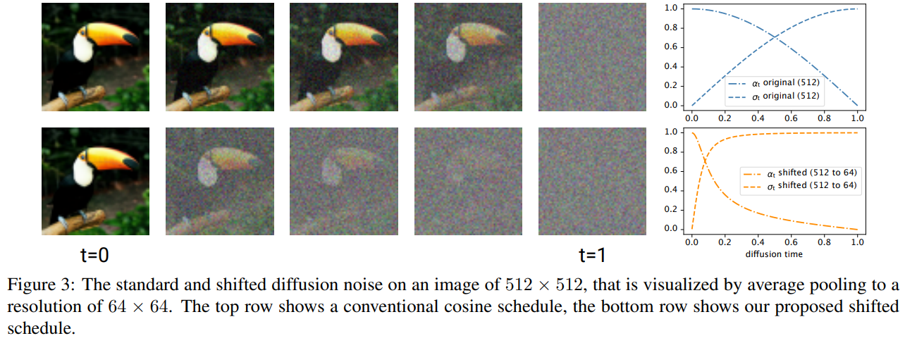
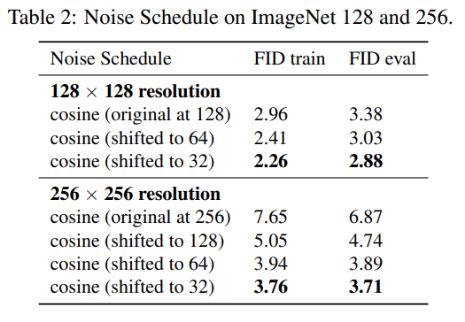
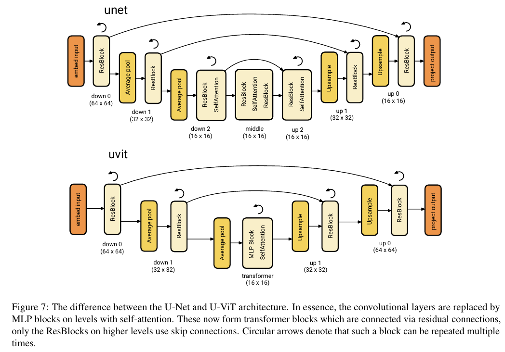

# Simple diffusion: End-to-end diffusion for high resolution images

> "Simple diffusion: End-to-end diffusion for high resolution images" ICML, 2023 Jan 26
> [paper](http://arxiv.org/abs/2301.11093v2) [code]() [pdf](./2023_01_Arxiv_Simple-diffusion--End-to-end-diffusion-for-high-resolution-images.pdf) [note](./2023_01_Arxiv_Simple-diffusion--End-to-end-diffusion-for-high-resolution-images_Note.md)
> Authors: Emiel Hoogeboom, Jonathan Heek, Tim Salimans

## Key-point

- Task
- Problems
- :label: Label:

类似 offset noise 的思想

> offset noise 参考 https://wandb.ai/johnowhitaker/multires_noise/reports/Multi-Resolution-Noise-for-Diffusion-Model-Training--VmlldzozNjYyOTU2?s=31

## Contributions

## Introduction

## methods

### shifted schedule

### U-ViT

> the convolutional layers are replaced by MLP blocks on levels with self-attention.

## setting

## Experiment

> ablation study 看那个模块有效，总结一下

## Limitations

## Summary :star2:

> learn what

### how to apply to our task

