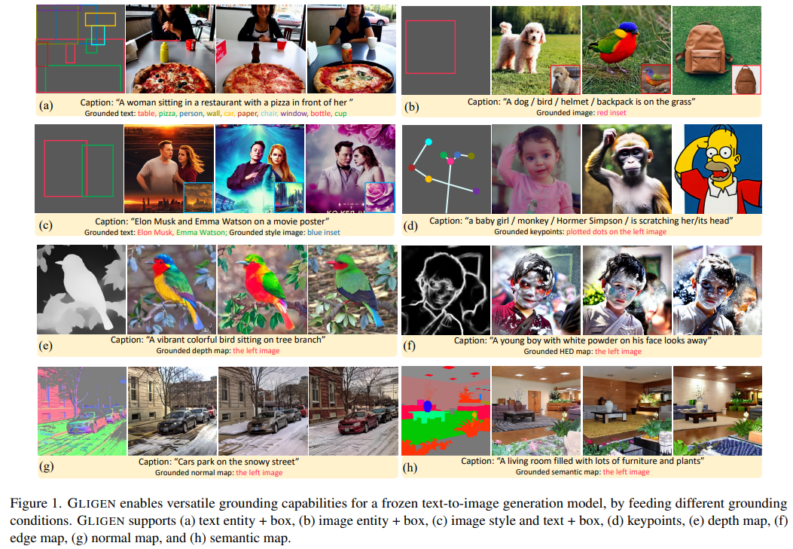

# GLIGEN: Open-Set Grounded Text-to-Image Generation

> "GLIGEN: Open-Set Grounded Text-to-Image Generation" CVPR, 2023 Jan 17
> [paper](http://arxiv.org/abs/2301.07093v2) [code](https://github.com/gligen/GLIGEN?tab=readme-ov-file) [pdf](./2023_01_CVPR_GLIGEN--Open-Set-Grounded-Text-to-Image-Generation.pdf) [note](./2023_01_CVPR_GLIGEN--Open-Set-Grounded-Text-to-Image-Generation_Note.md)
> Authors: Yuheng Li, Haotian Liu, Qingyang Wu, Fangzhou Mu, Jianwei Yang, Jianfeng Gao, Chunyuan Li, Yong Jae Lee

## Key-point

- Task
- Problems
- :label: Label:

## Contributions

## Introduction

- 使用 bbox or segMap or 骨架，实现指定位置的生成 :star:

## methods

#### 使用 clip-image feature

> https://github.com/gligen/GLIGEN/blob/f9dccb9c6cf48bad03c3666290a7dec8c5e58f3c/gligen_inference.py#L101

> We use the CLIP image encoder (ViT-L-14 is used for the Stable Diffusion) to get an image embedding
>
> we choose to project image features into the text feature space via P⊤ t Pih and normalized it to 28.7, which is average norm of ht we empirically found

增加 gated-attn，指定位置信息

- Q：这个位置信息怎么加入？

bbox 坐标提取 Fourier embedding，和 Text-embedding Concat 过 MLP :star:

represent the location information `l = [αmin, βmin, αmax, βmax]` with its top-left and bottomright coordinates

where Fourier is the Fourier embedding [44]

- Q：什么是 Fourier embedding？

> - "NeRF: Representing Scenes as Neural Radiance Fields for View Synthesis" 
>   [paper](https://arxiv.org/abs/2003.08934)

## setting

> batch size 64 using 16 V100 GPUs for 100k iterations
>
> but 500K iterations with batch size of 32 for the Stable diffusion modeL For all training, we use learning rate of 5e-5 with Adam
>
> and use warm-up for the first 10k iterations. We randomly drop caption and grounding tokens with 10% probability for classifier-free guidance

## Experiment

> ablation study 看那个模块有效，总结一下

## Limitations

## Summary :star2:

> learn what

### how to apply to our task

