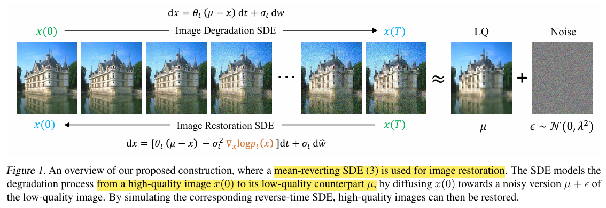

# Image Restoration with Mean-Reverting Stochastic Differential Equations

> "Image Restoration with Mean-Reverting Stochastic Differential Equations" ICML, 2023 Jan, **IR-SDE** :star:
> [Ziwei Luo](https://algolzw.github.io/), [Fredrik K. Gustafsson](https://www.fregu856.com/), [Zheng Zhao](https://zz.zabemon.com/), [Jens Sjölund](https://jsjol.github.io/), [Thomas B. Schön](https://user.it.uu.se/~thosc112/index.html)
> [paper](https://arxiv.org/abs/2301.11699) [code](https://github.com/Algolzw/image-restoration-sde) [website](https://algolzw.github.io/ir-sde/index.html?utm_source=catalyzex.com) [pdf](./2023_01_ICML_Image-Restoration-with-Mean-Reverting-Stochastic-Differential-Equations.pdf) [note](./2023_01_ICML_Image-Restoration-with-Mean-Reverting-Stochastic-Differential-Equations_Note.md)

## **Key-point**

 The SDE models the degradation process from a high-quality image $x(0)$ to its low-quality counterpart $\mu$, by diffusing $x(0)$towards a noisy version $\mu + \epsilon$ of the low-quality image.

- image deraining, deblurring, denoising, super-resolution, inpainting, and dehazing

**Contributions**

- mean-reverting SDE for IR
- maximum likelihood loss for better reverse-time trajectory
- 6 IR task, competitive

## **Related Work**

先前 Diffusion IR 工作都是转换到纯高斯噪声

- Score-based diffusion

  "Maximum Likelihood Training of Score-Based Diffusion Models" NeurIPS, 2021 Jan
  [paper](https://arxiv.org/abs/2101.09258) [code](https://github.com/yang-song/score_flow)

- SR3 image SR
  "Image super-resolution via iterative refinement"
  [paper](2104.07636) [code](https://github.com/Janspiry/Image-Super-Resolution-via-Iterative-Refinement)

## **methods**

### Forward SDE for IR

SDE diffusion 式子的特例，有 $\theta_t , \sigma_t$ 参数

### Maximum Likelihood Learning

发现用上述公式，训练不稳定。

## **Experiment**

> ablation study 看那个模块有效，总结一下

- metrics
  - 主观指标 LPIPS, FID
  - 客观指标 PSNR, SSIM on Y channel in `YCbCr`

### de-rain

- synthetic raining datasets Rain100H(1800+100) / Rain100L(200+100)
- baseline
  - MAXIM
    "MAXIM: Multi-Axis MLP for Image Processing" `CVPR 2022 Oral, Best Paper Nomination`, 2022 Jan, MAXIM
    [paper](https://arxiv.org/abs/2201.02973) [code](https://github.com/google-research/maxim?utm_source=catalyzex.com)

IR-SDE 在主观指标 LPIPS，FID 更好。客观指标 MAXIM 更优，IR-SDE 2nd 效果

### deblurring

- GoPro test set (2103 + 1111)

  blurry images in GoPro are collected by **averaging multiple sharp images** captured by a high-speed video camera

IR-SDE 在主观指标 LPIPS，FID 更好。客观指标 MAXIM 更优，

### Gaussian Image Denoising

Denoising-SDE – which is a **special case of the IR-SDE**,  by setting the clean image as the mean µ = x0

### SR

## **Limitations**

## **Summary :star2:**

> learn what & how to apply to our task