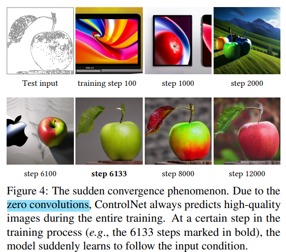
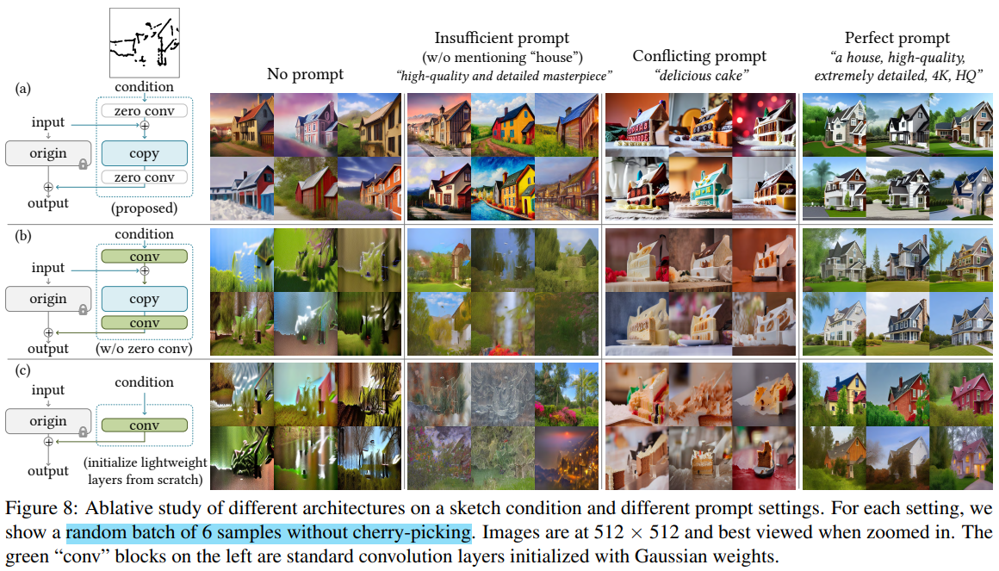
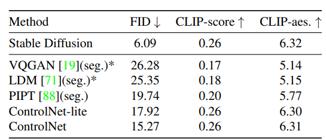
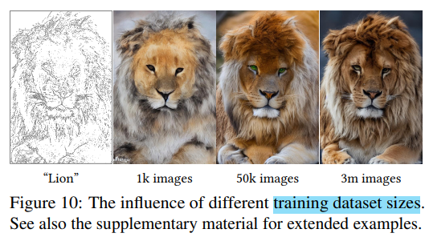

# ControlNet

> "Adding Conditional Control to Text-to-Image Diffusion Models" Arxiv, 2023 Feb, **ControlNet** :statue_of_liberty:
> [paper](https://arxiv.org/abs/2302.05543) [code](https://github.com/lllyasviel/ControlNet)
> [paper local pdf](./2023_02_ICCV_bestpaper_Adding-Conditional-Control-to-Text-to-Image-Diffusion-Models.pdf)
>
> ICCV 2023 Best paper

## **Key-point**

- Task: Image editing with prior
- Background
- :label: Label: diffusion prior, plug&play finetune,

> 关注如何利用 Stable Diffusion 先验，对 conditions 优化

## **Contributions**

- 利用 stable diffusion 先验的 framework，通过 ControlBlock 实现加入 conditions
- 使用 zero-conv block 模块，减少 

## **Related Work**

- "Classifier-Free Diffusion Guidance"
  [paper](https://arxiv.org/abs/2207.12598) [blog](https://betterprogramming.pub/diffusion-models-ddpms-ddims-and-classifier-free-guidance-e07b297b2869)

## **methods**

### zero-conv :key:

> - :question: 什么是 `zero-conv` ?
>
> - [QA: Why "zero convolution" works?](https://github.com/lllyasviel/ControlNet/blob/main/docs/faq.md)
>   $$
>   y=wx+b\\
>   \partial y/\partial w=x, \partial y/\partial x=w, \partial y/\partial b=1
>   $$
>   只要 StableDiffusion 输入的 feature_map x 不为0，一次梯度下降，将更新 w 权重。多次迭代使得 zero-conv 转化为普通 conv
>
> - [Why ControlNets use deep encoder? What if it was lighter? Or even an MLP?](https://github.com/lllyasviel/ControlNet/discussions/188)

ControlNet Block: 对预训练模块，复制一个 copy(复制参数去 finetune)，输入外部的 conditions `c`，通过首尾增加 `zero-convolution` skip connect 连接到原始预训练模块中。

前后的 zero-conv 为 1x1 卷积，**在 finetune 初期初始化参数 weight,bias 均为0**. 作者解释能够避免训练初期的 harmful noise

### For stable diffusion

Stable Diffusion v1.5 共 24个 block，对 encoder 12 个 block 加上 ControlNet block 结果连接到 BottleNeck 和 Decoder 中

> Stable Diffusion 对 512x512 图像模仿 VQ-GAN 方式，转化到 64x64 的特征空间

- ControlNet-Lite
  

### Training: sudden convergence

1. 训练数据 50% text prompts 设为 "" 空串

训到 10K iteration 突然和 conditions 很接近

- 由于 zero-conv 训练全程输出的都是高质量图（虽然和 conditions 不一致）

### Inference

- multiple conditions： 将多个 conditions 的 ControlNet Block 结果直接相加

- Classifier-free guidance：

  将 condition image 加到 $\epsilon_c$ 上再乘个权重。这个权重 $w_i = 64 / h_i$ 按当前 block 特征的尺寸决定

## **Experiment**

> ablation study 看那个模块有效，总结一下

### Ablation Study

#### structure & prompts

注意这里加入的 conditions 只是 sketches，细节不是很丰富

1. zero-conv 有效性

   替换为 Gaussian weights initialized conv layer ，在没有 prompts 时输出直接糊掉。验证了使用普通 conv 会引入 harmful noise！:star:

2. zero-conv + no-prompts 情况下，stable diffusion 很强大，能够在质量较差的 conditions 下恢复的很好

3. prompts 影响很大

   替换为 conv 在没有 prompts 下很烂，但在高质量 prompt 情况下，仍能恢复出很好的结果

4. `structure C` 类似直觉上的融合方式，将 conditions 过 MLP 或者 Conv Block 加入到 Stable Diffusion 中

#### Prior models

比较不同预训练模型，加上 ControlNet Block 的效果

- 比较生成图像质量
  Stable Diffusion V2 Depth-to-Image 作为比较
  ControlNet finetune 只用了 200k training samples, one single NVIDIA RTX 3090Ti, and 5 days of training

  user-study 让人去分别模型输出对应哪个模型， two method yields almost indistinguishable results

#### Discussion

- Dataset size 小一点质量也还 ok

- Transfer 能力，训好的 ControlNet block 直接用到其他 task-specific diffusion model

## **Limitations**

## **Summary :star2:**

> learn what & how to apply to our task