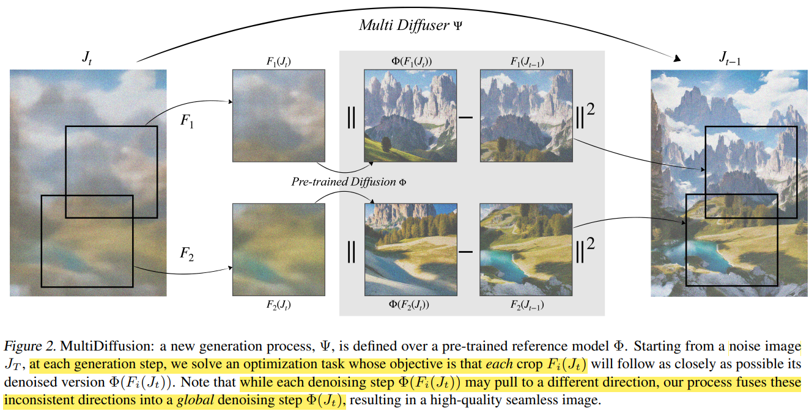

# MultiDiffusion: Fusing Diffusion Paths for Controlled Image Generation

> "MultiDiffusion: Fusing Diffusion Paths for Controlled Image Generation" ICML, 2023 Feb 16
> [paper](http://arxiv.org/abs/2302.08113v1) [code](https://github.com/omerbt/MultiDiffusion?tab=readme-ov-file) [web](https://multidiffusion.github.io) [pdf](./2023_02_ICML_MultiDiffusion--Fusing-Diffusion-Paths-for-Controlled-Image-Generation.pdf) [note](./2023_02_ICML_MultiDiffusion--Fusing-Diffusion-Paths-for-Controlled-Image-Generation_Note.md) [supplement-material](https://multidiffusion.github.io/sm/index.html)
> Authors: Omer Bar-Tal, Lior Yariv, Yaron Lipman, Tali Dekel

## Key-point

- Task: `controllable image generation`, `Text-to-Panorama`
- Problems
- :label: Label:

> MultiDiffusion, **a unified framework that enables versatile and controllable** image generation, using a pre-trained text-to-image diffusion model, **without any further training or finetuning.**

- Q：如何控制各个部分生成各自内容？
- Q：各个物体纹理差很多咋搞？
- Q：视频修复某些背景需要虚化，训练时候都搞成了 all-in-focus，如何控制？
- Q：全局一致性如何保证？

## Contributions

## Introduction

控制方式1： 从头训整个模型，需要资源太多

> Currently, controllability over diffusion models is achieved in one of two ways: (i) training a model from scratch or finetuning a given diffusion model for the task at hand
>
> extensive compute and long development period

控制方式2：  use pretrained model, controlnet 类似方式

> on specific tasks and designed a tailored methodology

提出 MultiDiffusion 框架，对一张大图分割多个 patch，用一个 diffusion 模型去分别预测每个 patch，在每一步去噪后多个 patch 设计 least square 优化一下整体的 loss 实现 patch 一致性

> In more detail, the reference diffusion model is applied to different regions in the generated image, predicting a denoising sampling step for each. In turn, the MultiDiffusion takes a global denoising sampling step reconciling all these different steps via least squares optimal solution.

## methods

- Q：在 loss 上如何处理？各个 patch 的 gradient direction 方向不同

对于一张大图，理想情况是用一个 Diffusion 模型 $\phi$ **直接出整图**

- $y \in Y$  is a text prompt

MultiDiffusion 提出**用一个小的 diffusion $\Psi$ 推理各个 patch 后面再拼起来**,

- z 为 condition

$$
\Psi:\mathcal{J}\times\mathcal{Z}\to\mathcal{J}
$$

希望 $\Psi$ 预测每一个 patch 去噪的图，和理想模型$\phi$ 出图的图的同一 patch 类似

> Our goal is to make every MultiDiffuser step Jt−1 = Ψ(Jt|z) follow as closely as possible Φ(I i t |yi),

**设计一个 loss 去优化每一个 patch 去噪的方向** :star:

- 定义 reference 图（每一步 denoised 出来的图）-> GT 图的映射 F
  $F_i:\mathcal{J}\to\mathcal{I}$

> define a set of mappings between the target and reference image spaces

- Q：什么是 FTD Loss?

> Intuitively, the FTD loss reconciles, in the least-squares sense

假定 :star:

- Q：啥意思？

> using a single reference diffusion process we can flexibly adapt to different image generation scenarios without the need to retrain the model, while still being consistent with the reference diffusion model. Next, we instantiate this framework outlining several application of the Follow-the-Diffusion Paths approach

### Panorama :star:

> We consider n such crops that cover the original images J. Setting Wi = 1, we get

> the solution of which is calculated analytically according to Eq. 5. See the Appendix B.1 for implementation details.

效果

###  Region-based text-to-image

## setting

## Experiment

> ablation study 看那个模块有效，总结一下

## Limitations

## Summary :star2:

> learn what & how to apply to our task

