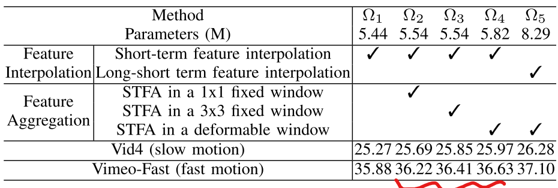

# STDAN: Deformable Attention Network for Space-Time Video Super-Resolution :statue_of_liberty:

> "STDAN: Deformable Attention Network for Space-Time Video Super-Resolution" NNLS, 2023 Feb
> [paper](https://ieeexplore.ieee.org/document/10045744) [code](https://github.com/littlewhitesea/STDAN)
> [paper local pdf](./2023_02_NNLS_STDAN--Deformable-Attention-Network-for-Space-Time-Video-Super-Resolution.pdf)

## **Key-point**

- Task

- Background

- Motivation

  VFI 针对时序插值，还没有用 two-stage 方式做 Spatial-Temporal 插值的工作

 adopts **deformable attention** to dynamically capture spatial and temporal contexts among frames

用 Deformable CNN 代替光流（可能不准确！）$F_{3\to 1}:~ Backward~I_3 \to I_1 的特征$

> local 每个点，用 deformable 筛选的 T=2 个点去融合特征。feature map 逐点融合，因此没有加 position bias


## **Contributions**


## **Related Work**

- Deformable CNN

  - "Deformable 3D convolution for video super-resolution"

  - "FDAN: Flow-guided deformable alignment network for video super-resolution"

    flow-guided deformable alignment mechanism
    
  - "Deformable ConvNets v2: More Deformable, Better Results" CVPR, 2018 Nov
    [paper](https://arxiv.org/abs/1811.11168)

- Deformable Transformer

  - "Fast online video super-resolution with deformable attention pyramid"
  - "Recurrent video restoration transformer with guided deformable attention,"

- Multi-correspondence

  - "MuCAN: Multi-correspondence aggregation network for video super-resolution"

- Dynamic filters

  - "Deep video super-resolution network using dynamic upsampling filters without explicit motion compensation"

- Video Transformer Has high computation cost
  - "Swin transformer: Hierarchical vision transformer using shifted windows"
  - "Swinir: Image restoration using swin transformer"

- This work
  - "Zooming slow-mo: Fast and accurate one-stage space-time video super-resolution" 
    DFI module


## **methods**

> [model structure code](https://github.com/littlewhitesea/STDAN/blob/main/codes/models/modules/sttrans.py)

### Encoder

> [code: RSTB](https://github.com/littlewhitesea/STDAN/blob/main/codes/models/modules/rstb.py#L12)

- L1: x 经过 Encoder 原始尺度特征，L2, L3 分别由 L1 downsample 2x, 4x

  多尺度特征


### LSTFI (Feature Interpolation)

> 此模块用途：**根据现有的 N 帧，插帧 N-1 帧，共 2N-1 帧的特征**（F1，F3帧，插帧得到 F2 帧） [code](https://github.com/littlewhitesea/STDAN/blob/d751a3a001fd060ac5f99c7eb5584368937a75b1/codes/models/modules/sttrans.py#L171)

`feat1=[L1, L2, L3] ` `feat2=[L1, L2, L3]` >> 输入的 F1，F3 各自3个尺度的特征

LSTFI 模块通过 **DFI 模块**提取 前向 F1->F3, 反向 F3->F1 的特征。将两个特征 [concat](https://github.com/littlewhitesea/STDAN/blob/d751a3a001fd060ac5f99c7eb5584368937a75b1/codes/models/modules/dconv.py#L576)

- 以 F3->F1 反向为例

  先从最小的尺度 L3 开始 concat，计算 Deformable offset 后的特征。再和 L2 concat 同样过 Deformable，结果 concat 到 L1。最后再过几个 Conv 得到反向的特征 F3->1

- DFI 模块：utilize a **pyramid**（多尺度）, cascading, and deformable (PCD) structure in [42] to achieve DFI


### STDFA(feature aggregation) :star:

> Spatial–Temporal Deformable Feature Aggregation
> N 帧插针后，有 `2N-1` 帧的特征 $\{F_t\}^{2N-1}_{t=1}$ **相互提取信息，优化各帧的特征**
>
> :star: 可学习特征提取模块 [code](https://github.com/littlewhitesea/STDAN/blob/main/codes/models/modules/def_enc_dec.py)

1. 每一帧的特征，单独和另外一帧的特征做 Deformable Attention (Deformable Transformer)

   每两帧这样看，更合理

2. deformable 取 $k\times k$ 个点作为参考点，去计算偏移

3. 为了减少存储，只计算相似度最大的 K 个点

   1. AttnMap $Softmax(QK)$ 作为相似度，先对 Key Softmax 加权平均
   2. 共 `2N-1` 帧，再对所有帧取 softmax 加权平均：QK 得到的 relevant weight map $W_{j\to i}$
   3. 对当前 i 帧的 $p_0$ 点，QKV 结果再所有帧的同一位置取加权平均

4. 最后得到的 $p_0$  更新后的特征向量，**过 Linear 得到 residual auxiliary feature**


- **获取当前帧 i 与参考帧 t （两帧）在空间维度融合**

  > 用 QK 点积作为相似度指标，QK结果为 weighted map，参考帧 t 对应 Value

  1. 初筛：每一个 Q 中的点，去与 K 中 offset 得到的 kxk 个点计算相似度，取 top T 相似度 K 中的点。

  2. 用这个筛选后的 T 个点，加权更新 Key, Value >> 公式 10，11

     **Deformable 的 k x k 个点，取 top T 最相似的点，计算 QK 后 Softmax 作为权重，将 T 个点的特征加权融合，理解为“融合成一个点”。从而 Q 中每个点对应 K，V 中一个“融合后”的点**
     $$
     w_\xi=\frac{e^{Q_i(\mathbf{p}_o)\cdot K_j\left(\mathbf{p}_o+\overline{\mathbf{p}}_\xi+\Delta\overline{\mathbf{p}}_\xi\right)}}{\sum_{\xi=1}^Te^{Q_i(\mathbf{p}_o)\cdot K_j\left(\mathbf{p}_o+\overline{\mathbf{p}}_\xi+\Delta\overline{\mathbf{p}}_\xi\right)}} \\
     
     K_{j\to i}(\mathbf{p}_o)=\sum_{\xi=1}^Tw_\xi\cdot K_j\left(\mathbf{p}_o+\overline{\mathbf{p}}_\xi+\Delta\overline{\mathbf{p}}_\xi\right).
     $$

  3. 用 Q 和更新后的 Key 相乘的权重（已经筛选好 T 个点），去融合 Value 中的T个点。因此得到当前帧 i 和参考帧 t 的 weighted_map $W_{t\to i} \in R^{H*W}， ~V_{j\to i}\in R^{H*W}$

- 当前帧 i 和其余帧都计算了权值矩阵 和 Value 后，在 **temporal 维度加权平均**

  $W_{t\to i} \in R^{H*W}$ 作为权重， $V_{j\to i}\in R^{H*W}$ 作为参考帧 j 中提取出的有用信息

  1. 再次加权平均一下，提取其余帧中能够用到当前帧的特征
  2. 其余帧融合过滤后的特征 + 当前帧本身的特征

> 参考帧太多，加权后融合的特征太均匀，直接糊掉了？


#### dueformable Attn

> [code url](https://github.com/littlewhitesea/STDAN/blob/main/codes/models/modules/def_enc_dec.py)


### HR reconstruction

将 Deformable Transformer 得到增强后的特征 $F^*_t$，过 RSTB 模块，pixel-shuffle up-sampling 模块

使用 `Charbonnier Loss`  代替 L1 loss 提高性能
$$
L_{rec} = \sqrt{\abs{\abs{I^{hr}_t - I^{GT}_{t} }}^2 + \epsilon^2}
$$

```python
class L1_Charbonnier_loss(torch.nn.Module):
    """L1 Charbonnierloss."""
    def __init__(self):
        super(L1_Charbonnier_loss, self).__init__()
        self.eps = 1e-6

    def forward(self, X, Y):
        diff = torch.add(X, -Y)
        error = torch.sqrt(diff * diff + self.eps)
        loss = torch.mean(error)
        return loss
```

- :question: 输入图像 128x128 crop 到 32x32

  显存还会 OOM，代码里面很多

  ```python
  del (feats_origin, to_lstm_fea, L1_fea, lr_medium_feat)
  torch.cuda.empty_cache()
  ```


## **Experiment**

> ablation study 看那个模块有效，总结一下

- Dataset

  Vimeo-90K, 60 000 training video sequences, and each video sequence has seven frames.

  - train: 原始 7 帧取为 GT，LR 选取奇数序号的帧，bicubic-sampling 下采样 4 倍
  - 提供 test 集合: Vimeo-Slow, Vimeo-Medium, and Vimeo-Fast according to the degree of motion

- metrics

  1. 取 YCbCr 的 Y 通道（灰度）计算 PSNR，SSIM
  2. 参数量，速度

- Experiment Setting

  > Section 4(B)

  1. Deformable Transformer

     设置 $k \times k$ 个参考点，按相似度筛选其中的 T 个点：k=3, T=2

  2. 训练数据随机 crop 32x32

- Qualitive Result: 与 STVSR SOTA 方法比较

  PSNR，SSIM 和 TMNet 接近


### Ablation Study

- 比较 3 种 Feature Aggregation 融合方法：STFA（spatial-temporal feature aggregation）STDFA(Deformable)

  STDFA 主观效果更好

  

  

  

  

  1. feature aggregation 有用

  2. spatial range 越大越好

  3. deformable 相对于 fixed patch 更有效

     STDAN 按像素点来融合，对于 deformable 的一个区域，选择 T 个相似度最高的点更为合理

- STDAN 与 3D conv 比较

  1. STDAN 按学到的 offset 去采样 deformable 区域，3D Conv 是固定的
  2. STDAN 动态加权的融合时序上多帧，可以长距离提取特征；3D CNN 大多只能是相邻帧

- Feature Interpolation

  LSTFI 模块加了 PSNR 高 0.3 db 但参数量多了 4M

- Efficiency of Selecting the First T Points

  Deformable 中加入 Keypoint 选择不是很耗时（对 Key 加权平均），without/with 0.542 s/0.543 s 

  > 因为只取 7 帧，而且 size 很小

- Deformable Transformer 用 3D 卷积


## **Limitations**

-  sample wrong locations when video motions are fast


## **Summary :star2:**

> learn what & how to apply to our task