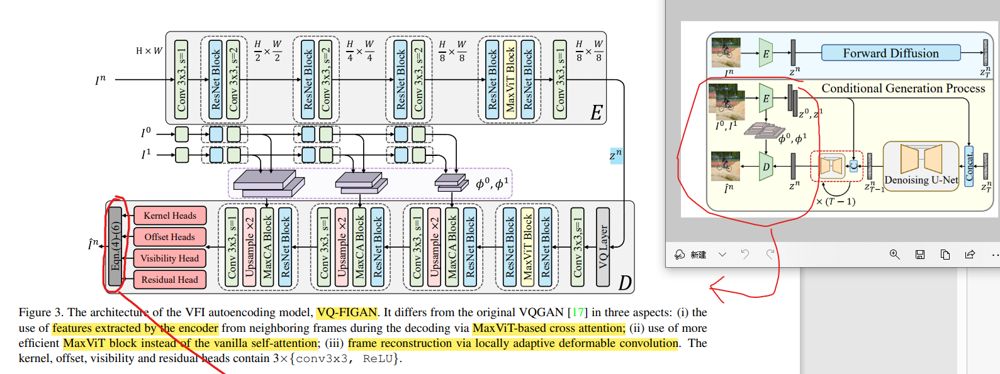

# LDMVFI: Video Frame Interpolation with Latent Diffusion Models

> "LDMVFI: Video Frame Interpolation with Latent Diffusion Models" Arxiv, 2023 Mar :+1:
> [paper](https://arxiv.org/abs/2303.09508) [code](https://github.com/danier97/LDMVFI)
> [paper local pdf](./2023_03_Arxiv_LDMVFI--Video-Frame-Interpolation-with-Latent-Diffusion-Models.pdf)

## **Key-point**

first approach to use Latent-diffusion-Model(Stable-diffusion) that addresses VFI Task(video frame interpolation), contains two major components: VFI-specific Autoencoder, Denoising U-net

- VQ-FIGAN

  replace LDM encoder, decoder with VQ-FIGAN

  1. LDM encoder 没针对 VFI 任务设计，用 MaxViT atten & deformable conv 增强 VFI 性能
  2. **在 decoder 中加入 GT code  >> 增强 reconstruction consistency**

- denoising U-net

  针对 VFI 任务，inference 时候能够使用前后帧信息，用前后帧的 code 作为 condition


**Contributions**

- 第一个用 LDM 做 VFI 的方法：用前后帧的 latent code 作为 condition
- 设计了一个新的 Encoder-Decoder `VQ-FIGAN` ，代替 Stable Diffusion 中的 VQGAN
  1. LDM encoder 没针对 VFI 任务设计，用 `MaxViT atten` & deformable conv 增强 VFI 性能
  2. **在 decoder 中加入 GT(已有的前后帧 I0, I1) 的 latent code >> 增强 reconstruction consistency**
  3. replace vanilla attention with MaxViT attention >> improve efficiency


## **Related Work**

- background

  **video frame interpolation (VFI)** is to generate intermediate frames between **two existing consecutive frames** in a video sequence.

  **现有 PSNR-oriented VFI 方法**，优化 L1/L2-based **distortion loss**，导致虽然 PSNR 指标高，但是主观看图的效果并不好。


现有 VFI 方法分为两大类: flow-based & kernel-based

- 光流预测
  - "XVFI: eXtreme Video Frame Interpolation" ICCV Oral, 2021 Mar
    [paper](https://arxiv.org/abs/2103.16206) [code](https://github.com/JihyongOh/XVFI?utm_source=catalyzex.com)
- predict locally **adaptive convolution kernels** to synthesize output pixels
  - "Video Frame Interpolation Transformer" CVPR 2022
    [paper](https://openaccess.thecvf.com/content/CVPR2022/html/Shi_Video_Frame_Interpolation_Transformer_CVPR_2022_paper.html) [code](https://github.com/zhshi0816/Video-Frame-Interpolation-Transformer?utm_source=catalyzex.com)

- 之前 DM 用于 VFI(video frame interpolation)

  - "MCVD: Masked Conditional Video Diffusion for Prediction, Generation, and Interpolation" NeurIPS, 2022 May
    [paper](https://arxiv.org/abs/2205.09853) [website](https://mask-cond-video-diffusion.github.io/?utm_source=catalyzex.com)

    > 只能对于低分辨率生成。发现 LDM 还没人用于 VFI


### **MaxCA blocks**

- "MaxViT: Multi-Axis Vision Transformer" ECCV, 2022 Apr
  [paper](https://arxiv.org/abs/2204.01697) [code](https://github.com/google-research/maxvit?utm_source=catalyzex.com)

  > MaxViT is a family of **hybrid (CNN + ViT) image classification models**, that achieves better performances across the board for both parameter and FLOPs efficiency than both SoTA ConvNets and Transformers

  


## **methods**

> - 写作 trick：简述一下 LDM 水一下篇幅
> - :question: $\phi$ 特征如何出
> - Encoder 结构

$$
Task Definition:\\
I^0, I^1 >> I^n, ~n=1/up\_sample\_rate\\
\text{if up=2,n=0.5. $I^0,I^1$ represent the previous and latter frame}
$$

 The proposed LDMVFI contains **two main components**: 

1. VQ-FIGAN: a VFI-specific autoencoding model
   projects frames into a latent space, and reconstructs the target frame
2. denoising U-Net that performs reverse diffusion process in the latent space for conditional image generation


> 整体框架


### VQ-FIGAN



**为啥要用个新的 Encoder ?**

作者发现 LDM 预训练的 encoder 压缩h会丢失高频细节，就自己设计了一个 Encoder 映射到 latent space. 

> LDM encoder's design purpose is to project images into efficient latent representations where high-frequency details are removed. **Lossy info brought by LDM encoder** would deteriorate the quality.


**如何在设计 Encoder, decoder 融合 I0, I1 信息?**

- MaxCA blocks 改进

  MaxViT attention: Q=latent code, KV=i0,i1 的 code. >> reversion Diffusion 预测两帧之间的差异，和 i0 关联得到一个权值矩阵，加到 i1 上

  1. VQGAN 用 ViT 的 attention，计算量大
  2. more-efficient inference HR video >> **用一个更轻量的 ViT 提速**
  3. 用了一种更 memory efficient free 的实现方式
     "Video Frame Interpolation via Adaptive Separable Convolution"
     [paper](https://arxiv.org/abs/1708.01692)

- Decoder 输出 $\set{\Omega^\tau,\alpha^\tau, \beta^\tau}$

  $\Omega^\tau$ 为 kernel 的 param，$\tau$ 表示 0, 1 帧
  $\alpha^\tau, \beta^\tau$ 代表水平和垂直方向空间上的像素偏移量


**locally adaptive deformable convolutions**

> TODO: equ 4-6 decoder 最后在送入这个 deformable conv
>
> 输出 $I^{n0},I^{n1}$ 加权融合一下


#### Encoder 

> `class FIEncoder(nn.Module)`

分为3段：开始一个 Conv 通道不变抽特征。mid: 连续几层 `ResBlock` (可以加 `MaxViT attention`) + `downsample-block` 进行降采样. end:  Res+Attention(可以是 maxViT, vanilla)+Res

- `MaxAttentionBlock`

  1. W,H 分为 8x8 的 patch
  2. 对 embedding x 做 MaxViT_atten(x) + x

- `max_cross_attn`

  先 MaxViT 一下，再 crossAttn

- `vanilla attention` >> Self-Attention

  ```python
  def forward(self, x):
      h_ = x
      h_ = self.norm(h_)  # Normalize
      q = self.q(h_)  # Conv2d
      k = self.k(h_)
      v = self.v(h_)
  
      # compute attention
      b,c,h,w = q.shape
      q = q.reshape(b,c,h*w)
      q = q.permute(0,2,1)   # b,hw,c
      k = k.reshape(b,c,h*w) # b,c,hw
      w_ = torch.bmm(q,k)     # b,hw,hw    w[b,i,j]=sum_c q[b,i,c]k[b,c,j]
      w_ = w_ * (int(c)**(-0.5))
      w_ = torch.nn.functional.softmax(w_, dim=2)
  
      # attend to values
      v = v.reshape(b,c,h*w)
      w_ = w_.permute(0,2,1)   # b,hw,hw (first hw of k, second of q)
      h_ = torch.bmm(v,w_)     # b, c,hw (hw of q) h_[b,c,j] = sum_i v[b,c,i] w_[b,i,j]  >> batch-matrix-matrix product
      h_ = h_.reshape(b,c,h,w)
  
      h_ = self.proj_out(h_)  # Conv2d
  
      return x+h_
  ```

- downsample 实现维度 / 2

  - HW 只pad一边 + conv2d(c, c, kernel_size=3, stride=2, padding=0) 

    `torch.nn.functional.pad(input, pad=(padding_left,padding_right,padding_top,padding_bottom),)`  每个维度pad成对些参数，维度从dim=-1 向前算

  - `torch.nn.functional.avg_pool2d(x, kernel_size=2, stride=2)`
    $$
    2D~avgPooling~output~rule\\
    H_{out} = \frac{H_{in} +2*pading[0] - kernel[0]}{stide[0]} + 1
    $$

#### Decoder

> `class VectorQuantizer2(nn.Module)` 

- VQGAN  >>`class VectorQuantizer2(nn.Module):` 对于 paper Figure3 Decoder 里面的 `VQLayer`

  根据 latent code ，从 VQGAN codebook 中获取 embedding

- mid part

  Res+MaxVit(Self-attn)+Res

- Upsample part

  Res+MaxVit(Cross attn) + Upsample(nearest 插值 + Conv2d 不改变尺寸)

  ```python
  class Upsample(nn.Module):
      def __init__(self, in_channels, with_conv):
          super().__init__()
          self.with_conv = with_conv
          if self.with_conv:
              self.conv = torch.nn.Conv2d(in_channels,
                                          in_channels,
                                          kernel_size=3,
                                          stride=1,
                                          padding=1)
  
      def forward(self, x):
          x = torch.nn.functional.interpolate(x, scale_factor=2.0, mode="nearest")
          if self.with_conv:
              x = self.conv(x)
          return x
  ```

- Decoder 输出 $\set{\Omega^\tau,\alpha^\tau, \beta^\tau}$ ，是 `deformable convolution-based interpolation kernel` 模块的参数

  > 这个 Kernel 参考下面的 paper，公式用 `cupy` 库实现 & 加速 :star:
  >
  > - "Deformable convolutional networks"
  >   [blogs](https://zhuanlan.zhihu.com/p/52476083)
  > - "AdaCoF: Adaptive Collaboration of Flows for Video Frame Interpolation" CVPR, 2019 Jul
  >   [paper](https://arxiv.org/abs/1907.10244v3) [code](https://github.com/HyeongminLEE/AdaCoF-pytorch) [website](https://ar5iv.labs.arxiv.org/html/1907.10244)
  > - "Video Frame Interpolation via deformable separable convolution" AAAI, 2020
  >   [paper](https://ojs.aaai.org/index.php/AAAI/article/view/6634) [code](https://github.com/I2-Multimedia-Lab/Video-Frame-Interpolation-Based-on-Deformable-Kernel-Region)

  - $\Omega^\tau$ 为 kernel 的 param，$\tau$ 表示 0, 1 帧
  - $\alpha^\tau, \beta^\tau$ 代表水平和垂直方向空间上的像素偏移量

  `def OffsetHead(c_in)` 4个Conv+Relu

  针对 VFI 任务特殊的模块，因为当前生成的帧，看作前后帧的信息加上**偏移**


**Training VQ-FIGAN**

直接用 VQGAN 原始的训练方式


### Conditional generate LDM

- 把 I0,i1 作为条件，reverse diffusion 如何实现? :question:

reverse diffusion, y 为前后帧 GT
$$
pθ(x_{t−1}|x_t, y)
$$

> Experiment Section 最后一小节有介绍
>
> conditioning the denoising U-Net on the latents z 0 , z1 （前后帧 GT 的 code）is concatenation


## **Experiment**

3090 GPUs, VQ-FIGAN 70 epochs, U-net 60 epochs

### Dataset

> Appendix J 提供了各个数据集的 url

- Training
  Vimeo90K + BVI-DVC quintuplets

  The final training set consists of 64612 frame septuplets from Vimeo90k and 17600 frame quintuplets from BVI-DVC provided by [11]

- evaluation on commonly used VFI benchmarks

  UCF101, DAVIS, SNU-FILM

- Full HD evaluation

  BVI-HFR [43] dataset

### Quantitative Result

- 10 baselines

  including BMBC [50], AdaCoF [37], CDFI [15], XVFI [60], ABME [51], IFRNet [35], VFIformer [41], ST-MFNet [11], FLAVR [30], and MCVD [70].

  **All these models were re-trained on our training dataset for fair comparison**


### Ablation Study

- Effectiveness of VQ-FIGAN

  - V2: Decoder 直接出 $I^n$ 而不是输出 kernel 的参数
  - V1: V2 基础上再去掉 I0I1 过来的 pyramid 特征 & 用 ResNet 代替 MaxCABlocks

- Down-sampling Factor f >> dimension of the latent space

  f increases from 8 to 32, there is generally an increasing trend in model performance;
  f=64 效果降低很多，选择 f=8

  > 通过压缩率，调整 $I_t$ 相对于 $I_0, I_1$ 的权重，压缩率 f 越大，$I_t$ 信息越少之后 decoder $I_0, I_1$ 的权重就越高！:star:

- U-net 参数量>> 调整通道数实现 c=256 450M 参数

  Table 3 reflects a decreasing trend in model performance as c is decreased
  
- Conditioning Mechanism：效果类似，选择复杂度更低的 concat

  - z0,z1,zt concat as U-net input
  - using MaxCA blocks at different layers of U-net


## **Limitations**

See Appendix H.

1. much **slower inference speed** 对比其他 SOTA 方法

2. model parameters in LDMVFI is also larger **450M 参数。。**

   > knowledge distillation [21] and model compression [4] can be used

3.  two-stage training strategy, large model size and slow inference speed of LDMVFI mean that large-scale training and evaluation processes

   训练推理慢。。。


## Code 

- LPIPS
  copy the code from [PerceptualSimilarity](https://github.com/richzhang/PerceptualSimilarity) :+1:
  this paper's code origin version miss the weight
  
- Datset

  

## **Summary :star2:**

> learn what & how to apply to our task

可以模仿这个把 LDM 用到 VFI 的思路

- 如果 LDM encoder 效果不好，尝试 replace LDM encoder, decoder with VQ-FIGAN && MaxViT 考虑换一下

  LDM encoder 没针对 VFI 任务设计，用 MaxViT atten & deformable conv 增强 VFI 性能

- **在 decoder 中加入 GT 信息>> 增强 reconstruction consistency**

- concat 方式的 condition 效果与 Atten 中替换 KV 效果类似