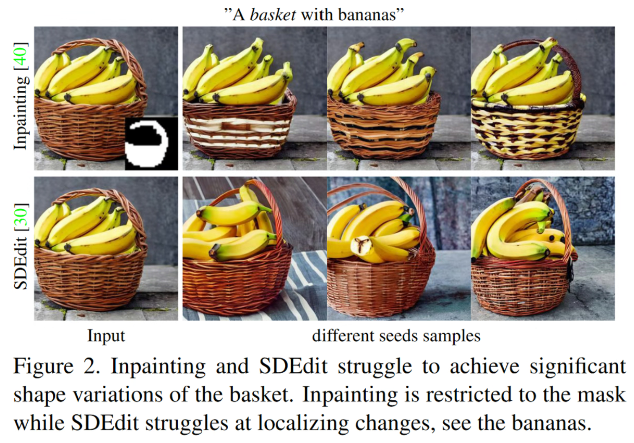
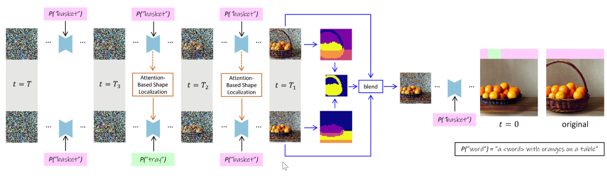
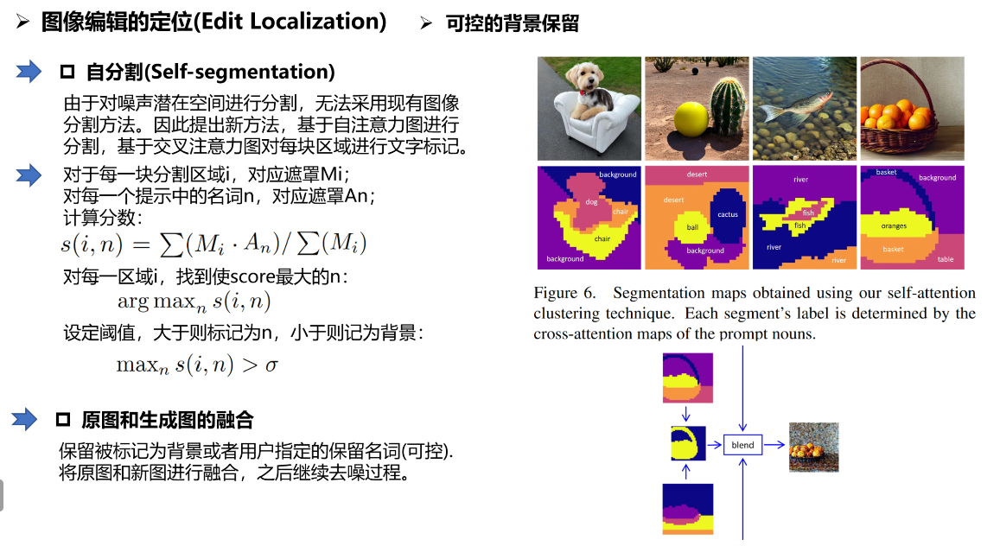
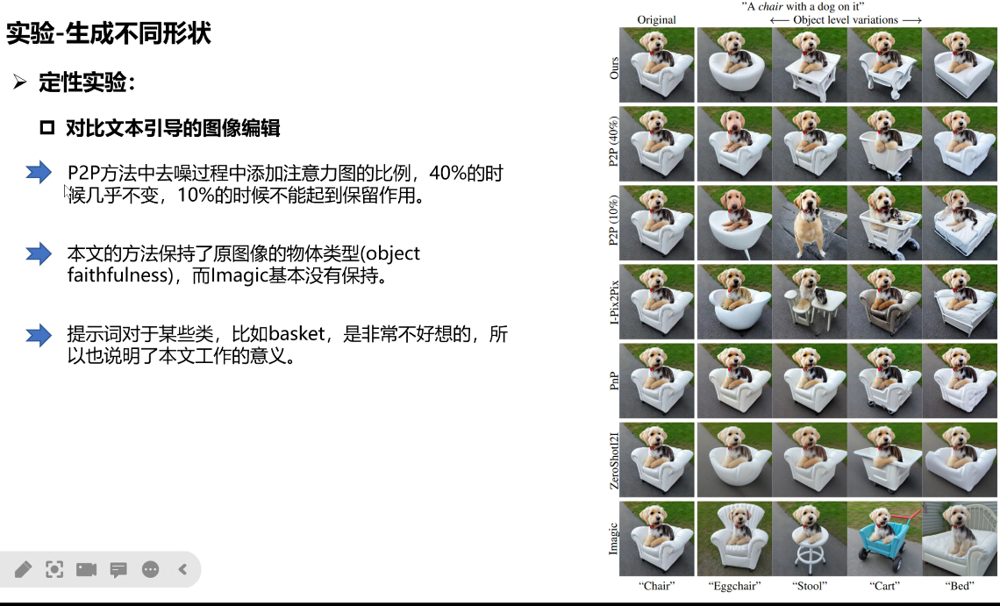
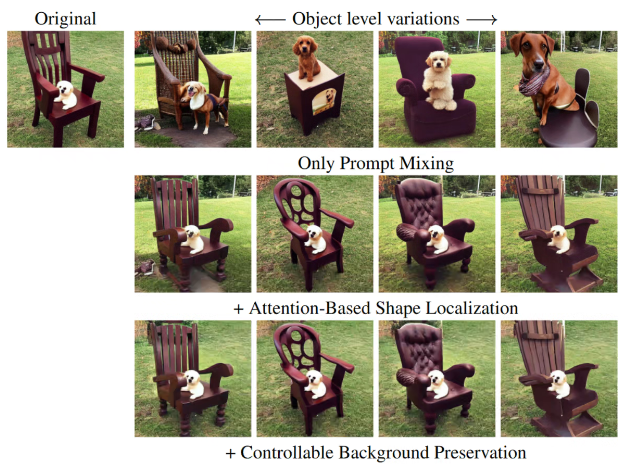
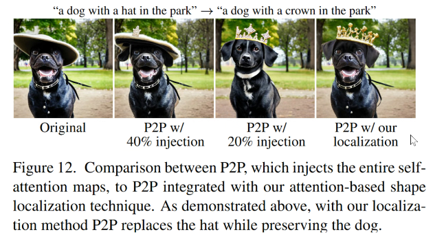

# Localizing Object-level Shape Variations with Text-to-Image Diffusion Models

> "Localizing Object-level Shape Variations with Text-to-Image Diffusion Models" Arxiv, 2023 Mar
> [paper](http://arxiv.org/abs/2303.11306v2) [code](https://github.com/orpatashnik/local-prompt-mixing) 
> [pdf](./2023_03_Arxiv_Localizing-Object-level-Shape-Variations-with-Text-to-Image-Diffusion-Models.pdf)
> Authors: Or Patashnik, Daniel Garibi, Idan Azuri, Hadar Averbuch-Elor, Daniel Cohen-Or

## Key-point

- Task: Diffusion 实例级别的编辑，改一个物体其余不变
- Background
- :label: Label:

- 挑战

  先前方法，一个改其他的物体也改变

  

## Contributions

## Related Work

## methods

去噪阶段，使用不同提示。类似感知方式理解去噪过程，扩散去噪一开始全是噪声只有轮廓信息，之后学细节。

分为 3 个阶段，$T \to T_3$ 控制图像布局；$$

## Experiment

> ablation study 看那个模块有效，总结一下

- 基于注意力图

  

- 可控背景保留

  

## Limitations

## Summary :star2:

> learn what & how to apply to our task

diffusion 去噪过程分阶段，修改不同 condition

1. 
