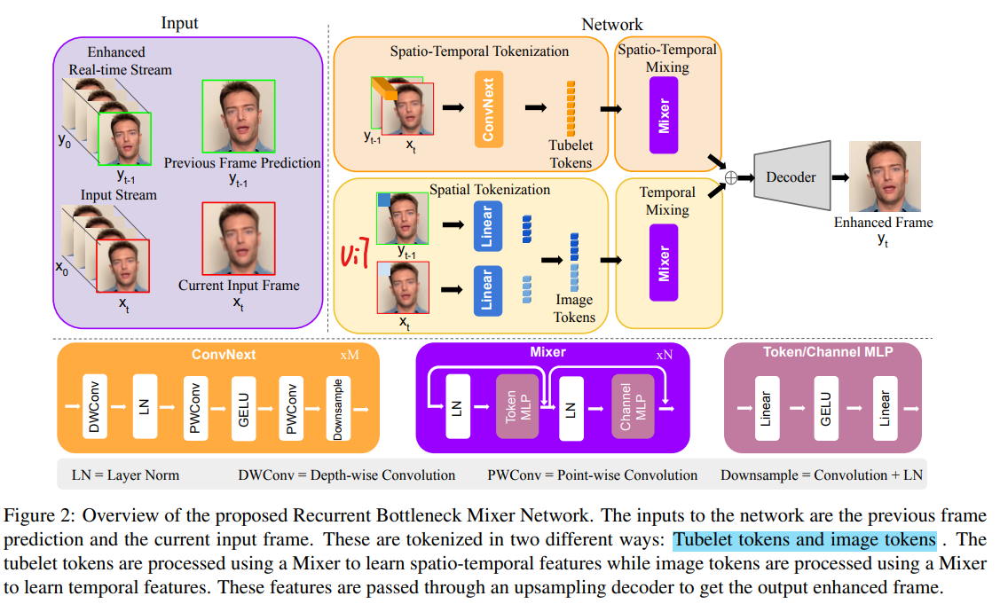
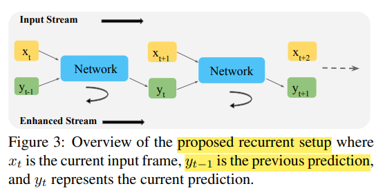

# ReBotNet: Fast Real-time Video Enhancement

> "ReBotNet: Fast Real-time Video Enhancement" AeXiv, 2023 Mar 
> [paper](https://arxiv.org/abs/2303.13504) [website](https://jeya-maria-jose.github.io/rebotnet-web/?utm_source=catalyzex.com)
> [paper local pdf](./2023_03_Arxiv_ReBotNet--Fast-Real-time-Video-Enhancement.pdf)

## **Key-point**

提出了 ReBotNet，一个可以 FPS=30 的，**实时视频增强（主要 deblur）方法**，针对视频会议，视频直播场景优化，能够 FPS=30 **实时视频增强，性能 SOTA**。

ReBotNet 方法，输入当前帧&上一帧的预测，处理部分分为 3 个模块：Tokenization（分为两个 branch 分别提取 spatial-temporal 特征，spatial 特征）， bottleneck(用 mixer 融合两个特征)，recurrent setup(**当前输出作为下一帧预测的输入**)

用 ConvNext + Mixer 代替 Transformer 减小计算量，增强实时性。从 spatial-temporal，temporal patches，recurrent-setup 角度提升视频的时间一致性。


**Contributions**

- real-time video enhancement 方法，针对视频会议，直播场景。能够 FPS=30 **实时视频增强，性能 SOTA**

- 针对视频构造了两个视频增强数据集：没开源

  - PortraitVideo: 关注人脸区域

    人脸区域视频；resolution of the faces to 384 × 384. The videos are processed at 30 frames per second (FPS) with a total of 150 frames per video. 加上退化操作

  - FullVideo: 关注说话人的身体和其他周围场景

    132 training videos and 20 testing videos, and all videos are 720 × 1280, 30 FPS and 128 frames long. We apply similar degradations as PortraitVideo

- 用 Mixer 替换计算量大的 Transformer，增加实时性能 :star:


## **Related Work**

- 先前 Video restoration 方法复杂度高，inference time 长，部分方法用到 future frame 作为输入，不适合实时

- 避免 vanilla attention，为了达到实时性

  > "Bottleneck transformers for visual recognition" CVPR 2021
  > [paper](https://openaccess.thecvf.com/content/CVPR2021/papers/Srinivas_Bottleneck_Transformers_for_Visual_Recognition_CVPR_2021_paper.pdf)

  模仿 "Bottleneck transformers for visual recognition" 用 Conv & Transformer 形式，**提出用 ConvNext，MLP-mixer** 代替计算量大的 transformer Attention

- 没有针对视频会议的数据集

  作者根据 TalkingHeads 数据集筛选处理了一下

- Baseline

  FastDVDNet, BasicVSR++, VRT, and RVRT

  - SOTA convolution-based video super-resolution method BasicVSR++
  -  fastest deblurring method FastDVD
  - RVRT current SOTA method across many tasks like deblur, denoising, super-resolution, and video-frame interpolation
  - VRT: RVRT 的先前版本


## **methods**

> - :question: 上一阵的 Vit 特征，和当前帧的特征咋合起来？图中似乎是 concat？
> - :question: ConvNext & MLP-mixer 原理
> - :question: Loss function: 为了公平比较都用 `Charbonnier Loss` 



ReBotNet 方法，输入当前帧&上一帧的预测，处理部分分为 3 个模块：Tokenization（分为两个 branch 分别提取 spatial-temporal 特征，spatial 特征）， bottleneck(用 mixer 融合两个特征)，recurrent setup(**当前输出作为下一帧预测的输入**)


**Encoder and Tokenization**

> Appendix F 写了 Banch1 为啥用 ConvNext 论文中的参数 :grey_question:

两个 Token 输出均为 NxC 大小（若不一致用 max-pool ）

**Branch 1 - Tubelet tokens**

**提取 spatial-temporal 特征（含有 spatial 信息 & temporal 信息）**：输入当前帧 & 上一帧的预测结果，按通道 concat 输入到 ConvNext 模块

> 用 ConvNext & MLP-mixer
>
> - Depth-wise Conv
>   [参考](https://keras.io/api/layers/convolution_layers/depthwise_convolution2d/#:~:text=Depthwise%202D%20convolution.%20Depthwise%20convolution%20is%20a%20type,following%20steps%3A%20Split%20the%20input%20into%20individual%20channels.)


**Branch 2 - Image tokens**

**增强 temporal consistency 特征**：对上一帧的输出（认为融合了之前的信息实现时间一致性）和 当前帧，分别对单帧提取空间特征，用于**进一步确保一致性**（类似 ViT 打成 patch，过 Linear 提取特征）

> :question: 上一阵的 Vit 特征，和当前帧的特征咋合起来？图中似乎是 concat？


**BottleNeck**

两个 branch 的输出各有一个 Mixer-MLP 模块处理。每个里面有 2 个 MLP，先  token mixing，再 channel mixing


**Recurrent Setup**

模仿 LSTM，使用之前的帧能够进一步提升 temporal consistency

可以用多个先前的处理结果，但为了实时性，作者就用了一帧之前的结果




## Experiment

**Setting**

- The training is parallelized across **8 NVIDIA A100 GPUs**, with each GPU processing a single video. The model is trained for 500,000 iterations

  train all these methods on the new datasets PortraitVideo and FullVideo

- Loss function: 为了公平比较都用 `Charbonnier Loss` 

  > "A General and Adaptive Robust Loss Function" CVPR 2019 :question:
  > [code](https://github.com/jonbarron/robust_loss_pytorch?utm_source=catalyzex.com)
  > [blog](https://blog.csdn.net/qq_43665602/article/details/127041832) 修改了 L1 loss 不可导，加了个常数


**Detailed Exp**

> Paper Page 6
>
> PSNR, SSIM 对视频的每一帧计算，然后 average

1. 自己制作的 PortraitVideo & FullVideo 数据集上，

   定量比较 PSNR，SSIM，计算速度指标（GFLOPS, Latency, Param)

   质量比较：直接看图，zoom

2. GoPro，DVD 数据集

   PSNR,SSIM

**Ablation Study**

- 比较去掉不同模块下的效果：只用 1st branch & decoder, 2nd..., +bottlenck, +recurrent_step
- FPS and Peak Memory Usage


### Dataset

several video super-resolution, deblurring, and denoising datasets like REDS [49], DVD [69], GoPro [50], DAVIS [35], Set8 [72]

- Talking-Heads 数据集

  > "One-Shot Free-View Neural Talking-Head Synthesis for Video Conferencing" CVPR, 2021 Apr
  > [paper](https://arxiv.org/abs/2011.15126) [code:unofficial](https://github.com/zhanglonghao1992/One-Shot_Free-View_Neural_Talking_Head_Synthesis)

  public dataset that uses Youtube videos and processes them using face detectors to obtain just the face. 

- PortraitVideo （本文构造的）

  关注人脸区域：从 Youtube Talking-Head数据集改造，筛选&抠出人脸区域视频；resolution of the faces to 384 × 384. The videos are processed at 30 frames per second (FPS) with a total of 150 frames per video. 加上退化操作
  
- FullVideo（本文构造的）

  关注说话人的身体和其他周围场景：从 Talking-Head 数据集筛选，没用 Talking-Head 的预处理方法。132 training videos and 20 testing videos, and all videos are 720 × 1280, 30 FPS and 128 frames long. We apply similar degradations as PortraitVideo

- GoPro

  > "Deep Multi-scale Convolutional Neural Network for Dynamic Scene Deblurring"
  >
  > [paper](https://arxiv.org/abs/1612.02177) [blog](https://zhuanlan.zhihu.com/p/32216223)

  作者使用GOPRO4 HERO Black相机拍摄了**240fps的视频，然后对连续的7到13帧取平均获得模糊程度不一的图像**。每张清晰图像的快门速度为1/240s，对15帧取平均相当于获得了一张快门速度为1/16s的模糊图像。作者将模糊图像对应的清晰图像定义为处于中间位置的那一帧图像。最终，一共生成了3214对模糊-清晰图像，分辨率为1280×720

- DVD

  > "Deep Video Deblurring for Hand-held Cameras" CVPR 2017
  >
  > [paper](https://ieeexplore.ieee.org/document/8099516) [code](https://github.com/shuochsu/DeepVideoDeblurring)
  > [dataset website](https://www.cs.ubc.ca/labs/imager/tr/2017/DeepVideoDeblurring/)

  拍摄了 71 个 240 FPS 视频，含有多个场景：**合成 Long Exposure 来得到 blur video**，最后处理得到 2Million training patches 

  | Dataset            | [[DeepVideoDeblurring_Dataset.zip (3.7GB)\]](https://www.cs.ubc.ca/labs/imager/tr/2017/DeepVideoDeblurring/DeepVideoDeblurring_Dataset.zip) |
  | ------------------ | ------------------------------------------------------------ |
  | Dataset (High FPS) | [[DeepVideoDeblurring_Dataset_Original_High_FPS_Videos.zip (2.8GB)\]](https://www.cs.ubc.ca/labs/imager/tr/2017/DeepVideoDeblurring/DeepVideoDeblurring_Dataset_Original_High_FPS_Videos.zip) |


### Degradation

> Appendix F 如何人工合成一些退化

退化只涉及一些模糊，调整对比度，亮度操作，主要还是针对 video deblur 任务

```
Type of Degradation Value
Eye Enlarge ratio 1.4
Blur kernel size 15
Kernel Isotropic Probability 0.5
Blur Sigma [0.1,3]
Downsampling range [0.8,2.5]
Noise amplitude [0,0.1]
Compression Quality [70,100]
Brightness [0.8,1.1]
Contrast [0.8,1.1]
Saturation [0.8,1.1]
Hue [-0.05,0.05]
```


## **Limitations**

- 退化很简单，只针对 video deblur，没有类似老视频的严重划痕
- 代码 & 数据没开源


## **Summary :star2:**

> learn what & how to apply to our task

- **维持 video temporal consistency** 至少看他 website 效果还不错 :star:
  1. recurrent setup 用之前的结果作为输入很常见，Blind Deflickering 也是这么做的
  2. 前后帧图像，分别按通道 concat 提取 spatial & temporal 特征；打成 ViT patches 单独提取特征，用 attention 提取前后帧关联性
- 可以参考实现实时性的一些模块：ConvNext & Mixer 代替 Transformer
- Baseline 可以参考一下
- 参考构造数据集的方式，直接从其他数据集筛选一些，针对指定场景 `视频会议` 做一些提取人脸的处理