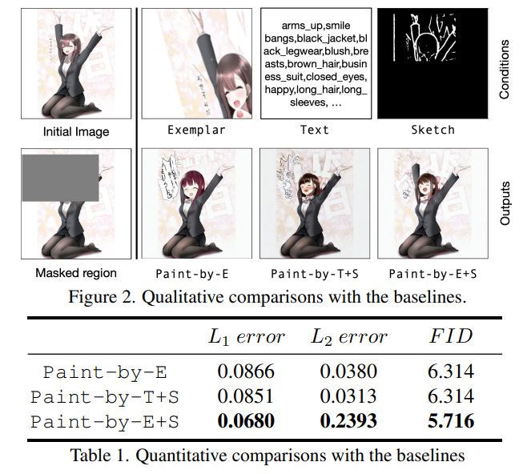

# Reference-based Image Composition with Sketch via Structure-aware Diffusion Model

> "Reference-based Image Composition with Sketch via Structure-aware Diffusion Model" Arxiv, 2023 Mar
> [paper](http://arxiv.org/abs/2304.09748v1) [code]() 
> [pdf](./2023_03_Arxiv_Reference-based-Image-Composition-with-Sketch-via-Structure-aware-Diffusion-Model.pdf) [note](2023_03_Arxiv_Reference-based-Image-Composition-with-Sketch-via-Structure-aware-Diffusion-Model_Note.md)
> Authors: Kangyeol Kim, Sunghyun Park, Junsoo Lee, Jaegul Choo

## Key-point

- Task
- Problems
- :label: Label:

## Contributions

## Introduction

- "Paint by Example: Exemplar-based Image Editing with Diffusion Models" 
  [paper](https://arxiv.org/abs/2211.13227) [code](https://github.com/Fantasy-Studio/Paint-by-Example) [note](./2022_11_CVPR_Paint-by-Example--Exemplar-based-Image-Editing-with-Diffusion-Models_Note.md)

## methods

## Experiment

> ablation study 看那个模块有效，总结一下

## Limitations

## Summary :star2:

> learn what & how to apply to our task

