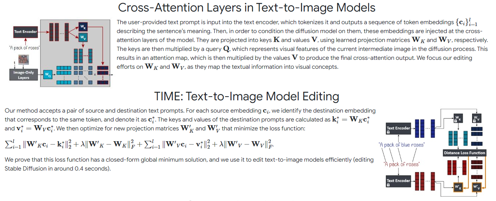
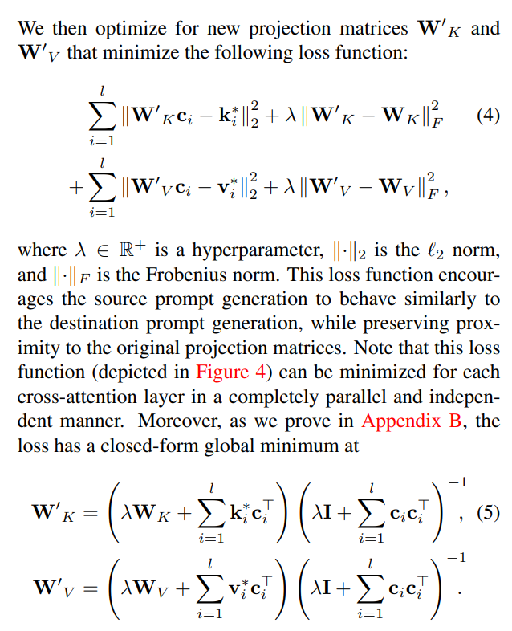
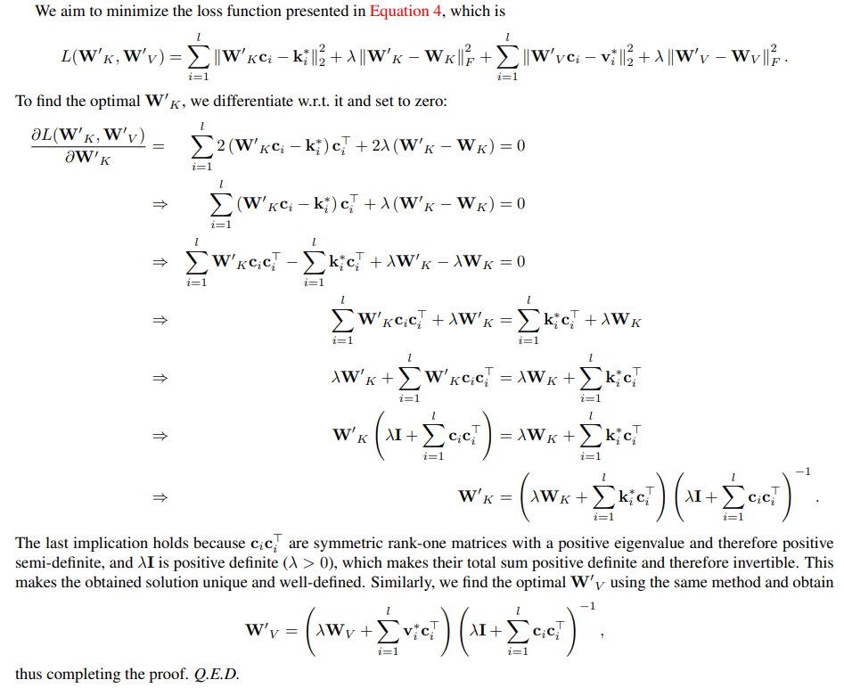
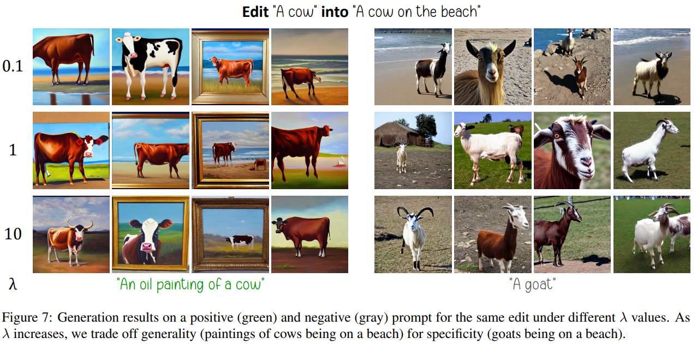
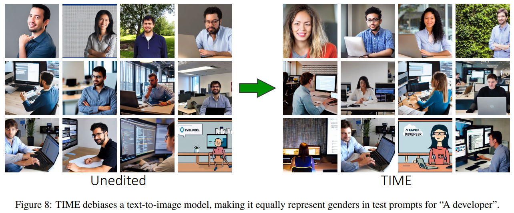

# Editing Implicit Assumptions in Text-to-Image Diffusion Models

> "Editing Implicit Assumptions in Text-to-Image Diffusion Models" CVPR, 2023 Mar
> [paper](http://arxiv.org/abs/2303.08084v2) [code](https://github.com/bahjat-kawar/time-diffusion?tab=readme-ov-file) [website](https://time-diffusion.github.io/)
> [pdf](./2023_03_CVPR_Editing-Implicit-Assumptions-in-Text-to-Image-Diffusion-Models.pdf)
> Authors: Hadas Orgad, Bahjat Kawar, Yonatan Belinkov

## Key-point

- Task: Stable Diffusion 图像编辑
- Problems
- :label: Label:

1. 输入原始 prompt 和加了编辑属性的 prompt，**用目标 prompt 去改造原始 prompt 的 cross attention layer QKV 映射矩阵**，实现编辑，**同时去除 stable diffusion 从训练数据学到的 bias**

   这种方式也不用加一层减一层，可能还不用训练！

2. 对 loss function 先看有没有闭合解，有的话也就不用训练了！加速

## Contributions

1. 编辑 cross atten layer 的 QKV mapping 矩阵，**有闭合解不用训练**
2. curate a Text-to-Image Model Editing Dataset (TIMED)

## Introduction

## methods

Our algorithm takes two textual prompts as input: an under-specified source prompt (e.g., “a pack of roses”), and a similar more specific destination prompt (e.g., “a pack of blue roses”). We aim to shift the source prompt’s visual association to resemble the destination.

使用目标 prompt embedding 去微调原始 prompt embedding，实现编辑 （编辑的原因是因为原始训练数据有 bias）: **optimize for new projection matrices W′ K**

> 对于编辑 prompt 中用于编辑的单词，因为和原始 prompt 没有对应，就直接丢掉了。
> paper 解释虽然丢掉，但由于 text-embedding model 结构，仍然会对其余的 target prompt token 产生影响。
>
>  Note that embeddings stemming from additional tokens in the destination prompt (e.g., “blue” in “a pack of blue roses”) are discarded. Nevertheless, their influence is present in other destination tokens through the text encoder architecture.

Loss Function

### Implementation Details

We use Stable Diffusion [54] version 1.4 with its default hyperparameters: 50 diffusion timesteps, a classifier-free guidance [26] scale of 7.5

The model generates images of size 512×512 pixels. Unless specified otherwise, we use λ = 0.1 for TIME.

### Closed-Form Solution Proof

对目标变量求梯度，将目标变量移到一边；

**想要求解梯度 = 0 的点，直接算出来全局最优解，因此也不用训练了**

## Experiment

> ablation study 看那个模块有效，总结一下

**去除 stable diffusion 从训练数据学到的 bias**

## Limitations

1. these models may fail to generate **images aligned with the requested prompts** in some cases, such as compositionality or counting

   text2image，去网上找一张图辅助

2. not designed to teach the model new visual concepts that it was unable to generate

## Summary :star2:

> learn what & how to apply to our task

