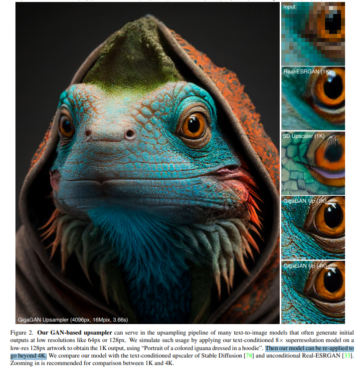
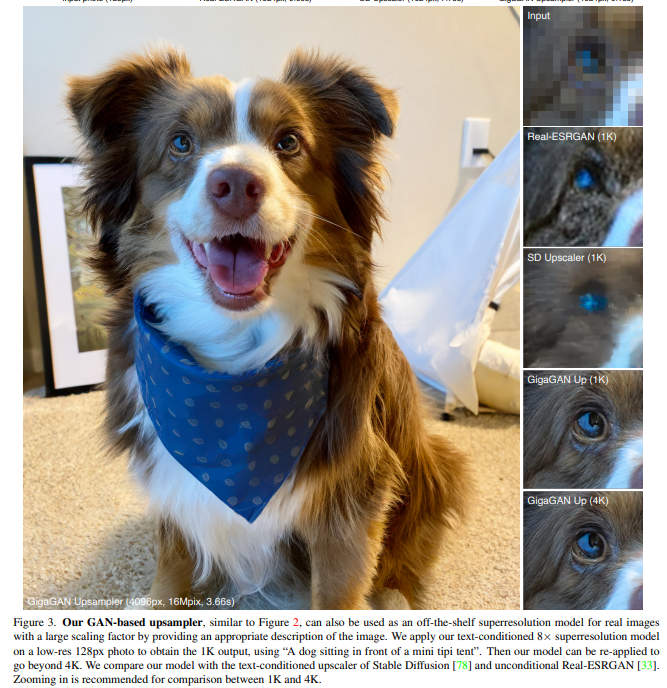
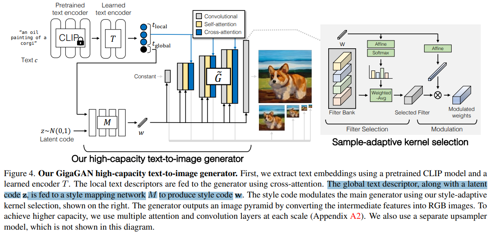
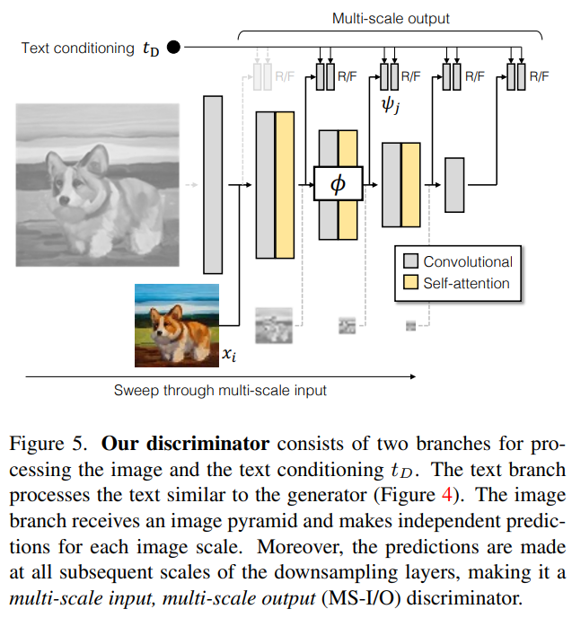
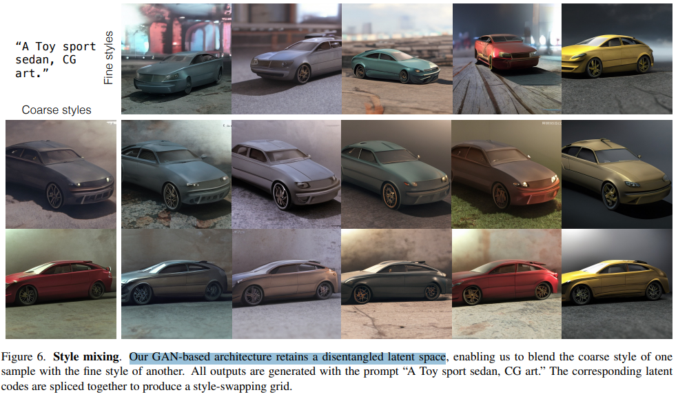
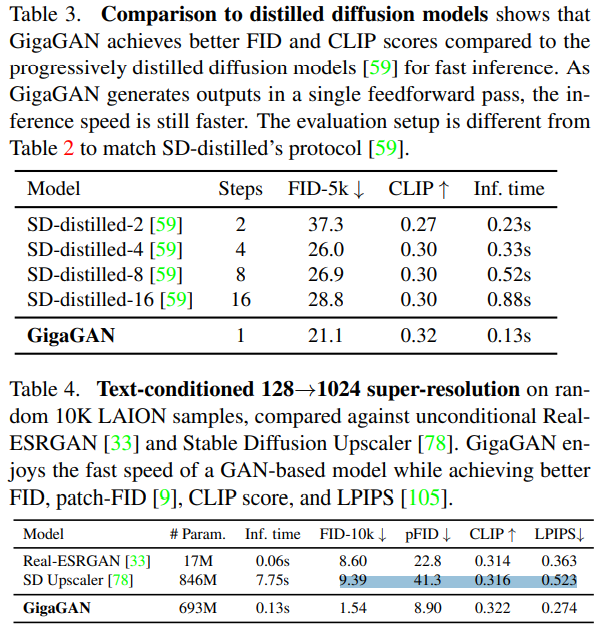

# Scaling up GANs for Text-to-Image Synthesis

> "Scaling up GANs for Text-to-Image Synthesis" CVPR, 2023 Mar 9,`GigaGAN`
> [paper](http://arxiv.org/abs/2303.05511v2) [code](https://github.com/lucidrains/gigagan-pytorch) [web](https://mingukkang.github.io/GigaGAN/) [pdf](./2023_03_CVPR_Scaling-up-GANs-for-Text-to-Image-Synthesis.pdf) [note](./2023_03_CVPR_Scaling-up-GANs-for-Text-to-Image-Synthesis_Note.md)
> Authors: Minguk Kang, Jun-Yan Zhu, Richard Zhang, Jaesik Park, Eli Shechtman, Sylvain Paris, Taesung Park

## Key-point

- Task
- Problems
- :label: Label:

## Contributions

- 第一个在 10B 数据上训练的 GAN，证明 GAN 还有潜力做 text2image

## Introduction

SD upsampler 在一致性上有损失，改变了纹理！

SD 生成高分辨率存在伪影

## methods

- Q：对比 diffusion?

> GigaGAN has three major practical advantages compared to diffusion and autoregressive models

1. 推理速度更快
2. 高分辨率 4K 只要 3.66s
3. 可控，可以在 latent 做编辑

Generator 里面使用生成的 style code `w`  + style-adaptive kernel selection 进行调制，保持风格

鉴别器 multi-scale input, multi-scale output (MS-I/O) discriminator.

## setting

## Experiment

> ablation study 看那个模块有效，总结一下

- Latent 可分解

> Our GAN-based architecture retains a disentangled latent space

- FID 和 SDv1.5 接近 & 推理速度更快

> Second, our text-to-image synthesis results demonstrate that GigaGAN exhibits comparable FID with Stable Diffusion (SD-v1.5) [79] while generating results hundreds of times faster than diffusion or autoregressive models (Section 4.3).

## Limitations

## Summary :star2:

> learn what

### how to apply to our task

