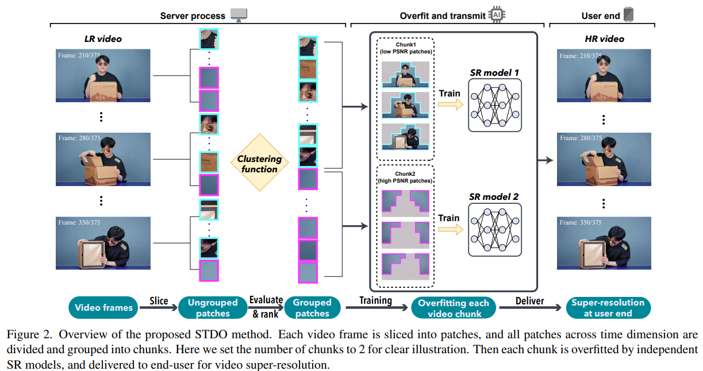
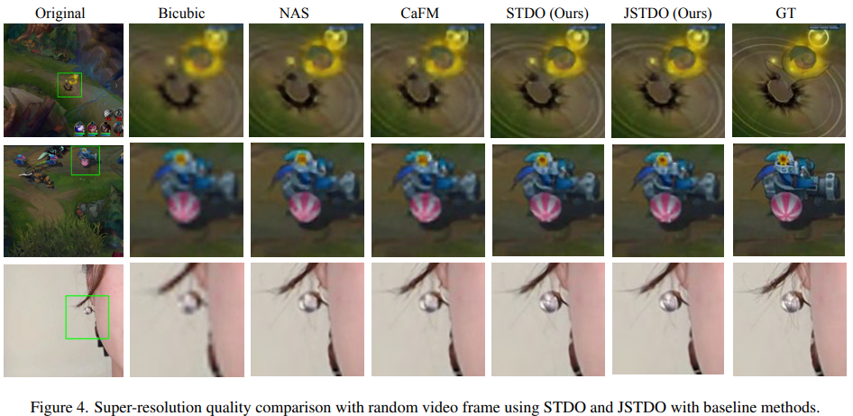

# Towards High-Quality and Efficient Video Super-Resolution via Spatial-Temporal Data Overfitting

> "Towards High-Quality and Efficient Video Super-Resolution via Spatial-Temporal Data Overfitting" CVPR_highlight, 2023 Mar, `STDO`
> [paper](http://arxiv.org/abs/2303.08331v2) [code](https://github.com/coulsonlee/STDO-CVPR2023.git) 
> [pdf](./2023_03_CVPR_highlight_Towards-High-Quality-and-Efficient-Video-Super-Resolution-via-Spatial-Temporal-Data-Overfitting.pdf)
> Authors: Gen Li, Jie Ji, Minghai Qin, Wei Niu, Bin Ren, Fatemeh Afghah, Linke Guo, Xiaolong Ma

## Key-point

- Task: VSR

- Problems

  为了提高视频传输效率，利用 DNN 过拟合能力，存储低分辨率视频，传输前再恢复。
  目前一般都是将视频分为较多段，传输后，用 DNN 提升分辨率。但较多的视频段增加了存储压力。

- :label: Label:

1. Spatial-Temporal Data Overfitting, namely **STDO**
2. Joint training technique (JSTDO)

## Contributions

1. discover the **unbalanced information density within video frames**, and it universally exists and constantly changes along the video timeline
2. 提出使用时空信息，准确地将视频按 patch 分组，最大化利用 DNN 过拟合能力下，降低视频段数量、模型参数量
3. 降低数据量的训练策略，几乎不降低性能情况下，降低存储压力
4. 手机端，实时 28fps (x14)，SOTA, 41.6PSNR(+2.29)

## Introduction

General method to train an SR model would firstly divide the video into frames, and slice each frame into multiple non-overlapping image patches. Pi,j,t, where i ∈ [0, I), j ∈ [0, J), and t ∈ [0, T).

- "How will deep learning change internet video delivery"

- EDSR
  "Enhanced deep residual networks for single image super-resolution"

  

- WDSR

  "Wide activation for efficient and accurate image super-resolution"

  

  在 EDSR 基础上优化，增加全局残差，EDSR 在上采样模块中使用几层卷积继续提取特征，WDSR 直接去掉上采样模块中的卷积，发现这几层卷积并不影响性能，还能提速

## methods

- Motivation

  train separate SR models to overfit each of the video chunks. With more fine-grained video chunks over time, the better overfitting quality can be obtained

  1. For a specific video, more chunks will surely improve the overfitting quality, but it also inevitably increases the data volume as well as system overhead when performing SR inference.
  2. patches are fed into the neural network indiscriminately for training, which may cause redundancy that contradicts with overfitting property

### Spatial-Temporal Data

> - 每个 chunk 各自有一个 SR model？

将视频分为不重叠的 patch 之后，用现有 SR 模型对 LR patch SR，去和 HR 计算 PSNR，按指定的 PSNR 阈值，将这些 patch 按 PSNR 聚类为不同的组。form a set of chunks as Ω = {Dˆ 0, Dˆ 1, . . . , Dˆ k}

这就是提到的 split training data by their spatial-temporal information in a one-shot manner, which is usually done in seconds。之后 train an SR model $f_{sr(k)} (w_k; D^k)$ to overfit each video chunk $ D^k$

- 发现对 patch 按 PSNR 分组以后，模型更容易去记住纹理相似的 patch，更好发挥每个 SR 模型的过拟合能力
- 小结：相当于对训练数据预处理，分为不同难度的数据，用不同模型去学

### Data-Aware Joint Training

探索用一个 SR model 处理整个视频，根据实验结果发现只在 D0 chunk (PSNR 最低的组) 上训练的模型，和在所有组上训练的模型对比，效果降低不多

- 根据现象小结，PSNR 低的组含有较多细节，PSNR 高的 patch 比较简单，因此提出降低训练数据量，保留全部 D0, 去掉全部 Dk，剩下的组里面随机采样数据，用少一些数据训练

  argue that low PSNR patches usually contain rich features, and contribute more to the model learning, which improves the generalization ability to the less informative data

## Experiment

> ablation study 看那个模块有效，总结一下

- Dataset

  VSD4K, set the resolution for HR videos to 1080p, and LR videos are generated by bicubic interpolation

  STDO: divide the spatial-temporal data into 2, 4, and 6 chunks respectively

- Training setting

  1. patch size
     use patch sizes of 48×54 for scaling factor 2 and 4, and 60×64 for scaling factor 3 to accommodate HR video size, 
  2. the threshold value λ is set to split the patches evenly into chunks.
  3. Adam: β1 = 0.9, β2 = 0.009, ϵ = 10−8
  4. LR: set 10−3 for WDSR and 10−4 for other models with decay at different training epochs

  本文使用模型 EDSR model with 16 resblocks and WDSR model with 16 resblocks.

**SOTA 比较**

**Backbone 选取**

When using extremely small networks such as ESPCN or SRCNN, time-divided methods PSNR drops quickly, while STDO still achieves 0.7 ∼ 1.7 dB better performance.

1. STDO 训练数据分组能在各个模型上提点，验证了视频按不同质量的 patch 分组去训练有效性
2. 使用 WDSR 作为 backbone 

**训练策略**

1. JSTDO 降低训练数据量，模型个数，性能降低不多
   JSTDO effectively reduces the overall model size from 4.8 MB to 1.2 MB

2. 从图上各 patch 的 PSNR 看，JSTDO 和 STDO 训练策略下的 PSNR heatmap 类似，说明**使用精选数据仍能够有效提取特征**
   heatmaps clearly demonstrate that our methods achieve better PSNR in the key content zone in the frame

    **JSTDO heatmap has similar patterns with the one using STDO**, which further proves that the joint training technique using carefully scheduled spatial-temporal data **effectively captures the key features**

没比较 STDO 只用一个模型的效果

PSNR heatmap

**主观结果**

###  Ablation Study

1. Chunk 数量：用低 chunk 数量，实现高效推理、传输 & 保持精度
2. JSTDO 降低数据量对性能的影响，仍要 95%；

**部署高效**

对比先前使用 overfitting 实现 SR 的方法，实现了 28 FPS when super-resolving videos from 270p to 1080p by WDSR

- real-time as latency less than 50 ms and FPS greater than 20

## Limitations

## Summary :star2:

> learn what & how to apply to our task

1. 训练 Trick：对**视频数据划分 patch 后，按某个指标分组（标识 patch 含有细节信息的程度），能够让模型学的更好**；类似 progressive training 逐步加大训练数据的难度

2. 发现了视频各个 patch 信息密度存在较大差异的现象，分组分开处理能够提升性能

   

3. **对数据预处理，按 PSNR 分组**，发现只用较多细节的数据（PSNR 低的组）训练，性能能保持差不多，可以降低训练数据量，降低chunk 的存储效率
