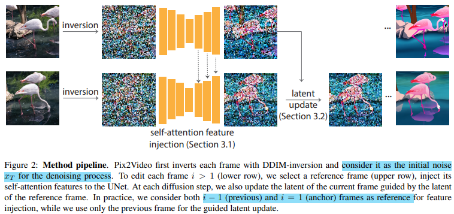
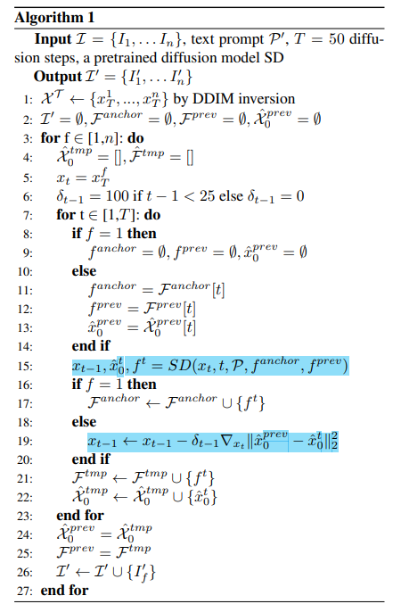
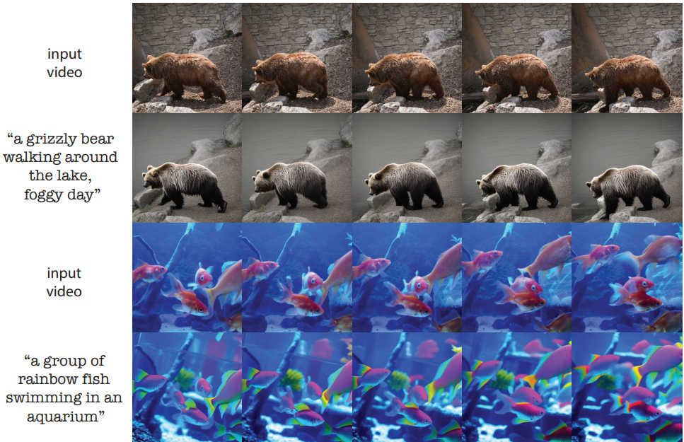
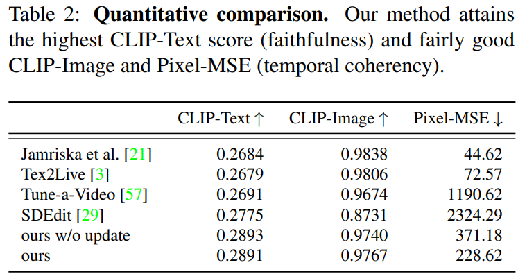
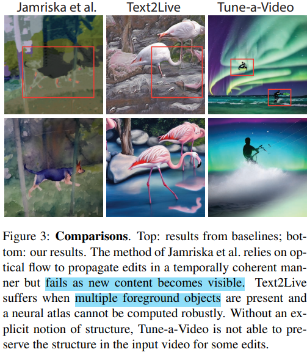
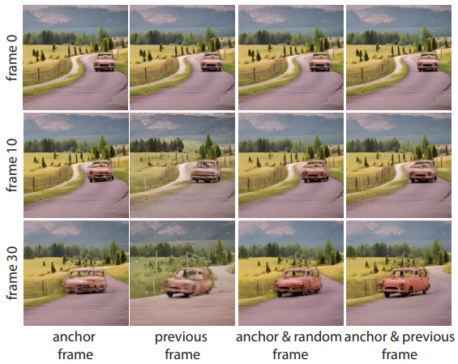

# Pix2Video: Video Editing using Image Diffusion

> "Pix2Video: Video Editing using Image Diffusion" ICCV, 2023 Mar
> [paper](http://arxiv.org/abs/2303.12688v1) [code](https://github.com/duyguceylan/pix2video) [website](https://duyguceylan.github.io/pix2video.github.io/)
> [pdf](./2023_03_Arxiv_Pix2Video--Video-Editing-using-Image-Diffusion.pdf)
> Authors: Duygu Ceylan, Chun-Hao Paul Huang, Niloy J. Mitra

## Key-point

- Task: Video Editing
- Problems
  1. 如何保持编辑后的视频，保留原始视频的内容（编辑后视频的一致性）
  2. 逐帧编辑，多帧不一致
- :label: Label: `Training-Free`

## Contributions

## Related Work

Temporal Consistency: 将上一个编辑后的帧，提取特征融合到当前帧的 self-attn layer；guided diffusion strategy

图像 diffusion 模型没法显式地处理运动信息，参考 ControlNet 使用 depths or 分割图提供运动信息

- patch-based video based stylization
  "Stylizing video by example"

- concurrent video editing

  "Tune-A-Video: One-shot tuning of image diffusion models for text-to-video generation" 需要 finetune

- neural layered representations
  "Text2Live: Text-driven layered image and video editing" >> compute-intensive preprocessing

### Diffusion

> [survey](https://arxiv.org/abs/2209.04747)

## methods

发现使用额外的信息，例如 depth 可提供足够的运动信息；本文中逐帧预测 depth 作为额外输入；通过 Self-attention Feature Injection 模块解决编辑的一致性问题，`Guided Latent Update` 解决闪烁问题

### Self-attention Feature Injection

Stable Diffusion 使用 UNet 结构的 decoder，有使用 cross-attention layer 去做注意力。对 cross-attention layer 修改，当前帧作为 Q，参考帧（上一帧&第一帧 concatenate）作为 KV

> 几个发现
>
> 1.  perform the above feature injection in the decoder layers of the UNet find effective in maintaining appearance consistency :star:
>
> 2. Decoder 深层特征表示高分辨率，外观特征，只有很小的结构差异
>
>    deeper layers of the decoder capture high resolution and appearance-related information and already result in generated frames with similar appearance but small structural changes
>
> 3. 对 Encoder 处理发现会引入噪点
>
>    do not observe further significant benefit when injecting features in the encoder of the UNet and observe slight artifacts

因此本文在 decoder 初始几层 layer 做编辑，避免修改后差异不是很大的问题

### Guided Latent Update

- Motivation

  按上述编辑方式已经有了一致性编辑，但存在闪烁的问题

Diffusion 从 $x_{t} \to x_{t-1}$ 需要预测 $\hat{x_0}$，再得到 $x_{t-1}$
$$
\hat{x}_0^t=\frac{x_t-\sqrt{1-\alpha_t}\epsilon_\theta^t(x_t)}{\sqrt{\alpha_t}}
$$
对这个 x0 使用前一帧 x0 进行约束，设计了下面的 L2 Loss 对当前步的 $x_{t-1}$ 进行更新，防止前后帧差异太大，参考伪代码 Line19
$$
\begin{aligned}g(\hat{x}_0^{i,t},\hat{x}_0^{i-1,t})=\Vert\hat{x}_0^{i,t}-\hat{x}_0^{i-1,t}\Vert_2^2\end{aligned}
$$
一共进行了 50 步的去噪，只对开始的 25步按上面 loss 对 $x_t$ 进行调整；对后续步数也调整反而会降低图像质量

> "Diffusion models already have a semantic latent space." **发现 overall structure of the generated image is already determined in the earlier diffusion steps**

并且初始 **noise 也对闪烁有影响**，使用 Image Captions 模型对视频首帧获取 prompt，从而辅助 inversion 提取图像特征

Pix2Video 算法流程伪代码

## Experiment

> ablation study 看那个模块有效，总结一下

**实验设置**

- evaluate:  DAVIS dataset，本文方法不需要训练！

  length of these videos ranges from 50 to 82 frames

- 模型结构

  depth-conditioned Stable Diffusion [1] as in our backbone diffusion model.

  预先保存好 video 每帧的特征

- metrics :star:

  capture the faithfulness **使用 CLIP-Score 评估生成结果真实度**：编辑文本 & 编辑后的图像 embedding 计算余弦相似度

  "Imagen video: High definition video generation with diffusion models", "Tune-A-Video" 

  temporal coherency ：对连续几帧计算 average CLIP similarity  && 使用光流 warp 到后面的帧计算 PixelMSE

  

- 对比方法

  "Stylizing video by example" ref21

  "Text2Live" 需要先预处理得到一个 neural atlas 要耗时 7-8 h，之后处理时需要 finetune text2image 生成，需要 30min

  "SDEdit"

  "Tune-a-Video"

**本文方法主观效果**

Pix2Video 可以使用单个 or 多个前景物体，能进行局部 （物体）or 全局编辑（风格）

### 与 SOTA 量化指标比较

CLIP-Text , Image 衡量编辑图像与编辑目标的一致性；PixelMSE 衡量时序一致性，时序一致性（闪烁）相比 "Text2Live" 差一些，但推理更快，Text2Live 需要 7 h先去计算 atlas

**对比主观效果**

1. ref21 使用光流作为额外信息，对于视频出现新物体，编辑效果降低很多

   fails as new content becomes visible

2. Tex2Live 对于多个前景物体失效

3. Tune-a-Video 编辑前后画面结构一致性不好

4. SDEdit 逐帧处理，时序一致性很差

### Ablations

attention layer 使用参考帧，对比使用 anchor 第一帧，前一帧，anchor+前一帧，anchor+随机取前面一帧

Attending only to the previous frame or a randomly selected previous frame results in **temporal and structural artifacts**

不用首帧，Without an anchor frame, we observe more temporal flickering and the edit diminishes

## Limitations

1. 生成的熊有多个耳朵，可信度仍可优化
1. 时序一致性较差，闪烁问题仍然存在
1. 目前针对 80 帧 & ch的短视频

## Summary :star2:

> learn what & how to apply to our task

1. 
