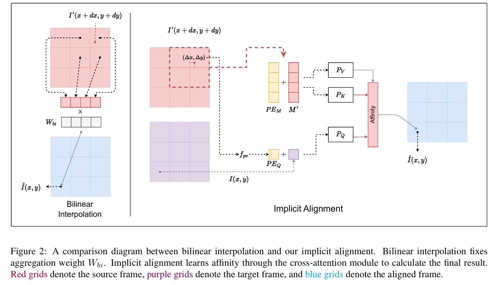

# An Implicit Alignment for Video Super-Resolution

> "An Implicit Alignment for Video Super-Resolution" Arxiv, 2023 Apr
> [paper](http://arxiv.org/abs/2305.00163v1) [code]() 
> [pdf](./2023_04_Arxiv_An-Implicit-Alignment-for-Video-Super-Resolution.pdf)
> Authors: Kai Xu, Ziwei Yu, Xin Wang, Michael Bi Mi, Angela Yao

## Key-point

- Task: VSR
- Problems
- :label: Label: Plug&Play, Sample 方法

bilinear 采样有伪影 >> 学习的方式去采样

## Contributions

## Introduction

## methods

## Experiment

> ablation study 看那个模块有效，总结一下

## Limitations

## Summary :star2:

> learn what & how to apply to our task

